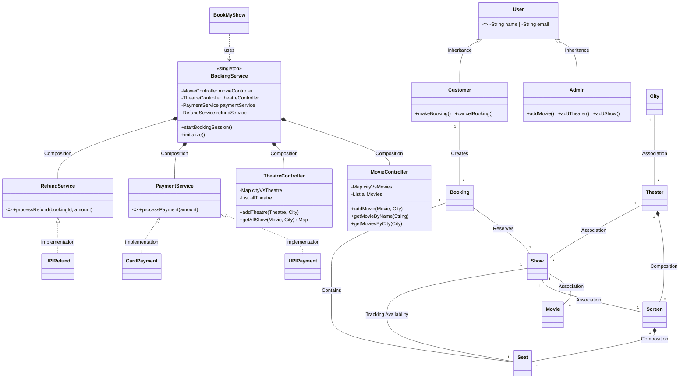
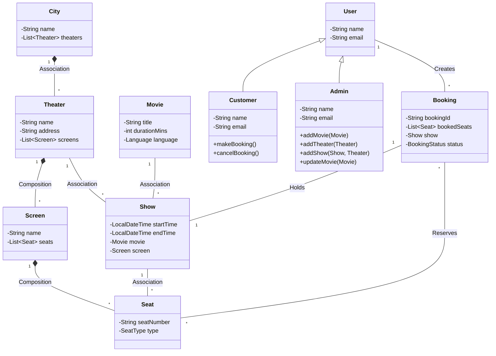

# 🍿 Class 11 — Movie Ticket Booking System (BookMyShow)

A comprehensive low-level design (LLD) for a Movie Ticket Booking System, handling multiple theaters, cities, concurrent bookings, and dynamic pricing strategies.

⸻
# 📊 5. Ultimate & Complete UML Diagram

Below is the definitive architecture combining all **V0 Entities**, **Controllers**, and **Abstract Services**.




## 📋 1. Core Requirements

### Functional Requirements
- **Location-based Browsing**: Users must select a city/location first.
- **Search & Discovery**:
  - List all theaters or movies in a selected city.
  - List all movies playing at a specific theater.
  - List all shows (different theaters and timings) for a specific movie.
- **Booking Flow**:
  - Display current real-time status of all seats for a given show.
  - Select seats and proceed to payment.
  - Confirm booking and generate a ticket.
  - Support cancellation of bookings.
- **Dynamic Pricing**: Base price is set per show. Final price is calculated by applying custom rules:
  - **Timing**: Morning vs Evening shifts.
  - **Day**: Weekends and Holiday surcharges.
  - **Week of month**: (e.g., month-end specials).
  - **Demand**: Auto-scaling based on % of seats filled.
- **Admin Capabilities**: 
  - `addMovie()`: Metadata, duration, and language.
  - `addTheater()`: Locations and screen mappings.
  - `addShow()`: Link Movie + Theater + Screen + Slot.

### Non-Functional & Technical Requirements
- **Concurrency**: Ensure the exact same seat cannot be booked by multiple users fighting for the same show.
- **Payment Timeouts**: Handle scenarios where an inventory lock is acquired but the user abandons or fails payment.
- **Performance**: Use caching for heavy-read operations (movie/theater catalogs) and efficient data structures (e.g., bit vectors) for seat tracking.
- **User Identification**: Use **Email Address** as the unique identifier for all users.
- **Multilingual Support**: Design for movies in multiple languages and regions.

### 🚫 Out of Scope (For V1)
- No internal currency or custom tokens.
- No discount policies, coupon codes, or referral systems.
- No add-on features like food, beverages, or merchandise.

⸻

## 🔄 2. User Journey (Flow)

1. **Select Location** 📍
2. **Path A (By Movie):**
   - View all movies in the city ➡️ Click Movie ➡️ See Shows (Theaters & Timings)
3. **Path B (By Theater):**
   - View all theaters ➡️ Select Theater ➡️ See Movies showing there
4. **Show Selection** ➡️ View Seat Map (Available vs. Booked)
5. **Seat Selection** ➡️ The system places a **temporary lock** on the seats.
6. **Payment** ➡️ If successful, confirm booking. If failed/timeout, release the lock.

⸻

## 🏛️ 3. Core Entities & Data Model

| Entity | Description |
| :--- | :--- |
| **User** | Customers and Admins using the system. |
| **City / Location** | Represents geographical boundaries for filtering. |
| **Theater (Cinema)** | Physical building containing multiple screens. |
| **Screen (Auditorium)** | A specific hall inside a theater. |
| **Movie** | The film metadata (Title, Duration, Language, Rating). |
| **Show** | The intersection of a Movie, Screen, and Time. |
| **Seat** | Physical seats in a screen. Can have types (Gold, Platinum, Silver) which vary per show. |
| **Booking (Ticket)** | The reservation record for a user, show, and specific seats. |

### 📊 V0 UML — Core Entities



⸻

## 🛡️ 4. Services & Abstractions

### 💸 Payment & Refund Services
To handle multiple payment modes and follow **Open/Closed Principle**, we use interfaces.

```java
// Payment Abstraction
public interface PaymentService {
    boolean processPayment(double amount);
}

public class UPIPayment implements PaymentService {
    @Override public boolean processPayment(double amt) { /* UPI Logic */ return true; }
}

public class CardPayment implements PaymentService {
    @Override public boolean processPayment(double amt) { /* Card Logic */ return true; }
}

// Refund Abstraction
public interface RefundService {
    boolean processRefund(String bookingId, double amount);
}

public class UPIRefund implements RefundService {
    @Override public boolean processRefund(String id, double amt) { /* UPI Refund */ return true; }
}
```

⸻

## 💻 4. Advanced Production-Grade Implementation (Java)

This version includes **Concurrency (TTL Locks)**, **Strategy Pattern (Pricing)**, and **Observer-ready state tracking**.

```java
import java.time.*;
import java.util.*;
import java.util.concurrent.*;
import java.util.concurrent.atomic.AtomicInteger;

// ================= ENUMS =================
enum SeatStatus { AVAILABLE, LOCKED, BOOKED }
enum SeatType { SILVER, GOLD, PLATINUM }
enum BookingStatus { CREATED, CONFIRMED, CANCELLED }

// ================= USER =================
abstract class User {
    String name;
    String email;

    public User(String name, String email) {
        this.name = name;
        this.email = email;
    }
}

class Customer extends User {
    public Customer(String name, String email) {
        super(name, email);
    }
}

class Admin extends User {
    public Admin(String name, String email) {
        super(name, email);
    }
}

// ================= CORE ENTITIES =================
class City {
    String name;
    List<Theater> theaters = new ArrayList<>();

    public City(String name) { this.name = name; }
}

class Theater {
    String name;
    List<Screen> screens = new ArrayList<>();

    public Theater(String name) { this.name = name; }
}

class Screen {
    String name;
    List<Seat> seats = new ArrayList<>();

    public Screen(String name) { this.name = name; }
}

class Seat {
    String seatNumber;
    SeatType type;

    public Seat(String seatNumber, SeatType type) {
        this.seatNumber = seatNumber;
        this.type = type;
    }
}

class Movie {
    String title;
    int duration;

    public Movie(String title, int duration) {
        this.title = title;
        this.duration = duration;
    }
}

// ================= SHOW SEAT =================
class ShowSeat {
    Seat seat;
    volatile SeatStatus status;
    double price;

    public ShowSeat(Seat seat, double price) {
        this.seat = seat;
        this.price = price;
        this.status = SeatStatus.AVAILABLE;
    }
}

// ================= SHOW =================
class Show {
    Movie movie;
    Screen screen;
    LocalDateTime startTime;
    Map<String, ShowSeat> seatMap = new ConcurrentHashMap<>();

    public Show(Movie movie, Screen screen, LocalDateTime time) {
        this.movie = movie;
        this.screen = screen;
        this.startTime = time;

        for (Seat s : screen.seats) {
            seatMap.put(s.seatNumber, new ShowSeat(s, 100));
        }
    }
}

// ================= BOOKING =================
class Booking {
    static AtomicInteger counter = new AtomicInteger(0);

    String bookingId;
    List<ShowSeat> seats;
    Show show;
    BookingStatus status;

    public Booking(Show show, List<ShowSeat> seats) {
        this.bookingId = "B-" + counter.incrementAndGet();
        this.show = show;
        this.seats = seats;
        this.status = BookingStatus.CREATED;
    }
}

// ================= SEAT LOCK =================
class SeatLock {
    ShowSeat seat;
    Customer user;
    LocalDateTime lockTime;
    int timeoutSec;

    public SeatLock(ShowSeat seat, Customer user, int timeoutSec) {
        this.seat = seat;
        this.user = user;
        this.lockTime = LocalDateTime.now();
        this.timeoutSec = timeoutSec;
    }

    public boolean isExpired() {
        return Duration.between(lockTime, LocalDateTime.now()).getSeconds() > timeoutSec;
    }
}

// ================= PAYMENT =================
interface PaymentService {
    boolean processPayment(double amount);
}

class UPIPayment implements PaymentService {
    public boolean processPayment(double amount) {
        System.out.println("💳 UPI Payment Success: ₹" + amount);
        return true;
    }
}

// ================= REFUND =================
interface RefundService {
    boolean processRefund(String bookingId, double amount);
}

class UPIRefund implements RefundService {
    public boolean processRefund(String id, double amount) {
        System.out.println("💵 Refund processed for " + id);
        return true;
    }
}

// ================= PRICING =================
interface PricingStrategy {
    double calculatePrice(ShowSeat seat, Show show);
}

class WeekendPricingStrategy implements PricingStrategy {
    public double calculatePrice(ShowSeat seat, Show show) {
        if (show.startTime.getDayOfWeek() == DayOfWeek.SATURDAY ||
            show.startTime.getDayOfWeek() == DayOfWeek.SUNDAY) {
            return seat.price * 1.2;
        }
        return seat.price;
    }
}

// ================= CONTROLLERS =================
class MovieController {
    Map<City, List<Movie>> cityMovies = new HashMap<>();

    public void addMovie(Movie movie, City city) {
        cityMovies.computeIfAbsent(city, k -> new ArrayList<>()).add(movie);
    }
}

class TheatreController {
    Map<City, List<Theater>> cityTheatres = new HashMap<>();

    public void addTheatre(Theater t, City city) {
        cityTheatres.computeIfAbsent(city, k -> new ArrayList<>()).add(t);
    }
}

// ================= BOOKING SERVICE =================
class BookingService {
    private static BookingService instance;

    MovieController movieController = new MovieController();
    TheatreController theatreController = new TheatreController();

    PaymentService paymentService;
    RefundService refundService;
    PricingStrategy pricingStrategy;

    Map<ShowSeat, SeatLock> locks = new ConcurrentHashMap<>();

    private BookingService(PaymentService p, RefundService r, PricingStrategy pr) {
        this.paymentService = p;
        this.refundService = r;
        this.pricingStrategy = pr;
    }

    public static BookingService getInstance(PaymentService p, RefundService r, PricingStrategy pr) {
        if (instance == null) instance = new BookingService(p, r, pr);
        return instance;
    }

    // 🔥 LOCK SEATS
    public synchronized List<ShowSeat> lockSeats(Show show, List<String> seatNumbers, Customer user) {
        List<ShowSeat> lockedSeats = new ArrayList<>();

        for (String num : seatNumbers) {
            ShowSeat seat = show.seatMap.get(num);

            if (seat.status != SeatStatus.AVAILABLE) {
                throw new RuntimeException("❌ Seat not available: " + num);
            }

            seat.status = SeatStatus.LOCKED;
            locks.put(seat, new SeatLock(seat, user, 10)); // 10s TTL
            lockedSeats.add(seat);
        }
        return lockedSeats;
    }

    // 🔥 CONFIRM BOOKING
    public Booking confirmBooking(Customer user, Show show, List<ShowSeat> seats) {
        double total = 0;

        for (ShowSeat seat : seats) {
            total += pricingStrategy.calculatePrice(seat, show);
        }

        if (!paymentService.processPayment(total)) {
            releaseSeats(seats);
            throw new RuntimeException("❌ Payment failed");
        }

        for (ShowSeat seat : seats) {
            seat.status = SeatStatus.BOOKED;
            locks.remove(seat);
        }

        Booking booking = new Booking(show, seats);
        booking.status = BookingStatus.CONFIRMED;
        return booking;
    }

    // 🔥 RELEASE LOCK
    public void releaseSeats(List<ShowSeat> seats) {
        for (ShowSeat seat : seats) {
            seat.status = SeatStatus.AVAILABLE;
            locks.remove(seat);
        }
    }

    // 🔥 AUTO CLEANUP (TTL)
    public void cleanExpiredLocks() {
        for (SeatLock lock : locks.values()) {
            if (lock.isExpired()) {
                lock.seat.status = SeatStatus.AVAILABLE;
                locks.remove(lock.seat);
            }
        }
    }
}

// ================= MAIN =================
public class Main {
    public static void main(String[] args) {

        // Setup
        City city = new City("Bangalore");

        Theater theater = new Theater("PVR");
        Screen screen = new Screen("Screen1");

        screen.seats.add(new Seat("A1", SeatType.GOLD));
        screen.seats.add(new Seat("A2", SeatType.GOLD));

        theater.screens.add(screen);
        city.theaters.add(theater);

        Movie movie = new Movie("Avengers", 180);
        Show show = new Show(movie, screen, LocalDateTime.now());

        Customer user = new Customer("Kaif", "kaif@email.com");

        BookingService service = BookingService.getInstance(
                new UPIPayment(),
                new UPIRefund(),
                new WeekendPricingStrategy()
        );

        // Booking flow
        System.out.println("🚀 Starting Booking for " + user.name + "...");
        List<ShowSeat> locked = service.lockSeats(show, Arrays.asList("A1"), user);
        Booking booking = service.confirmBooking(user, show, locked);

        System.out.println("✅ Booking Confirmed: " + booking.bookingId);
    }
}
```

⸻

#
⸻

## 🛠️ 6. Technical Implementation Notes (Advanced)

### ⚠️ Concurrency & Seat Locking
- **The Problem:** Two users clicking the same `Seat_A1` at the exact same millisecond.
- **Database Transactions:** Essential to use strict ACID properties.
- **Optimistic vs. Pessimistic Locking:** 
  - *Pessimistic Locking* (e.g., `SELECT ... FOR UPDATE`) is safer for highly contended rows but limits throughput.
  - *Optimistic Locking* (using a `version` column) handles high throughput better but requires handling `OptimisticLockException` gracefully.
- **Temporary Lock:** When a user selects seats, switch status to `LOCKED` with a TTL (Time To Live, e.g., 10 minutes). If payment succeeds, switch to `BOOKED`. If TTL expires, revert to `AVAILABLE`.

### 🧠 Efficient Seat Tracking
- Instead of querying hundreds of row locks per show, consider using **Bit Vectors** (Bitmaps) in cache (e.g., Redis). 
- `1` = Booked/Locked, `0` = Available. 
- Fast Bitwise operations can instantly find contiguous available seats.

### 💰 Pricing Strategy Pattern
Pricing rules can be elegantly handled using the **Strategy Pattern**. Base price can be decorated or augmented based on runtime factors.

```java
public interface PricingStrategy {
    double calculatePrice(Show show, SeatType type);
}

// Example Implementations:
// - WeekendPricingStrategy
// - HolidayPricingStrategy
// - BlockbusterPricingStrategy
```

### ⚡ Caching
- Implement caching for static/read-heavy data like the Movie Catalog, Theater Lists, and static Show Schedules to reduce database load.
- Ensure proper cache invalidation policies when admins add or modify shows.

### 🔐 API & Security
- **API Design:** Use strictly RESTful principles with versioning (e.g., `/api/v1/bookings`).
- **Security:** Implement JWT/OAuth authentication for users and strict Role-Based Access Control (RBAC) for Admins. Ensure secure PCI-compliant handling of payment gateways.
