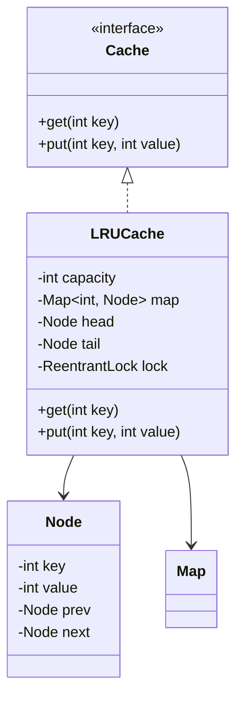
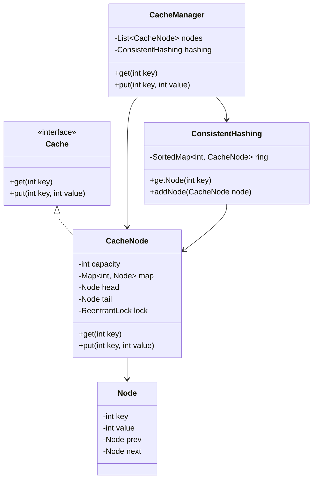
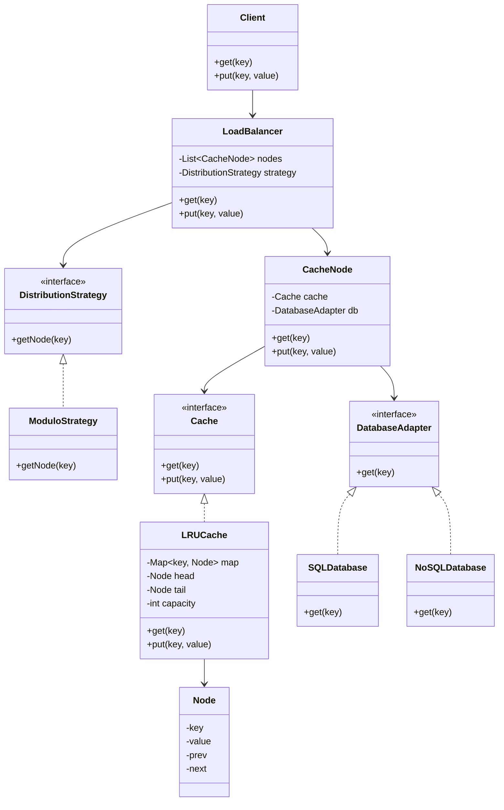

```mermaid

classDiagram

class Cache {
    <<interface>>
    +get(int key)
    +put(int key, int value)
}

class LRUCache {
    -int capacity
    -Map~int, Node~ map
    -Node head
    -Node tail
    -ReentrantLock lock
    +get(int key)
    +put(int key, int value)
}

class Node {
    -int key
    -int value
    -Node prev
    -Node next
}

Cache <|.. LRUCache
LRUCache --> Node
LRUCache --> Map
```

```mermaid
classDiagram

class Cache {
    <<interface>>
    +get(int key)
    +put(int key, int value)
}

class CacheNode {
    -int capacity
    -Map~int, Node~ map
    -Node head
    -Node tail
    -ReentrantLock lock
    +get(int key)
    +put(int key, int value)
}

class Node {
    -int key
    -int value
    -Node prev
    -Node next
}

class CacheManager {
    -List~CacheNode~ nodes
    -ConsistentHashing hashing
    +get(int key)
    +put(int key, int value)
}

class ConsistentHashing {
    -SortedMap~int, CacheNode~ ring
    +getNode(int key)
    +addNode(CacheNode node)
}

Cache <|.. CacheNode
CacheNode --> Node
CacheManager --> CacheNode
CacheManager --> ConsistentHashing
ConsistentHashing --> CacheNode
```

```mermaid
classDiagram

%% ======================
%% CLIENT LAYER
%% ======================
class Client {
    +get(key)
    +put(key, value)
}

%% ======================
%% LOAD BALANCER
%% ======================
class LoadBalancer {
    -List~CacheNode~ nodes
    -DistributionStrategy strategy
    +get(key)
    +put(key, value)
}

%% ======================
%% DISTRIBUTION STRATEGY
%% ======================
class DistributionStrategy {
    <<interface>>
    +getNode(key)
}

class ModuloStrategy {
    +getNode(key)
}

DistributionStrategy <|.. ModuloStrategy

%% ======================
%% CACHE NODE
%% ======================
class CacheNode {
    -Cache cache
    -DatabaseAdapter db
    +get(key)
    +put(key, value)
}

%% ======================
%% CACHE (LRU)
%% ======================
class Cache {
    <<interface>>
    +get(key)
    +put(key, value)
}

class LRUCache {
    -Map~key, Node~ map
    -Node head
    -Node tail
    -int capacity
    +get(key)
    +put(key, value)
}

Cache <|.. LRUCache

%% ======================
%% NODE STRUCTURE
%% ======================
class Node {
    -key
    -value
    -prev
    -next
}

LRUCache --> Node

%% ======================
%% DATABASE ADAPTER
%% ======================
class DatabaseAdapter {
    <<interface>>
    +get(key)
}

class SQLDatabase {
    +get(key)
}

class NoSQLDatabase {
    +get(key)
}

DatabaseAdapter <|.. SQLDatabase
DatabaseAdapter <|.. NoSQLDatabase

%% ======================
%% RELATIONS
%% ======================
Client --> LoadBalancer
LoadBalancer --> DistributionStrategy
LoadBalancer --> CacheNode
CacheNode --> Cache
CacheNode --> DatabaseAdapter
```