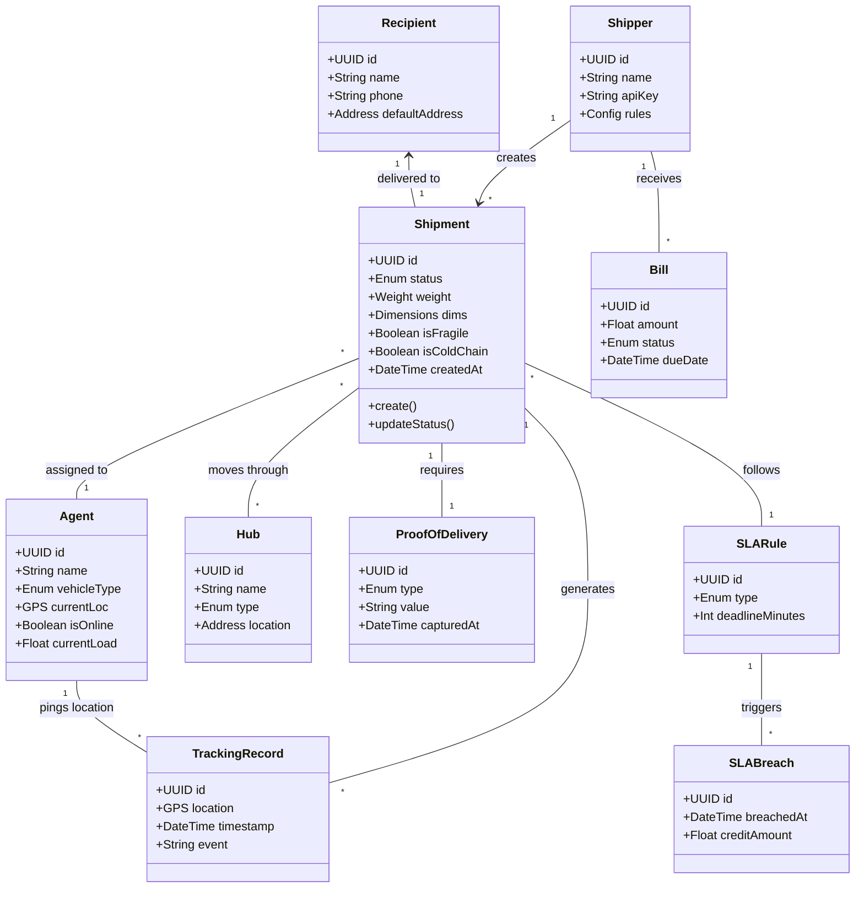

# 📦 CargoSync: Last-Mile Logistics System Design

> **CargoSync** is a high-scale, real-time last-mile delivery platform operating across 120 cities in 8 countries, managing 200,000+ delivery agents. This system handles complex combinatorial optimization for route sequencing, real-time tracking, and high-throughput event processing.

---

## 🎨 System Entities & UML Diagram

Below is the core entity relationship diagram for CargoSync, illustrating the lifecycle of a shipment and its interaction with various actors and services.

---

```mermaid
classDiagram

%% =========================
%% CORE ENTITIES
%% =========================

class Shipment {
  +string id
  +string trackingId
  +ShipmentStatus status
  +Address pickupAddress
  +Address deliveryAddress
  +float weight
  +float volume
  +float declaredValue
  +boolean fragile
  +boolean refrigerated
  +boolean hazmat
  +string shipperId
  +string recipientId
  +string agentId
  +datetime createdAt
  +datetime updatedAt

  +createShipment()
  +updateStatus(status)
  +assignAgent(agentId)
  +markDelivered()
  +markFailed(reason)
}

class Address {
  +string id
  +string line1
  +string city
  +string state
  +string country
  +float latitude
  +float longitude

  +validate()
  +geocode()
}

class Shipper {
  +string id
  +string name
  +string email

  +createShipment()
  +viewAnalytics()
  +defineRules()
}

class Recipient {
  +string id
  +string name
  +string phone

  +trackShipment()
  +provideInstructions()
}

class Agent {
  +string id
  +string name
  +string vehicleType
  +boolean available
  +Location currentLocation

  +acceptShipment()
  +updateLocation()
  +markPickup()
  +markDelivery()
}

class Location {
  +float latitude
  +float longitude
  +datetime timestamp
}

class Route {
  +string id
  +list~Shipment~ shipments
  +string agentId

  +optimizeRoute()
  +reorderStops()
}

class ProofOfDelivery {
  +string id
  +string shipmentId
  +string type
  +string imageUrl
  +string signature
  +string otp
  +datetime timestamp

  +captureProof()
}

class SLA {
  +string id
  +string shipmentId
  +datetime deadline
  +boolean breached

  +checkBreach()
  +triggerAlert()
}

class Billing {
  +string id
  +string shipmentId
  +float amount
  +string status

  +calculateCost()
  +generateInvoice()
}

class Payment {
  +string id
  +string agentId
  +float amount

  +calculatePayout()
  +processPayment()
}

class ReturnShipment {
  +string id
  +string originalShipmentId

  +createReturn()
}

class Rule {
  +string id
  +string condition
  +string action

  +evaluate()
}

class Geofence {
  +string id
  +float radius
  +Location center

  +checkEntry()
  +checkExit()
}

class TemperatureLog {
  +string id
  +string shipmentId
  +float temperature
  +datetime timestamp

  +detectBreach()
}

class AuditLog {
  +string id
  +string shipmentId
  +string actorId
  +string action
  +datetime timestamp
  +string deviceId
  +Location location

  +logEvent()
}

%% =========================
%% ENUM
%% =========================

class ShipmentStatus {
  <<enumeration>>
  CREATED
  PICKUP_PENDING
  PICKED_UP
  IN_TRANSIT
  OUT_FOR_DELIVERY
  DELIVERED
  FAILED_DELIVERY
  RETURNED
}

%% =========================
%% SERVICES
%% =========================

class ShipmentService {
  +createShipment()
  +updateShipment()
  +getShipment()
}

class DispatchService {
  +assignAgent()
  +preventDoubleAssignment()
}

class RouteService {
  +optimizeRoute()
}

class TrackingService {
  +storeLocation()
  +getLiveLocation()
}

class NotificationService {
  +sendSMS()
  +sendEmail()
  +sendWhatsApp()
}

class SLAService {
  +monitorSLA()
}

class BillingService {
  +calculateBilling()
}

class PaymentService {
  +processAgentPayment()
}

class ReturnService {
  +handleReturn()
}

class RuleEngine {
  +evaluateRules()
}

class AdminService {
  +overrideStatus()
  +reassignShipment()
}

%% =========================
%% EVENT SYSTEM
%% =========================

class Event {
  +string id
  +string type
  +string payload
  +datetime timestamp
}

class EventBus {
  +publish(event)
  +subscribe()
}

%% =========================
%% RELATIONSHIPS
%% =========================

Shipment --> Address
Shipment --> Agent
Shipment --> Recipient
Shipment --> Shipper
Shipment --> ProofOfDelivery
Shipment --> SLA
Shipment --> Billing
Shipment --> ReturnShipment
Shipment --> AuditLog
Shipment --> TemperatureLog

Agent --> Route
Agent --> Location

Route --> Shipment

SLA --> Shipment
Billing --> Shipment
Payment --> Agent

Rule --> Shipper

Geofence --> Location

ShipmentService --> Shipment
DispatchService --> Shipment
DispatchService --> Agent
RouteService --> Route
TrackingService --> Location
NotificationService --> Shipment
SLAService --> SLA
BillingService --> Billing
PaymentService --> Payment
ReturnService --> ReturnShipment
RuleEngine --> Rule
AdminService --> Shipment

EventBus --> Event
ShipmentService --> EventBus
DispatchService --> EventBus
TrackingService --> EventBus
SLAService --> EventBus
NotificationService --> EventBus
```

## 🚀 1. System Scale & Complexity

- **Throughput**: Handles **13,000+ writes/sec** from 200k agents pinging every 15 seconds.
- **Complexity**: Unlike ride-sharing, agents carry **30–60 packages per trip**, making assignment and sequencing a combinatorial optimization problem.
- **Geography**: 120 cities, 8 countries.

---

## ⚙️ 2. Functional Requirements

### 📦 Shipment Management
- **Creation**: Single API or Bulk CSV upload.
- **Lifecycle**: `CREATED` → `PICKUP_PENDING` → `PICKED_UP` → `IN_TRANSIT` → `OUT_FOR_DELIVERY` → `DELIVERED`.
- **Special Handling**: Hazmat certification, Cold Chain (temperature logging), Fragile flags.

### 🚚 Dispatch & Optimization
- **Dispatch**: Assign within 60s based on distance, load, vehicle type, and SLA.
- **Route Optimizer**: Dynamic sequencing based on traffic and delivery failures.
- **Co-loading**: Multiple shippers in one vehicle with separate billing/tracking.

### 🔍 Tracking & Privacy
- **Real-time**: High-frequency GPS updates.
- **Privacy**: Location masking (500m) near destination for recipient privacy.
- **Proof of Delivery (POD)**: Mandatory photo, OTP, or signature.

---

## 🏗️ 3. High-Level Architecture

### Core Microservices
1.  **Shipment Service**: Transactional source of truth for shipment states.
2.  **Dispatch Service**: Pluggable engine for agent assignment (Greedy/Optimization/3rd Party).
3.  **Tracking Service**: Ingests high-volume location pings into Time-Series DB.
4.  **Route Service**: Computes optimal sequences for delivery agents.
5.  **SLA Service**: Real-time monitoring of delivery deadlines via event streams.
6.  **Rule Engine**: Evaluates per-shipper business logic (e.g., "OTP required for > $100").

### Technology Stack
- **Primary DB**: PostgreSQL (Transactional)
- **Tracking Store**: Cassandra / InfluxDB (High-volume writes)
- **Caching**: Redis (Agent availability, Distributed locks)
- **Event Bus**: Kafka (Asynchronous communication)
- **Object Storage**: AWS S3 (Proof of delivery images)

---

## 🔁 4. Event-Driven Workflows

The system is fully decoupled using a messaging backbone (Kafka).

1.  **ShipmentCreated**: Triggered by Shipper → Consumed by Dispatcher.
2.  **ShipmentAssigned**: Triggered by Dispatcher → Consumed by Notification & Agent App.
3.  **LocationUpdated**: Triggered by Agent App → Consumed by ETA Engine & Hub Geofencing.
4.  **Delivered**: Triggered by Agent → Consumed by Billing & SLA Close-out.

---

## ⚡ 5. Concurrency & Reliability

### 🚫 Double Assignment Prevention
Uses **Distributed Locking** in Redis (`SETNX`) or DB-level Optimistic Locking to ensure a shipment is never assigned to two agents simultaneously.

### 📶 Offline Sync Handling
Agents often work in low-connectivity areas. The app stores events locally and replays them upon reconnection.
- **Conflict Resolution**: Server-side timestamp verification + state machine validation (e.g., a "Delivered" event cannot occur after a "Canceled" state).

### 🚨 Flash Sale Support
Handles sudden spikes (5k shipments in 2 mins) by using priority queues and pre-scaling the Dispatch workers.

---

## 📊 6. Analytics & Monitoring
- **On-time Delivery Rate (OTD)**.
- **Agent Heatmaps**: Real-time congestion monitoring.
- **Cold Chain Breaches**: Instant alerts if temperature exceeds thresholds.
- **Audit Logging**: Immutable history of every state change with actor, GPS, and device ID.

---

## 🧠 7. Interview Summary Point
> "I designed CargoSync as an **event-driven microservices architecture** to handle massive write loads (13k/sec) while maintaining strict state consistency. By decoupling dispatching as a pluggable strategy and utilizing a time-series store for tracking, the system remains performant and extensible for multi-tenant logistics."
