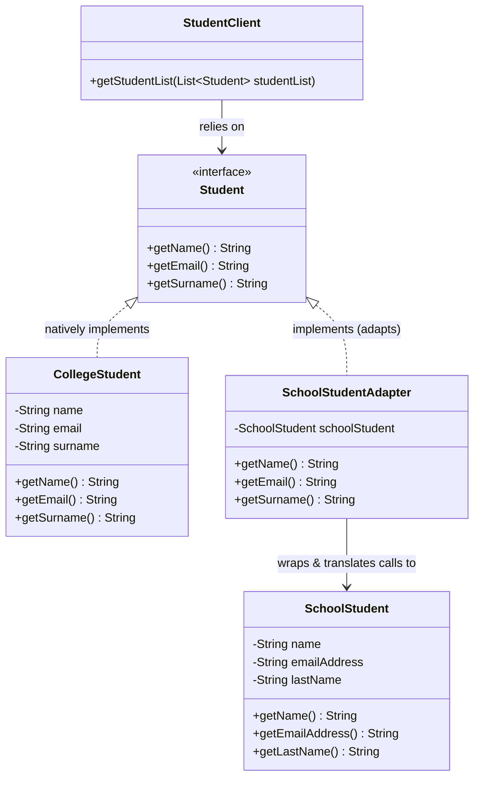

# 🔌 Adapter Design Pattern: A Beginner's Guide

## 📖 Overview

The **Adapter Design Pattern** is a **structural design pattern** that enables incompatible interfaces to work together. It does this by creating a intermediate wrapper (the adapter) that translates calls from the client's format into a format the legacy or incompatible system understands.

This pattern is extremely useful when integrating **legacy code** (existing, unmodifiable code) or third-party libraries into your new systems. It avoids the need to rewrite or alter the original code while ensuring it becomes fully compatible with your client's expectations.

It operates as a **client-focused pattern**, meaning the client code remains completely unchanged and blindly interacts with the adapted legacy system as if it were natively compatible.

---

## 🏥 Real-World Analogy: Medical Insurance

You might hear the "physical charger adapter" analogy often, but it can be confusing because hardware adapters modify physical plugs. In software, adapters translate **method calls and data structures**. 

**A better analogy:**
Hospitals generate patient records (prescriptions, medical reports) in their own unique format. However, insurance companies (e.g., HDFC, MetLife) require claims to be submitted in their specific, strict formats. 

The hospital's **insurance office** acts as the **Adapter**:
1. It receives the raw hospital-format documents *(Legacy Code)*.
2. It extracts the core patient information.
3. It reformats and translates the data to strictly match the Insurance company's required format *(Client Interface)*.
4. It seamlessly provides the compatible documents for claims without asking the doctors to change how they write prescriptions.

---

## 🏗️ Class Diagram

Here is a visual representation of how our Java implementation is structured using the Adapter Pattern:



### Component Roles
| Component | Role in Pattern | Description |
|-----------|-----------------|-------------|
| **`Student`** | **Target Interface** | The standard format that the Client (`StudentClient`) expects and knows how to use. |
| **`CollegeStudent`** | **Compatible Class** | A modern class that already perfectly implements the target interface. |
| **`SchoolStudent`** | **Adaptee (Legacy)** | The incompatible existing class. Notice it has `lastName` instead of `surname` and `emailAddress` instead of `email`. |
| **`SchoolStudentAdapter`** | **Adapter** | Wraps the `SchoolStudent`. It implements the `Student` interface and secretly passes along the mapped method calls to the `SchoolStudent`. |

---

## 💻 Code Implementation Walkthrough

Here is the complete implementation of the Adapter Design Pattern:

```java
import java.util.ArrayList;
import java.util.List;

// 1. Target Interface - Expected perfectly by the client
interface Student {
    String getName();
    String getEmail();
    String getSurname();
}

// 2. Compatible Class - Works out of the box
class CollegeStudent implements Student {
    private String name;
    private String email;
    private String surname;
    
    public CollegeStudent(String name, String email, String surname) {
        this.name = name;
        this.email = email;
        this.surname = surname;
    }
    
    @Override public String getName() { return name; }
    @Override public String getEmail() { return email; }
    @Override public String getSurname() { return surname; }
}

// 3. Incompatible Legacy Class - Method names don't match the Student Interface!
class SchoolStudent {
    private String name;
    private String emailAddress; // Mismatch
    private String lastName;     // Mismatch
    
    public SchoolStudent(String name, String emailAddress, String lastName) {
        this.name = name;
        this.emailAddress = emailAddress;
        this.lastName = lastName;
    }
    
    public String getName() { return name; }
    public String getEmailAddress() { return emailAddress; }
    public String getLastName() { return lastName; }
}

// 4. The Adapter - Bridges the gap
class SchoolStudentAdapter implements Student {
    private SchoolStudent schoolStudent; // The object we are adapting
    
    public SchoolStudentAdapter(SchoolStudent schoolStudent) {
        this.schoolStudent = schoolStudent;
    }
    
    @Override
    public String getName() {
        return schoolStudent.getName(); 
    }
    
    @Override
    public String getEmail() {
        // Translates 'getEmail' call into 'getEmailAddress'
        return schoolStudent.getEmailAddress();  
    }
    
    @Override
    public String getSurname() {
        // Translates 'getSurname' call into 'getLastName'
        return schoolStudent.getLastName();  
    }
}

// 5. The Client - Has no idea Adapters exist, just wants 'Student' objects
class StudentClient {
    public void getStudentList(List<Student> studentList) {
        for (Student student: studentList) {
            System.out.println("Name: " + student.getName());
            System.out.println("Email: " + student.getEmail());
            System.out.println("Surname: " + student.getSurname());
            System.out.println("---");
        }
    }
}

// Demo Execution
public class AdapterDemo {
    public static void main(String[] args) {
        StudentClient client = new StudentClient();
        List<Student> studentList = new ArrayList<>();
        
        // CollegeStudent works directly (compatible)
        studentList.add(new CollegeStudent("John Doe", "john@college.com", "Doe"));
        
        // ❌ Without Adapter: studentList.add(new SchoolStudent(...)); would cause a Type Error!
        
        SchoolStudent schoolStudent = new SchoolStudent("Jane Smith", "jane@school.com", "Smith");
        
        // ✅ With Adapter: Now compatible!
        studentList.add(new SchoolStudentAdapter(schoolStudent));  
        
        // Client works seamlessly with both
        client.getStudentList(studentList);
    }
}
```

### Expected Output
```text
Name: John Doe
Email: john@college.com
Surname: Doe
---
Name: Jane Smith
Email: jane@school.com
Surname: Smith
---
```

---

## 🎯 Key Benefits and Takeaways

- **Loose Coupling:** The client code (`StudentClient`) only depends on the `Student` interface. It doesn't care if the object underneath is heavily adapted legacy code or brand new code.
- **Single Responsibility Principle:** You can separate the interface or data conversion code from the primary business logic. 
- **Open-Closed Principle:** You can easily introduce new types of Adapters into the program without breaking or changing the existing client code.
- **Seamless Integrations:** This is the absolute best way to connect your modern application with older API services or unmodifiable third-party libraries. 
