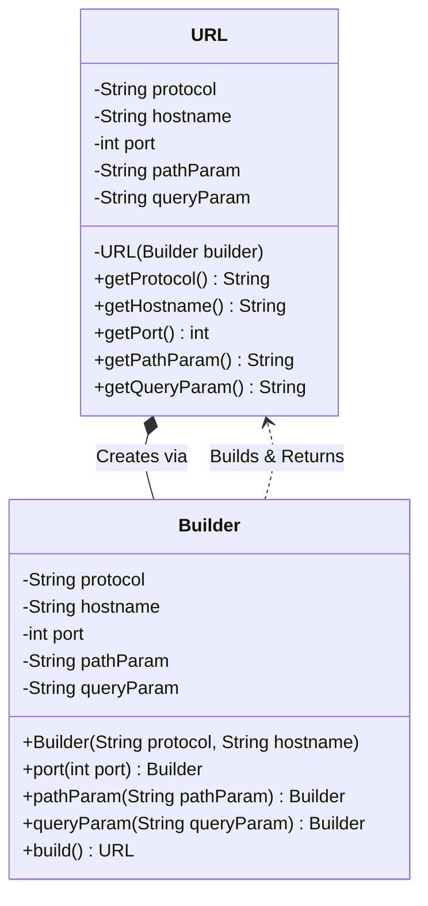

# 🏗️ Builder Design Pattern: A Beginner's Guide

## 📖 Overview

The **Builder Pattern** is a **creational design pattern** designed to solve problems associated with **complex object creation**. It is particularly useful when an object requires numerous parameters, many of which might be optional.

### 🛑 The Problem: Telescoping Constructors
When building objects with many optional properties, developers often create multiple overloaded constructors. This leads to **Constructor Explosion** (or Telescoping Constructors), which are incredibly difficult to read, maintain, and scale. Furthermore, it forces developers to blindly pass `null` values for optional fields they do not want to set.

---

## 🗄️ Real-World Analogy: Building a Wardrobe

Imagine ordering a customized wardrobe. 
- **Essential components:** Doors, wooden panels.
- **Optional components:** Mirror, wheels, extra hanging rods, secret compartments.

If you had to write a constructor for every possible combination:
```java
Wardrobe(doors, panels, hinges) 
Wardrobe(doors, panels, hinges, mirror) 
Wardrobe(doors, panels, hinges, wheels) 
Wardrobe(doors, panels, hinges, mirror, wheels, hangingRods) 
```
Every time you add a new optional feature (like a built-in light), you multiply the number of constructors needed! This is unmanageable.

**The Builder Solution:** You hire a "Builder" (carpenter) where you specify exactly what you want step-by-step: `addMirror()`, `addWheels()`, and finally say `build()`.

---

## 📐 Class Diagram

Here is a visual representation of how the Builder Pattern is structured using a `URL` example:



---

## 💻 Code Implementation Walkthrough

Here is the complete implementation of the **Builder Design Pattern** creating a robust, immutable `URL` object.

```java
// 1. The Complex Object we want to securely build
public class URL {
    // All fields are final, making the object entirely IMMUTABLE!
    private final String protocol;
    private final String hostname;
    private final int port;
    private final String pathParam;
    private final String queryParam;
    
    // 2. Private Constructor - Prevents direct instantiation. ONLY the Builder can call this.
    private URL(Builder builder) {
        this.protocol = builder.protocol;
        this.hostname = builder.hostname;
        this.port = builder.port;
        this.pathParam = builder.pathParam;
        this.queryParam = builder.queryParam;
    }
    
    // 3. Getters only - No setters allowed!
    public String getProtocol() { return protocol; }
    public String getHostname() { return hostname; }
    public int getPort() { return port; }
    public String getPathParam() { return pathParam; }
    public String getQueryParam() { return queryParam; }
    
    // 4. The nested Static Builder Class
    public static class Builder {
        // Fields mirror the outer class
        private String protocol;
        private String hostname;
        private int port;
        private String pathParam;
        private String queryParam;
        
        // REQUIRED parameters are passed in the Builder's constructor
        public Builder(String protocol, String hostname) {
            this.protocol = protocol;
            this.hostname = hostname;
        }
        
        // OPTIONAL parameters - Methods return 'this' to allow Fluent Chaining!
        public Builder port(int port) {
            this.port = port;
            return this;  
        }
        
        public Builder pathParam(String pathParam) {
            this.pathParam = pathParam;
            return this;
        }
        
        public Builder queryParam(String queryParam) {
            this.queryParam = queryParam;
            return this;
        }
        
        // 5. The Build step generates the final immutable object
        public URL build() {
            return new URL(this);  
        }
    }
}

// Demo Execution
public class BuilderDemo {
    public static void main(String[] args) {
        // Example 1: Fluent chaining for protocol + hostname + port
        URL url1 = new URL.Builder("https", "example.com")
                          .port(443)
                          .build();
                          
        System.out.println(url1.getProtocol() + "://" + url1.getHostname() + ":" + url1.getPort());
        
        // Example 2: Skipping port entirely, only adding a pathParam! (No nulls passed!)
        URL url2 = new URL.Builder("https", "example.com")
                          .pathParam("/api/users")
                          .build();
                          
        System.out.println(url2.getProtocol() + "://" + url2.getHostname() + url2.getPathParam());
    }
}
```

### Expected Output
```text
https://example.com:443
https://example.com/api/users
```

---

## 🎯 Key Benefits and Takeaways

| **Feature** | **Traditional Constructors** | **Builder Pattern** |
|-------------|------------------------------|-------------------|
| **Complex Objects** | Constructor explosion (`new URL(p,h,null,null,null)`) | Single elegant fluid interface |
| **Optional Parameters** | Cumbersome `null` tracking | Just skip the method call! |
| **Immutability** | Very hard, normally requires setters | Built-in via `final` fields and private constructor |
| **Code Readability** | Difficult to decipher what unnamed strings represent | Fluid Method chaining reads like readable sentences |
| **Maintainability** | Adding a field breaks legacy usages | Just add an optional method to the Builder class |

### Using vs. Implementing
*   **Using a Builder:** Ex: `StringBuilder sb = new StringBuilder().append("a").append("b");`
*   **Implementing a Builder:** Create a `static Builder` class inside the target, ensure all setter-like methods end with `return this;`, and finalize the process with a `build()` method.
