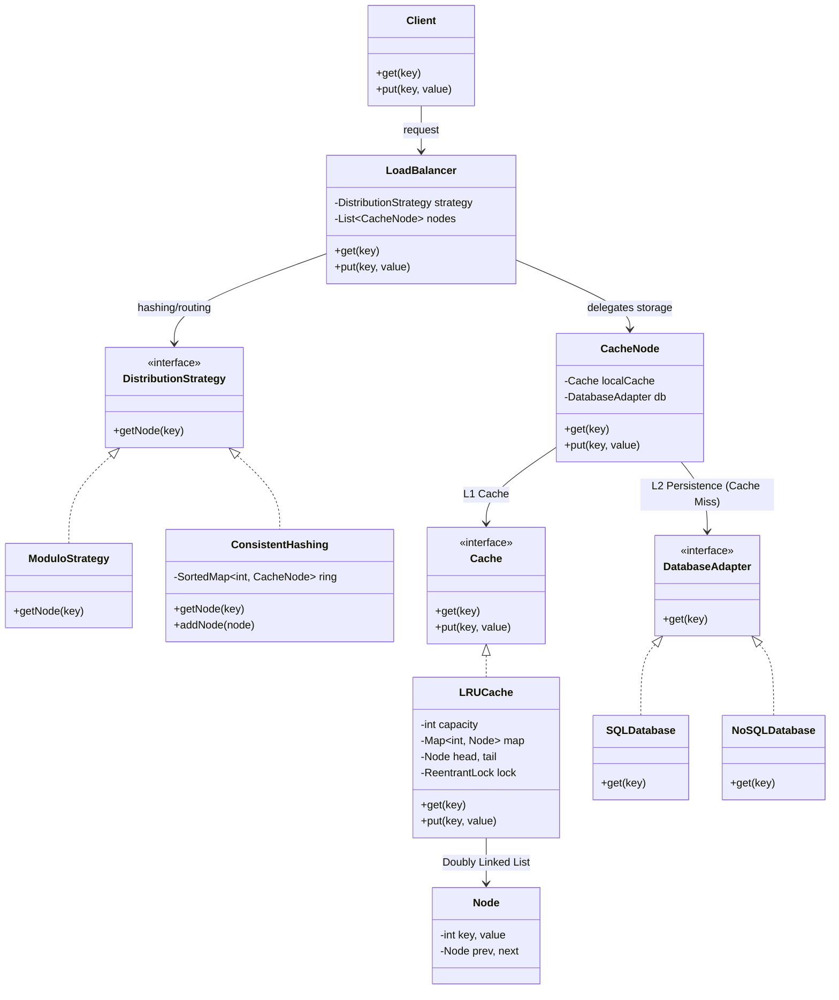

# Distributed Cache System Design

## 🏗️ Complete UML Architectural Design
The following diagram provides a comprehensive view of the Distributed Cache architecture, showing the interaction between the Client, Load Balancer, Cache Nodes, and Persistent Storage.

---

## 🧩 Component Breakdown

### 1. Load Balancing & Distribution
- **DistributionStrategy**: Decouples the routing logic.
- **Consistent Hashing**: Ensures minimal data reshuffling when nodes are added or removed.

### 2. Cache Node (LRU)
- **Local Cache**: Each node runs an independent LRU cache.
- **Concurrency**: `ReentrantLock` ensures thread safety within the cache operations.

### 3. Persistence Layer
- **Write-Through/Read-Through**: Cache nodes interact with a database adapter to ensure data consistency and survive cache misses.