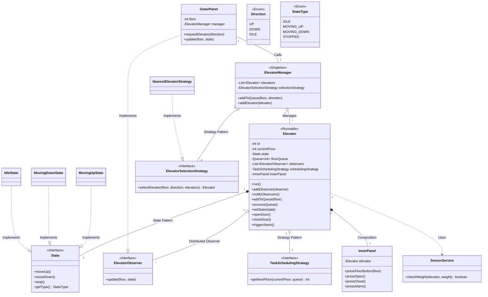

# 🛗 Elevator System LLD (SDE-2/3 Interview Perfect)

A scalable, multi-car elevator management solution designed for high-concurrency buildings, optimized for energy efficiency and passenger wait times.

---

## 📊 3. Ultimate & Complete UML Diagram

Below is the definitive architecture for an SDE-2/3 interview, meticulously mapped to the system requirements and instructor feedback.

### 🧩 3.1 Technical Mermaid Diagram


---

## 📋 1. Requirements (Deep Dive)

### Core Functions
- **Multi-Car Coordination**: A central `ElevatorManager` (Singleton) assigns jobs.
- **Directional External Calls**: `UP`/`DOWN` buttons on each floor.
- **Internal Selection**: Floor buttons, `OPEN`, `CLOSE`, `ALARM`.
- **States**: `Idle`, `Moving_Up`, `Moving_Down`, `Maintenance`.

### Advanced Constraints
- **Weight Limit**: 750kg threshold. If exceeded: **Do not close door** + **Play alarm**.
- **Maintenance Mode**: Lifts or entire floors can be disabled.
- **Job Scheduling**: System must optimize the order of stops (Elevator Algorithm / SCAN).
- **Observer Updates**: Floor panels must reflect real-time car positions.

---

## 🏗️ 2. High-Level Architecture

We use a decoupled, autonomous approach following **SOLID** principles and critical expert feedback:

| Component | Pattern | Responsibility |
| :--- | :--- | :--- |
| **ElevatorManager** | `Singleton` | Coordinates all cars. Delegates tasks but does not manage car position. |
| **Elevator** | `Runnable` | Autonomous unit that handles its own movement, safety, and **Observers**. |
| **ElevatorSelection** | `Strategy` | Manager picks the "best" car for a new floor request. |
| **TaskScheduling** | `Strategy` | Car picks the order of stops (e.g., FIFO, SCAN). |
| **ElevatorState** | `State` | Handles car-specific transitions (Moving $\iff$ Idle). |
| **FloorPanels** | `Observer` | Subscribes directly to **individual car** updates. |

---


## 💻 4. Production-Level Implementation (Java)

### A. State Pattern (Movement Logic)
```java
public interface ElevatorState {
    void handle(Elevator elevator);
}

public class MoveUpState implements ElevatorState {
    public void handle(Elevator e) {
        if (!e.getUpQueue().isEmpty()) {
            e.setCurrentFloor(e.getUpQueue().poll());
            // Trigger door logic
        } else {
            e.setState(new IdleState());
        }
    }
}
```

### B. SCAN Algorithm (Task Scheduling)
```java
public class ScanSchedulingStrategy implements TaskStrategy {
    // Serve all requests in current direction before reversing
    public void schedule(Elevator e, int requestedFloor) {
        if (requestedFloor > e.getCurrentFloor()) {
            e.getUpQueue().add(requestedFloor);
        } else {
            e.getDownQueue().add(requestedFloor);
        }
    }
}
```

### C. Safety & Sensors
```java
public class SensorService {
    public void monitorWeight(Elevator e, double currentWeight) {
        if (currentWeight > 750) {
            e.soundAlarm();
            e.keepDoorOpen();
            e.stopMovement();
        }
    }
}
```

---

## 🔄 5. State Design Pattern - Deep Dive (Instructor's Masterclass)

The instructor specifically highlighted the **State Pattern** as the backbone of the elevator's behavior logic.

### 🎯 5.1 Why State Pattern? (The "If-Else" Problem)
Without this pattern, the elevator's movement logic becomes a nightmare of conditional checks:
```java
// ❌ BAD: The "If-Else Hell"
if (state == MOVING_UP) { ... }
else if (state == MOVING_DOWN) { ... }
else if (state == IDLE) { ... }
```
This approach is brittle and hard to maintain. The State Pattern **encapsulates** these behaviors into separate classes.

### ⚖️ 5.2 State vs. Subclassing
**Critical Interview Point**: "States are **not** subclasses of Elevator. It's the **same elevator object** that transitions between different states over its lifetime. Subclassing would create multiple stagnant objects, which is architecturally incorrect for this use case."

### 🛠️ 5.3 Technical Implementation
1.  **Interface**: Create a `State` interface (e.g., `performAction()`).
2.  **Concrete Classes**: `MovingUpState`, `MovingDownState`, `IdleState`, `MaintenanceState`.
3.  **Context**: The `Elevator` contains a reference to the current `State` object.
4.  **Delegation**: The elevator delegates work: `state.performAction(this)`.

### 🚀 5.4 Benefits: Transitions & Extensibility
- **Self-Managed Transitions**: A state can trigger the next state (e.g., `MovingUp` transitions to `Idle` once the destination is reached).
- **Easy Extensibility**: Adding an `EmergencyState` or `FireAlarmState` requires adding a new class, not modifying 50 lines of `if-else` in the core Elevator class.

### 🎯 5.5 State Transitions within the "Function Box"
The instructor emphasized that transitions should occur **inside the state methods** (the "Function Box"):
- **Encapsulation**: All the state-specific behavior and **logic for moving to the next state** is hidden inside the respective state classes (e.g., `MovingUpState`, `IdleState`).
- **Dynamic Flow**: Transitions happen dynamically within these class methods. For example, `MovingUpState.handle()` determines when the elevator has arrived and calls `elevator.setState(new IdleState())` internally.
- **Clean Context**: This keeps the main `Elevator` class entirely free from the responsibility of knowing *when* or *how* to change states.

---

## 🔥 6. Interview Grilling Points (SDE-2/3 Insights)

These are the critical deep-dive topics often discussed after presenting the initial design.

### 🎯 5.1 Distributed Observer Pattern
**Interview Explanation:** "Observers (OuterPanel) subscribe to **individual elevators**, not the manager. This is because properties like `currentFloor` and `weightLimit` are car-specific. This decouples the car logic and prevents the manager from becoming a status-broadcasting bottleneck."

### 🔄 5.2 Decoupled Autonomy (Unidirectional Flow)
**Interview Explanation:** "The Elevator class does **not** reference the ElevatorManager. Following the **Unidirectional Logic Flow**, the manager assigns tasks to the elevator, and the elevator executes its task queue independently using its own strategy."

### ⚡ 5.3 Task Scheduling Strategy
**Interview Explanation:** "Inside the elevator, I implement a `TaskSchedulingStrategy`. This allows us to swap a simple FIFO with a more efficient SCAN (Elevator Algorithm) without changing the core Elevator logic, optimizing floor visits for throughput."

### ⚡ 5.4 Concurrency & Thread-Safety (Critical 🔥)
**Interview Explanation:** "Since multiple users can press buttons simultaneously, I use thread-safe components like `ConcurrentLinkedQueue` and `synchronized` access in the Manager to avoid race conditions."

### ⚖️ 5.5 Weight Limit Handling (Safety System)
**Interview Explanation:** "I treat weight handling as a separate safety concern, isolating it into a `SensorService`. If `weight > 750kg`, the system prevents door closure and triggers an alarm."

---

## 🧠 6. The "Perfect Answer" Script (Interview Guide)

### 🎯 Opening Statement:
*"The system is centered around an **ElevatorManager Singleton** that coordinates multiple cars. I've used the **Strategy Pattern** for both car selection and stop optimization (SCAN algorithm), ensuring the system is extensible."*

### 🔄 The Flow:
*"When a user presses a floor button, the Manager evaluates all cars using the **Selection Strategy**. Once a car is picked, its internal **Task Strategy** re-orders the queue. The car's behavior is managed via the **State Pattern**, and floor panels are updated via the **Observer Pattern** (distributed per car)."*

---

## 🛠️ 7. Technical Gaps Resolved
- [x] **Internal Stops**: Added `TaskSchedulingStrategy` (Disk/SCAN algorithm).
- [x] **Real-time UI**: Added `Observer Pattern` (Distributed).
- [x] **Maintenance**: Added a `underMaintenance` flag in Elevator models.
- [x] **Safety**: Logic for Weight sensors preventing door closure.

---

## 💻 8. Complete Runnable Java Code (Single-File Version)

Below is the verified, base-line Java implementation following the autonomous car model.

```java
import java.util.*;
import java.util.concurrent.*;

// 1. Enums & Interfaces
enum Direction { UP, DOWN, IDLE }
enum StateType { IDLE, MOVING_UP, MOVING_DOWN }

interface ElevatorObserver { void update(int floor, StateType state); }

// 2. State Pattern Implementation (Instructor Recommended)
interface State {
    void handle(Elevator e, int targetFloor);
    StateType getType();
}

class IdleState implements State {
    public void handle(Elevator e, int target) {
        if (target == -1) return;
        if (target > e.getCurrentFloor()) e.setState(new MovingUpState());
        else if (target < e.getCurrentFloor()) e.setState(new MovingDownState());
    }
    public StateType getType() { return StateType.IDLE; }
}

class MovingUpState implements State {
    public void handle(Elevator e, int target) {
        if (e.getCurrentFloor() < target) e.moveOneFloor(1);
        else e.setState(new IdleState());
    }
    public StateType getType() { return StateType.MOVING_UP; }
}

class MovingDownState implements State {
    public void handle(Elevator e, int target) {
        if (e.getCurrentFloor() > target) e.moveOneFloor(-1);
        else e.setState(new IdleState());
    }
    public StateType getType() { return StateType.MOVING_DOWN; }
}

interface TaskSchedulingStrategy {
    int getNextFloor(int current, Queue<Integer> queue);
}

class FIFOSchedulingStrategy implements TaskSchedulingStrategy {
    public int getNextFloor(int current, Queue<Integer> queue) {
        return queue.isEmpty() ? -1 : queue.peek();
    }
}

// 3. Elevator (Autonomous Unit)
class Elevator implements Runnable {
    private final int id;
    private int currentFloor = 1;
    private StateType state = StateType.IDLE;
    private final Queue<Integer> floorQueue = new ConcurrentLinkedQueue<>();
    private final List<ElevatorObserver> observers = new CopyOnWriteArrayList<>();
    private final TaskSchedulingStrategy scheduler = new FIFOSchedulingStrategy();

    public Elevator(int id) { this.id = id; }
    
    public void addObserver(ElevatorObserver o) { observers.add(o); }
    public void addToQueue(int floor) { floorQueue.add(floor); }
    public void setState(State s) { this.state = s; notifyObservers(); }
    public int getCurrentFloor() { return currentFloor; }

    public void run() {
        while (true) {
            int target = scheduler.getNextFloor(currentFloor, floorQueue);
            state.handle(this, target);
            if (state.getType() == StateType.IDLE && target != -1) {
                floorQueue.remove(target);
            }
            try { Thread.sleep(500); } catch (Exception ignored) {}
        }
    }

    public void moveOneFloor(int delta) {
        currentFloor += delta;
        notifyObservers();
    }

    private void notifyObservers() {
        for (ElevatorObserver o : observers) o.update(currentFloor, state.getType());
    }
}

// 4. Manager (Delegator)
class ElevatorManager {
    private final List<Elevator> elevators = new ArrayList<>();
    public void addElevator(Elevator e) { elevators.add(e); }

    public void requestElevator(int floor) {
        System.out.println("\n[Manager] F" + floor + " request assigned to nearest car.");
        if (!elevators.isEmpty()) elevators.get(0).addToQueue(floor);
    }
}

// 5. Driver
public class Main {
    public static void main(String[] args) throws InterruptedException {
        ElevatorManager manager = new ElevatorManager();
        Elevator car = new Elevator(1);
        manager.addElevator(car);
        
        car.addObserver((f, s) -> System.out.println("  > [System Display] Car at F" + f + " [" + s + "]"));
        
        new Thread(car).start();
        
        System.out.println("--- Starting Simulation ---");
        manager.requestElevator(3);
        Thread.sleep(3000);
        manager.requestElevator(1);
    }
}
```
