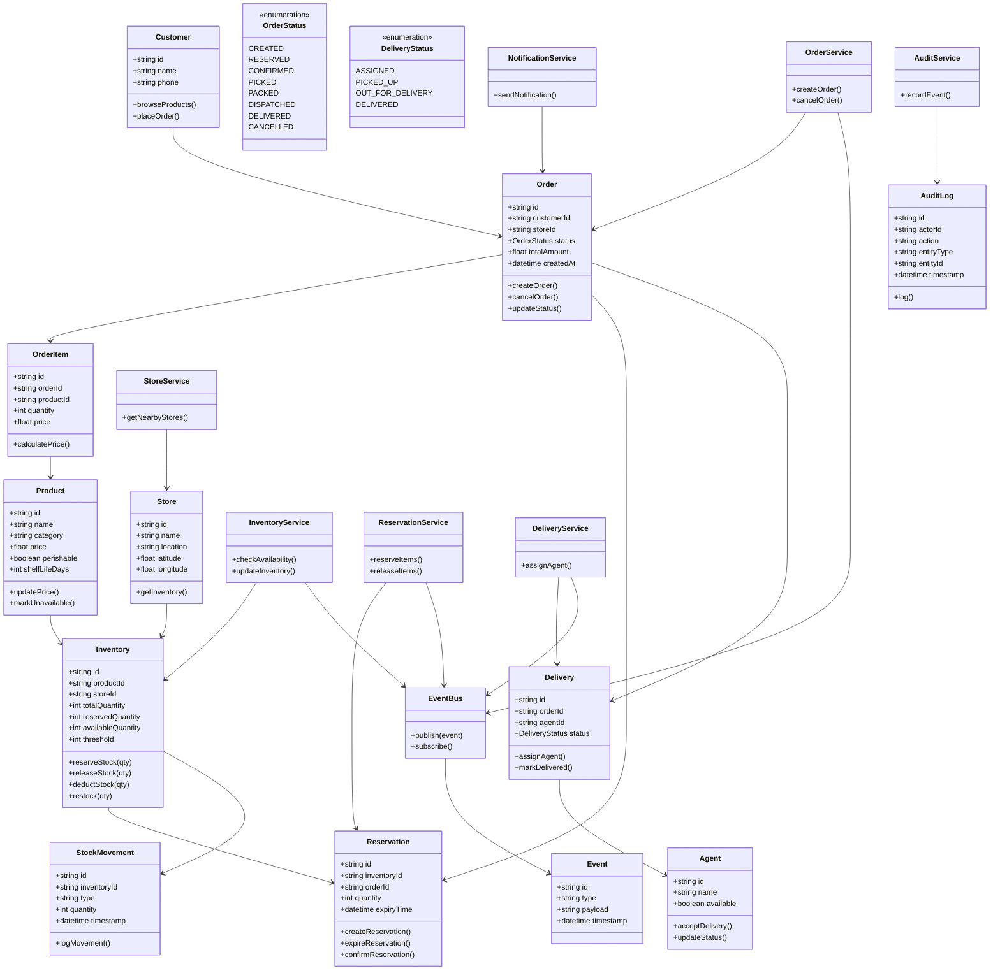

# 🏪 Instamart/Zepto: Inventory Management System Design

> **Instamart Inventory** is a real-time, hyper-local inventory management system designed for quick commerce (10-20 min delivery). It manages stock across 1000+ dark stores with strict consistency to prevent overselling during high-traffic peaks.

---

## 🎨 System Entities & UML Diagram

This diagram covers the core inventory lifecycle, reservation logic, and the interaction between orders and various services.

---

## 🧠 1. Entity Extraction (The Memory Trick)

> [!TIP]
> **Formula**: “Product lives in Store as Inventory, Order consumes it, Reservation protects it, and StockMovement tracks it.”

| Requirement Snippet | Extracted Entity |
| :--- | :--- |
| “Products available to browse” | **Product** |
| “Inventory per specific Dark Store” | **Inventory** |
| “Total Orders placed by users” | **Order** |
| “Individual items within an order” | **OrderItem** |
| “Holding stock for 5-10 mins during payment” | **Reservation** |
| “Tracking every increase/decrease in stock” | **StockMovement** |
| “Nearby physical mini-warehouse” | **Store** |
| “Who changed what and when” | **AuditLog** |

---

## 🔁 2. Inventory Lifecycle

`IN_STOCK` → `RESERVED` → `PICKED` → `PACKED` → `DISPATCHED` → `DELIVERED`

**Edge Cases**:
- `RESERVATION_EXPIRED`: Auto-reverts `RESERVED` quantity back to `AVAILABLE`.
- `CANCELLED`: Stock restored to inventory if order is cancelled before dispatch.

---

## ⚙️ 3. Core Functional Requirements

- **Real-Time Stock Updates**: Immediate reduction on order and restoration on failure.
- **Inventory Reservation**: Temporary hold (5-10 mins) to prevent overselling.
- **Substitution Engine**: Smart suggestions if an item becomes unavailable during picking.
- **Threshold Alerts**: Automatic notification when stock drops below a safety margin.
- **Batch Tracking**: Handling expiry-sensitive items like milk or bread.

---

## ⚡ 4. Concurrency & Scale (Top 1% Knowledge)

### 🔥 The Overselling Problem
During flash sales, multiple users may attempt to buy the last remaining item simultaneously. 

**Solutions**:
1.  **Distributed Caching (Redis)**: Use `DECRBY` (atomic) for ultra-fast stock counters.
2.  **Pessimistic Locking**: Lock the DB row for the specific `inventory_id` during the transaction.
3.  **Optimistic Locking**: Use a version column (`WHERE version = 5`) to detect concurrent updates.

### 📶 Offline & Sync
While rare in dark stores, the system handles manual inventory audits via a sync service that resolves conflicts using server-priority rules.

---

## 🧩 5. Advanced Features

- **Demand Prediction**: Machine learning to predict stock needs per dark store based on historic weather/event data.
- **Smart Substitution**: Context-aware replacement suggestions (e.g., suggesting another brand of Full Cream milk if one is out).
- **Event-Driven Architecture**: Fully decoupled via an Event Bus (Kafka) for `OrderPlaced`, `StockReserved`, and `ItemOutOfStock` events.

---

## 🎯 Interview Summary Point
> "I designed the Instamart Inventory system around the concept of **'Inventory Reservations'** to ensure strict consistency in a hyper-local environment. By decoupling the inventory state into sub-quantities (Total, Reserved, Available) and using atomic Redis operations, the system can handle thousands of orders per second without overselling, while maintaining a complete audit trail through StockMovement logs."
