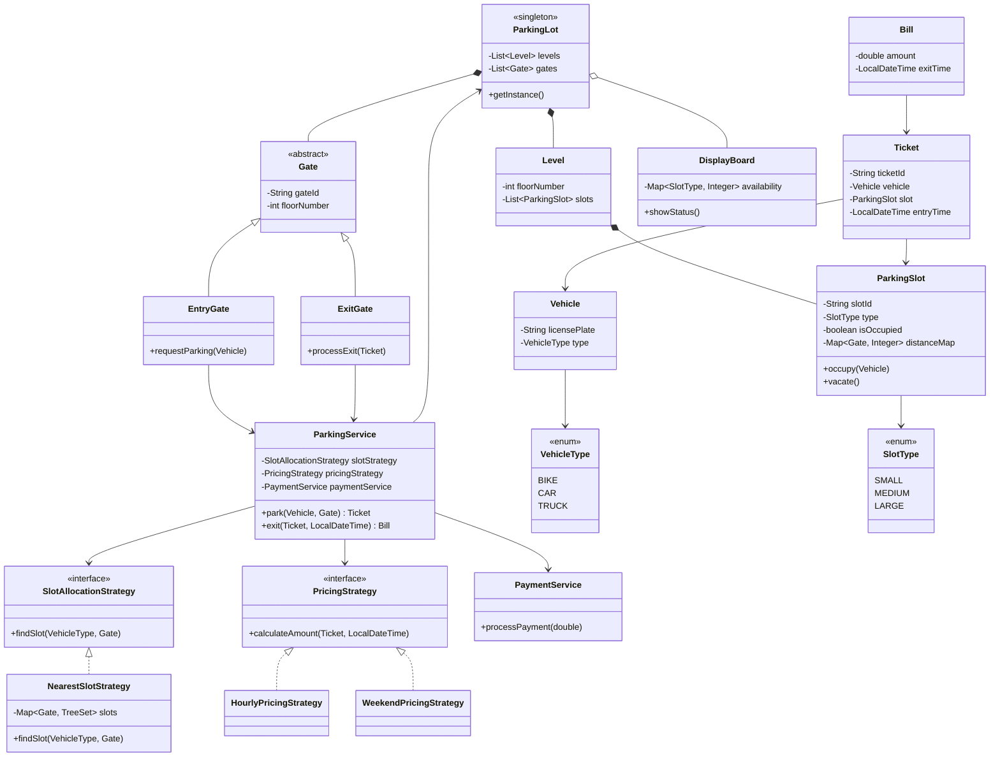

# 🅿️ Parking Lot Design — SDE-2 Production Guide

A high-performance, concurrent, and modular Parking Lot system evolved from V0 to V3.

---

## 📊 1. Class Diagram



---

## 💻 2. Full Java Implementation (All-in-One Registry)

```java
import java.time.*;
import java.util.*;
import java.util.concurrent.*;
import java.util.concurrent.atomic.AtomicInteger;

// ================= ENUMS =================
enum VehicleType { BIKE, CAR, TRUCK }
enum SlotType { SMALL, MEDIUM, LARGE }

// ================= VEHICLE =================
class Vehicle {
    String licensePlate;
    VehicleType type;

    public Vehicle(String licensePlate, VehicleType type) {
        this.licensePlate = licensePlate;
        this.type = type;
    }
}

// ================= SLOT =================
class ParkingSlot {
    String slotId;
    SlotType type;
    boolean isOccupied;
    Map<Gate, Integer> distanceMap = new HashMap<>();

    public ParkingSlot(String id, SlotType type) {
        this.slotId = id;
        this.type = type;
    }

    public synchronized void occupy(Vehicle v) {
        this.isOccupied = true;
    }

    public synchronized void vacate() {
        this.isOccupied = false;
    }

    public boolean isAvailable() {
        return !isOccupied;
    }
}

// ================= LEVEL =================
class Level {
    int floorNumber;
    List<ParkingSlot> slots = new ArrayList<>();

    public Level(int floorNumber) {
        this.floorNumber = floorNumber;
    }
}

// ================= GATE =================
abstract class Gate {
    String gateId;
    int floorNumber;

    public Gate(String id, int floor) {
        this.gateId = id;
        this.floorNumber = floor;
    }
}

class EntryGate extends Gate {
    public EntryGate(String id, int floor) {
        super(id, floor);
    }

    public Ticket requestParking(Vehicle v, ParkingService service) {
        return service.park(v, this);
    }
}

class ExitGate extends Gate {
    public ExitGate(String id, int floor) {
        super(id, floor);
    }

    public Bill processExit(Ticket t, ParkingService service) {
        return service.exit(t, LocalDateTime.now());
    }
}

// ================= TICKET =================
class Ticket {
    static AtomicInteger counter = new AtomicInteger(0);

    String ticketId;
    Vehicle vehicle;
    ParkingSlot slot;
    LocalDateTime entryTime;

    public Ticket(Vehicle v, ParkingSlot slot) {
        this.ticketId = "T-" + counter.incrementAndGet();
        this.vehicle = v;
        this.slot = slot;
        this.entryTime = LocalDateTime.now();
    }
}

// ================= BILL =================
class Bill {
    double amount;
    LocalDateTime exitTime;

    public Bill(double amount) {
        this.amount = amount;
        this.exitTime = LocalDateTime.now();
    }
}

// ================= STRATEGY =================
interface SlotAllocationStrategy {
    ParkingSlot findSlot(VehicleType type, Gate gate);
}

class NearestSlotStrategy implements SlotAllocationStrategy {

    Map<Gate, TreeSet<ParkingSlot>> slots = new HashMap<>();

    @Override
    public ParkingSlot findSlot(VehicleType type, Gate gate) {
        TreeSet<ParkingSlot> set = slots.get(gate);
        if (set == null) return null;

        for (ParkingSlot slot : set) {
            if (slot.isAvailable() && canFit(type, slot.type)) {
                return slot;
            }
        }
        return null;
    }

    private boolean canFit(VehicleType v, SlotType s) {
        switch (v) {
            case BIKE: return true;
            case CAR: return s == SlotType.MEDIUM || s == SlotType.LARGE;
            case TRUCK: return s == SlotType.LARGE;
        }
        return false;
    }
}

// ================= PRICING =================
interface PricingStrategy {
    double calculateAmount(Ticket t, LocalDateTime exit);
}

class HourlyPricingStrategy implements PricingStrategy {
    public double calculateAmount(Ticket t, LocalDateTime exit) {
        long hours = Duration.between(t.entryTime, exit).toHours();
        if (hours == 0) hours = 1;
        return 10 + hours * 5;
    }
}

class WeekendPricingStrategy implements PricingStrategy {
    PricingStrategy base;
    public WeekendPricingStrategy(PricingStrategy base) { this.base = base; }

    public double calculateAmount(Ticket t, LocalDateTime exit) {
        double amt = base.calculateAmount(t, exit);
        DayOfWeek d = exit.getDayOfWeek();
        if (d == DayOfWeek.SATURDAY || d == DayOfWeek.SUNDAY) {
            return amt * 1.5;
        }
        return amt;
    }
}

// ================= PAYMENT =================
class PaymentService {
    public void processPayment(double amount) {
        System.out.println("Processing Payment: $" + String.format("%.2f", amount));
    }
}

// ================= PARKING LOT =================
class ParkingLot {
    private static ParkingLot instance;

    List<Level> levels = new ArrayList<>();
    List<Gate> gates = new ArrayList<>();

    private ParkingLot() {}

    public static ParkingLot getInstance() {
        if (instance == null) instance = new ParkingLot();
        return instance;
    }
}

// ================= SERVICE =================
class ParkingService {
    SlotAllocationStrategy slotStrategy;
    PricingStrategy pricingStrategy;
    PaymentService paymentService;

    public ParkingService(SlotAllocationStrategy s,
                          PricingStrategy p,
                          PaymentService pay) {
        this.slotStrategy = s;
        this.pricingStrategy = p;
        this.paymentService = pay;
    }

    public Ticket park(Vehicle v, Gate gate) {
        ParkingSlot slot = slotStrategy.findSlot(v.type, gate);

        if (slot == null) {
            System.err.println("❌ Entry Failed: No Slot available for Vehicle " + v.licensePlate);
            return null;
        }

        synchronized (slot) {
            if (!slot.isAvailable()) return null;
            slot.occupy(v);
        }

        return new Ticket(v, slot);
    }

    public Bill exit(Ticket t, LocalDateTime exitTime) {
        double amt = pricingStrategy.calculateAmount(t, exitTime);
        t.slot.vacate();
        paymentService.processPayment(amt);
        return new Bill(amt);
    }
}

// ================= MAIN (TEST DEMO) =================
public class Main {
    public static void main(String[] args) throws InterruptedException {
        System.out.println("🚀 Executing Parking Lot Demonstration Suite...\n");

        ParkingLot lot = ParkingLot.getInstance();

        // Setup
        Level l1 = new Level(1);
        ParkingSlot s1 = new ParkingSlot("S1", SlotType.SMALL);
        ParkingSlot s2 = new ParkingSlot("S2", SlotType.MEDIUM);
        l1.slots.addAll(Arrays.asList(s1, s2));
        lot.levels.add(l1);

        EntryGate g1 = new EntryGate("G1", 1);
        ExitGate g2 = new ExitGate("G2", 1);
        lot.gates.addAll(Arrays.asList(g1, g2));

        NearestSlotStrategy strategy = new NearestSlotStrategy();
        strategy.slots.put(g1, new TreeSet<>(Comparator.comparing(a -> a.slotId)));
        strategy.slots.get(g1).addAll(l1.slots);

        ParkingService service = new ParkingService(
                strategy,
                new HourlyPricingStrategy(),
                new PaymentService()
        );

        // Run
        Vehicle v = new Vehicle("KA-01", VehicleType.CAR);
        Ticket t = g1.requestParking(v, service);
        if (t != null) {
            System.out.println("✅ Parked: " + t.ticketId + " at " + t.slot.slotId);
        }

        Bill b = g2.processExit(t, service);
        System.out.println("💵 Final Bill Amount: $" + b.amount);
    }
}
```
