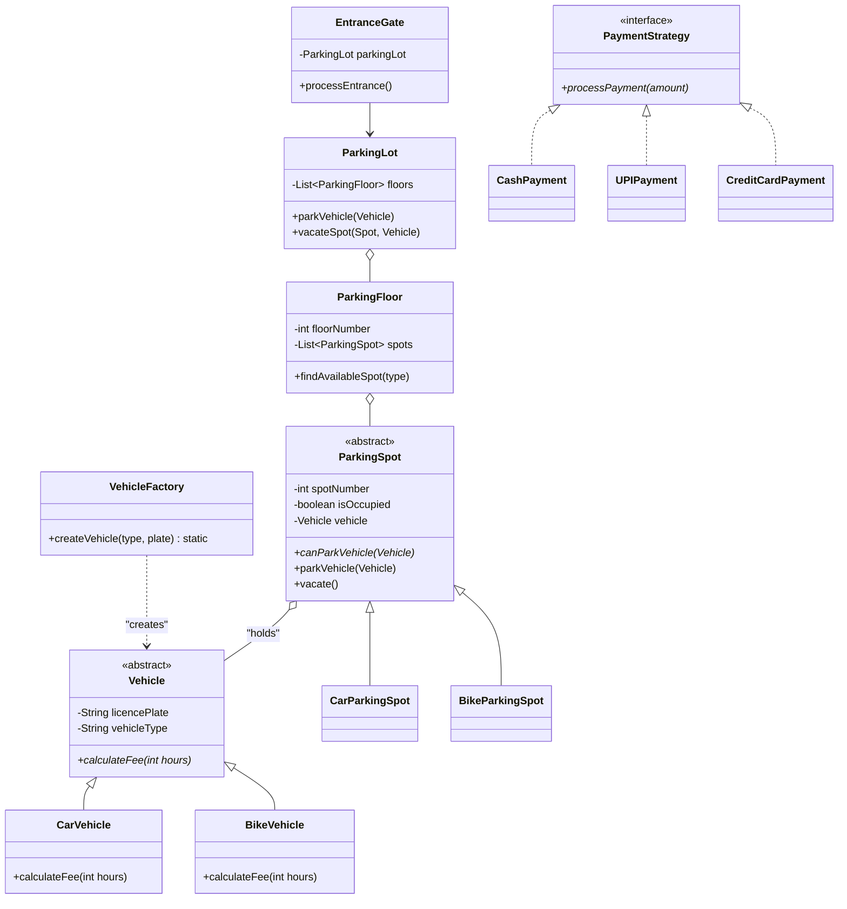

# 🏎️ Parking Lot System – Notion Style (Interview-Ready)

This is a production-grade Low-Level Design (LLD) of a **Multi-Level Parking Lot System**. It follows **SOLID principles** and uses **Design Patterns** to ensure scalability and maintainability.

---

## 📊 UML Diagram (Visual Structure)



---

## 🧩 Core Components (Explained for Viva)

### 1. 🏎️ The Vehicle Layer (`vehicles/`)
- **Vehicle (Abstract)**: The base class for all vehicles. It defines the core attributes like `licencePlate`.
- **Factory Pattern**: We use a `VehicleFactory` to create objects. When a user enters "Car", the factory gives us a `CarVehicle` object. This decouples the creation logic from the main code.

### 2. 🅿️ The Parking Structure (`parkinglot/`)
- **ParkingSpot**: An abstract base class. Each spot "knows" if it's occupied and which vehicle is parked there.
- **ParkingFloor**: A collection of spots. It handles finding the first available spot for a specific type (Car/Bike).
- **ParkingLot (Singleton Concept)**: The central manager that coordinates multiple floors.

### 3. 🚪 The Gate System (`gates/`)
- **Entrance Gate**: Handles the "Check-in". It takes user input, creates a vehicle using the factory, and asks the `ParkingLot` to find a spot.
- **Exit Gate**: Handles the "Check-out". It calculates the fee based on hours stayed and triggers the payment.

### 4. 💸 The Payment System (`payments/`)
- **Strategy Pattern**: Since there are multiple ways to pay (Cash, UPI, Card), we use the Strategy Pattern. This allows us to add a new payment method (like Bitcoin) in the future without changing the `PaymentService` code (**Open-Closed Principle**).

---

## 🏆 Viva-Ready Thumb Rules

1. **Why Abstract Classes?**
   - We use `Vehicle` and `ParkingSpot` as abstract classes because you shouldn't be able to "park" a generic vehicle; it must be a specific type like a Car or Bike.

2. **How is Decoupling achieved?**
   - The `Main` class doesn't know how a fee is calculated. It just calls `vehicle.calculateFee()`. This is **Polymorphism** in action.

3. **What happens during Entrance?**
   - User Input → `VehicleFactory` creates Vehicle → `ParkingLot` finds Spot → `spot.parkVehicle(v)` sets state.

4. **What happens during Exit?**
   - `Vehicle` calculates its own fee → `PaymentStrategy` processes it → `spot.vacate()` clears the spot.

---

## 💻 Running the Project
Use the included helper script:
```bash
./parking_lot/run.sh
```

---
*Developed as part of LLD Interview preparation.*
