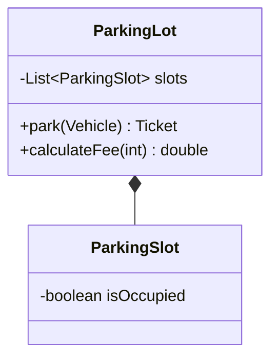
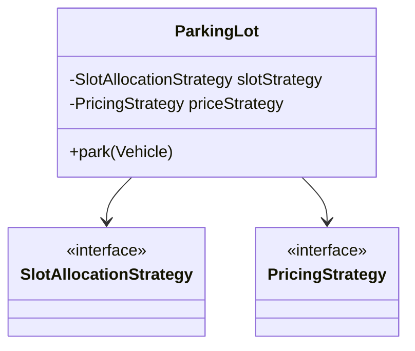
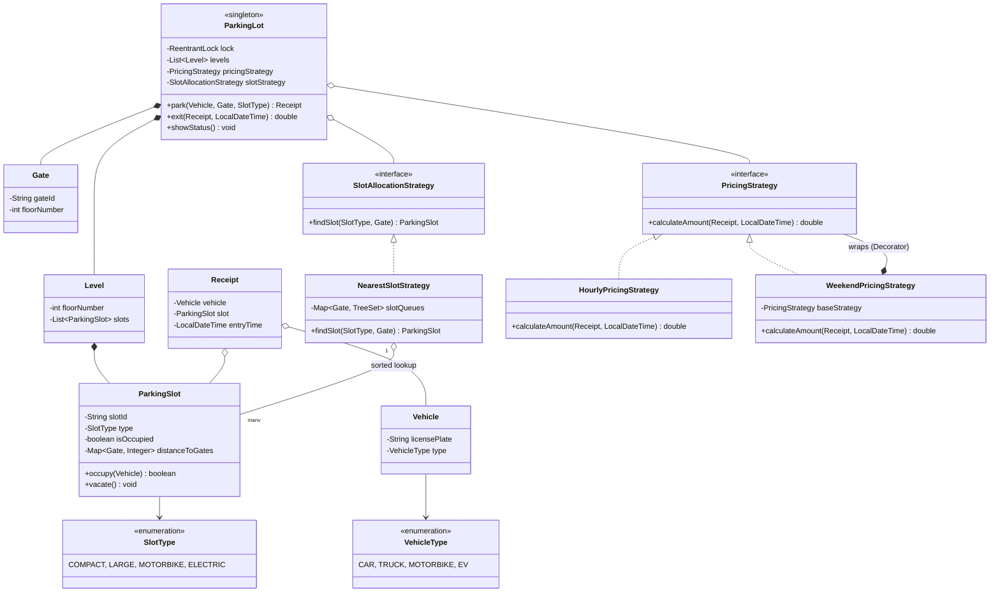
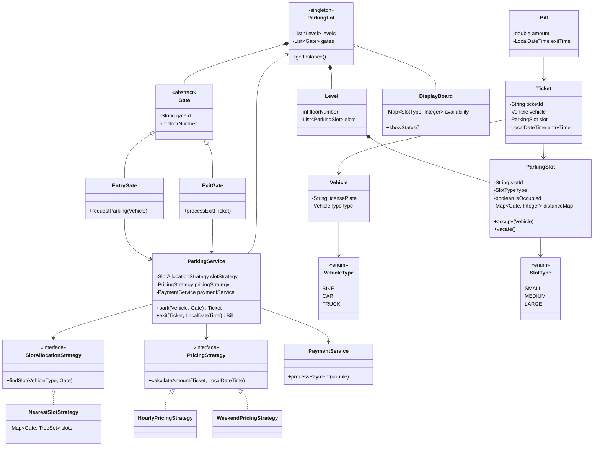
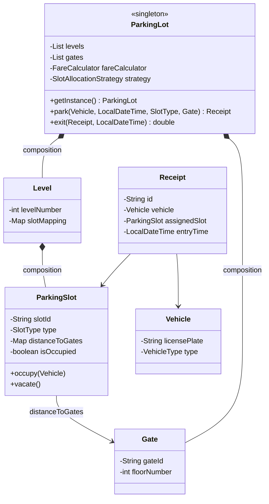
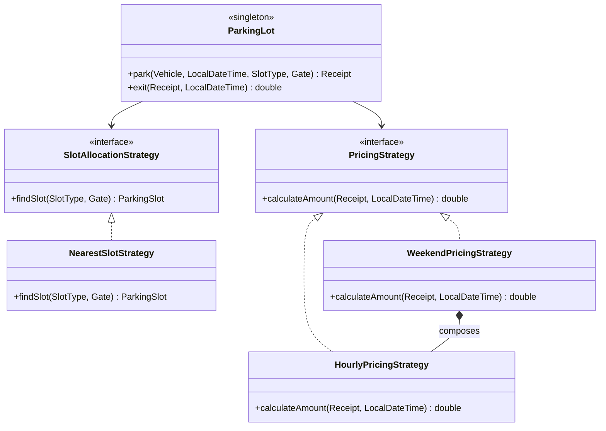
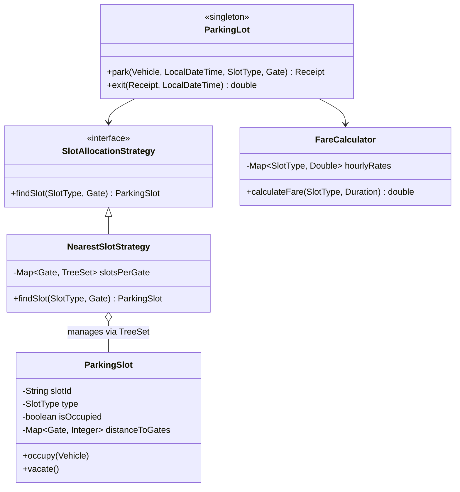

# 🅿️ Multi-Level Parking Lot: Comprehensive SDE-2 Interview Guide

This repository contains the Object-Oriented Design (OOD) evolution of a Multi-Level Parking Lot System, progressing from a simple monolithic script to a high-performance architecture using **Strategy Patterns**, **Singleton**, and **Concurrent Optimizations**.

---

## 🏗️ Step 1: V0 - The Basic Monolith Approach

**The Problem:** Most juniors start by putting all logic inside the `ParkingLot` class. Finding a slot involves an $O(N)$ scan through all levels and slots. Pricing is hardcoded (e.g., $20/hr).
**Why it fails:** This violates **SRP** and **OCP**. If you want to add a "Weekend Discount" or a "Nearest Slot" algorithm, you have to rewrite the core `ParkingLot` class.

### 💻 V0 Code & Main Execution
```java
class ParkingLot {
    List<ParkingSlot> slots;
    public Ticket park(Vehicle v) {
        // O(N) Linear Scan
        for (ParkingSlot slot : slots) {
            if (!slot.isOccupied()) {
                slot.occupy(v);
                return new Ticket(v, slot);
            }
        }
        return null;
    }
    public double calculateFee(int hours) {
        return hours * 20.0; // Hardcoded pricing
    }
}

public class Main {
    public static void main(String[] args) {
        ParkingLot lot = new ParkingLot();
        // ... init slots ...
        Ticket t = lot.park(new Vehicle("KA-01-1234"));
        System.out.println("Fee for 3 hours: " + lot.calculateFee(3));
    }
}
```

### 📊 V0 UML Architecture


---

## 🛠️ Step 2: V1 - Strategy Pattern (Decoupling)

**The Fix:** We extract the **Slot Allocation** and **Pricing** logic into the **Strategy Pattern**. 
Now, the `ParkingLot` is a "Conductor" that delegates work. You can add new pricing rules (Hourly, Flat, Weekend) without touching the `ParkingLot` class.

### 💻 V1 Code & Main Execution
```java
// 1. Strategies
public interface SlotAllocationStrategy {
    ParkingSlot findSlot(List<Level> levels);
}

public interface PricingStrategy {
    double calculateAmount(long hours);
}

// 2. Abstract implementations
public class HourlyPricingStrategy implements PricingStrategy {
    public double calculateAmount(long hrs) { return hrs * 20.0; }
}

// 3. Decoupled ParkingLot
public class ParkingLot {
    private SlotAllocationStrategy allocationStrategy;
    private PricingStrategy pricingStrategy;

    public Ticket park(Vehicle v) {
        ParkingSlot slot = allocationStrategy.findSlot(levels);
        if (slot != null) {
            slot.occupy(v);
            return new Ticket(v, slot);
        }
        return null;
    }
}

public class Main {
    public static void main(String[] args) {
        ParkingLot lot = ParkingLot.getInstance();
        lot.setPricingStrategy(new HourlyPricingStrategy());
        lot.setSlotAllocationStrategy(new FirstAvailableStrategy());
        
        Ticket t = lot.park(new Vehicle("SUV-789"));
    }
}
```

### 📊 V1 UML Architecture


---

## 🚀 Step 3: V2 - Optimization & Concurrency ($O(\log N)$)

**The Problem:** In large lots, scanning thousands of slots is slow. Also, if two cars enter different gates at once, they might both "book" the same slot.
**The Fix:** 
1. **TreeSet ($O(\log N)$):** Store slots in a `TreeSet` sorted by distance to the gate.
2. **Locking:** Use `ReentrantLock` for thread safety and `synchronized` for memory consistency.

### 💻 V2 Complete Architecture
```java
public class NearestSlotStrategy implements SlotAllocationStrategy {
    // Every gate has its own TreeSet of slots sorted by distance!
    private Map<Gate, TreeSet<ParkingSlot>> slotQueues;

    public ParkingSlot findSlot(SlotType type, Gate entryGate) {
        TreeSet<ParkingSlot> set = slotQueues.get(entryGate);
        for (ParkingSlot slot : set) {
            // Lazy Deletion: Check object state instead of removing from all sets
            if (!slot.isOccupied() && slot.getType() == type) return slot;
        }
        return null;
    }
}

public class ParkingLot {
    private final ReentrantLock lock = new ReentrantLock();

    public Ticket park(Vehicle v, Gate gate) {
        lock.lock(); // Ensure only one car is assigned at a time
        try {
            ParkingSlot slot = slotStrategy.findSlot(v.getType(), gate);
            if (slot != null) {
                slot.occupy(v); // Internally synchronized
                return new Ticket(v, slot);
            }
        } finally {
            lock.unlock();
        }
        return null;
    }
}

public class Main {
    public static void main(String[] args) {
        ParkingLot lot = ParkingLot.getInstance();
        lot.setSlotAllocationStrategy(new NearestSlotStrategy());
        
        // Concurrent parking simulation
        new Thread(() -> lot.park(new Vehicle("V1"), gateA)).start();
        new Thread(() -> lot.park(new Vehicle("V2"), gateB)).start();
    }
}
```

---

## 🎤 Viva & Interview Cheat Sheet

### 1. "How do you ensure scale?"
> *"I replaced $O(N)$ scanning with **$O(\log N)$ lookup using TreeSets**. Each gate maintains its own sorted view of available slots, ensuring the assignment is always the absolute 'nearest' to that entrance."*

### 2. "How do you handle 'Double Booking'?"
> *"I use a two-layered defense: First, a **ReentrantLock** on the entry API ensures only one request is processed at a time. Second, the **isOccupied** check on the `ParkingSlot` object acts as a source of truth for all disparate gate-queues (Lazy Deletion)."*

### 3. "Why use the Strategy Pattern?"
> *"It makes the system **OCP compliant**. If we introduce an 'Electric Vehicle' pricing rule, we just create a new `PricingStrategy` class. We don't touch the `ParkingLot` or `Ticket` classes at all."*

### 4. "What is the Singleton's role?"
> *"The `ParkingLot` must be a **Singleton**. If we had multiple instances, they would maintain different lists of available slots, leading to catastrophic data inconsistency and over-booking."*

---

## 📊 4. Final Unified System UML



---


# 🅿️  Part 3: Parking Lot Design

A complex machine coding challenge covering multi-level parking, slot allocation strategies, fare computation, and concurrency handling.

⸻

### 🧱 1. Comprehensive Requirements

Based on the detailed system needs, here is the breakdown of the multi-level parking lot:

#### 🏢 Parking Lot Structure & Initialization
- **Components**: Multiple floors, multiple entry gates (can be on different floors), and multiple exit gates.
- **Initialization**: Provide number of floors, slots, gates, and distance maps. System should maintain the current state of the parking lot (Data Persistence).

#### 🚗 Vehicles & Slots
- **Vehicle Information**: Number, color, and model (optional).
- **Parking Slot Types**: `SMALL` (two-wheelers), `MEDIUM` (cars), `LARGE` (buses).
- **Vehicle-Slot Compatibility**: Smaller vehicles can park in larger slots if needed (e.g., a two-wheeler in a car slot).
- **Extensibility**: Design should allow for easy addition of new slot types in the future.

#### 🎟️ Core APIs
1. **`generateParkingTicket(vehicleDetails, inTime, requestedSlotType, entryGate)`**
   - Output: Parking Ticket (Vehicle details, Entry time, Entry gate info, Assigned slot info).
   - **Slot Assignment**: Assesses the *nearest available slot* of the requested type from the entry gate (considering slots across different floors).
   - **Slot Mapping**: Requires a distance matrix ( \times N$, where $ is entry gates and $ is slots) to calculate distances efficiently.
   - **Edge Cases**: Handle scenarios where no slots are available, or a vehicle requests a larger slot.

2. **`generateBill(parkingTicket, outTime)`**
   - Output: Total amount to be paid.
   - **Pricing**: Different hourly rates for different slot types.
   - **Billing Rule**: Payment is based strictly on the **slot type used**, not the vehicle type. Extensible to support new pricing strategies.

3. **`showStatus()`**
   - Display available slots for each type (`SMALL`, `MEDIUM`, `LARGE`).
   - Assumes a display board at each entry gate querying this API, and a dashboard for viewing status.

#### ⚙️ Non-Functional Requirements
- **Concurrency Handling**: Ensure the same slot is not double-assigned to multiple vehicles simultaneously.
- **Performance**: Requires an efficient algorithm for finding the nearest available slot.
- **Error Handling**: Appropriate error messages or exceptions for invalid inputs or operations (e.g., full parking lot).

⸻

### 🔑 2. Core Entities & Key Insights

```
ParkingLot (Singleton)
 ├── Level[]          (one per floor)
 │    └── ParkingSlot[]    (categorized by SlotType)
 ├── Gate[]           (entry points at floor 0)
 ├── FareCalculator   (Strategy)
 └── SlotAllocationStrategy  (Strategy)
```

> [!NOTE]
> **`ParkingSlot` stores a `Map<Gate, Integer> distanceToGates`** — this is the key data structure enabling the "nearest gate" allocation strategy.

⸻

### 🎲 3. Class Design (V0 — Basic Structure)

#### Enums
```java
public enum SlotType    { SMALL, MEDIUM, LARGE }
public enum VehicleType { TWO_WHEELER, CAR, TRUCK }
```

#### ParkingLot (Singleton)
```java
public class ParkingLot {
    private static ParkingLot instance;
    private List<Level> levels;
    private List<Gate> gates;
    private FareCalculator fareCalculator;
    private SlotAllocationStrategy slotAllocationStrategy;

    private ParkingLot() {}

    public static ParkingLot getInstance() {
        if (instance == null) instance = new ParkingLot();
        return instance;
    }

    public Receipt park(Vehicle vehicle, LocalDateTime entryTime,
                        SlotType slotType, Gate entryGate) {
        ParkingSlot slot = slotAllocationStrategy.findSlot(slotType, entryGate);
        if (slot == null) throw new NoAvailableSlotException();
        slot.occupy(vehicle);
        return new Receipt(vehicle, slot, entryTime);
    }

    public double exit(Receipt receipt, LocalDateTime exitTime) {
        Duration duration = Duration.between(receipt.getEntryTime(), exitTime);
        double amount = fareCalculator.calculateFare(receipt.getSlot().getType(), duration);
        receipt.getSlot().vacate();
        return amount;
    }
}
```

#### 📊 V0 UML — Core Entities



⸻


### 🚀 4. Strategy Pattern — Slot Allocation & Fare

#### SlotAllocationStrategy
The `SlotAllocationStrategy` interface deeply decouples the slot-finding algorithm from the `ParkingLot`. This modularity permits dynamic routing behavior:
- **`NearestSlotStrategy`**: Proximity-based routing. Uses an optimized **`TreeSet`** (or **`PriorityQueue`** with lazy deletion) to guarantee extremely scalable (\log N)$ lookup speeds for the closest gate distance.
- **`RandomSlotStrategy`**: Non-proximity fallback. Automatically grabs the first blindly available slot.

```java
public interface SlotAllocationStrategy {
    ParkingSlot findSlot(SlotType slotType, Gate entryGate);
}

// 🟢 Strategy 1: Optimized Distance-Based Allocation (TreeSet / PriorityQueue)
public class NearestSlotStrategy implements SlotAllocationStrategy {
    private Map<Gate, PriorityQueue<ParkingSlot>> slotQueues;

    public NearestSlotStrategy() {
        slotQueues = new HashMap<>();
    }

    public void addSlot(Gate gate, ParkingSlot slot) {
        slotQueues.computeIfAbsent(gate, k -> new PriorityQueue<>((a, b) -> 
            Integer.compare(getDistance(gate, a), getDistance(gate, b))))
            .offer(slot);
    }

    @Override
    public ParkingSlot findSlot(SlotType slotType, Gate entryGate) {
        PriorityQueue<ParkingSlot> queue = slotQueues.get(entryGate);
        if (queue == null) return null;
        
        while (!queue.isEmpty()) {
            ParkingSlot slot = queue.poll();
            if (!slot.isOccupied() && slot.getType() == slotType) {
                return slot;
            }
        }
        return null;
    }

    private int getDistance(Gate gate, ParkingSlot slot) {
        // Implementation to calculate distance from precomputed map
        return slot.getDistanceToGates().getOrDefault(gate, Integer.MAX_VALUE);
    }
}

// 🔵 Strategy 2: Random / First-Available Slot Allocation
public class RandomSlotStrategy implements SlotAllocationStrategy {
    private List<ParkingSlot> allSlots;

    public RandomSlotStrategy(List<ParkingSlot> allSlots) {
        this.allSlots = allSlots;
    }

    @Override
    public ParkingSlot findSlot(SlotType slotType, Gate entryGate) {
        return allSlots.stream()
                .filter(slot -> !slot.isOccupied() && slot.getType() == slotType)
                .findFirst()
                .orElse(null);
    }
}
```

> [!NOTE] 
> #### 🧠 The Priority Queue Consistency Problem
>
> **Initial Setup:**
> - For each entry gate (E1, E2, E3, etc.), a separate priority queue was maintained.
> - Each priority queue contained all available slots, ordered by their distance from that particular entry gate.
>
> **The Problem:**
> - When a vehicle enters from a particular gate (let's say E1), the nearest available slot (S2) is popped from E1's priority queue and assigned to the vehicle.
> - However, S2 is still present in the priority queues of other entry gates (E2, E3, etc.).
> - This leads to a situation where S2 might be assigned to another vehicle entering from a different gate, even though it's already occupied.
>
> **The Challenge:**
> - To maintain consistency, when a slot (S2) is assigned from one priority queue (E1), it needs to be removed from all other priority queues as well.
> - However, removing a specific element from a priority queue that isn't at the top is an $\mathcal{O}(N)$ operation, which is inefficient.
>
> **Proposed Solution (Lazy Deletion & Object References):**
> - Instead of explicitly removing the slot from all queues, we **mark it as unavailable** in the `ParkingSlot` object itself (`isOccupied = true`).
> - **Consistency Across Queues:** Because Java uses object references, the *exact same* `ParkingSlot` object exists in all priority queues. Marking it unavailable in one queue effectively marks it unavailable for all queues immediately!
> - When finding a slot, we simply check if it's available before assigning it. If it's already occupied (assigned by another gate), we naturally filter it out and keep popping.
> - This clever use of object references effectively drops the time complexity from $\mathcal{O}(N \log N)$ down to $\mathcal{O}(\log N)$ for each slot assignment.
>
> **Implementation Details (Slot Object):**
> ```java
> class ParkingSlot {
>     private boolean isOccupied;
>     // other attributes...
> 
>     public boolean isOccupied() { return isOccupied; }
>     public void occupy(Vehicle v) { this.isOccupied = true; }
>     public void vacate() { this.isOccupied = false; }
> }
> ```
>
> **Time Complexity Summary:**
> - Popping the minimum from a priority queue is $\mathcal{O}(\log N)$.
> - But removing a specific element (other than the minimum) from a priority queue is $\mathcal{O}(N)$.
> - By using the availability flag in the `ParkingSlot` object, we avoid the need for $\mathcal{O}(N)$ removals from other queues.
> 
> *This issue highlights the importance of considering data consistency across different data structures in a system, especially when dealing with multiple entry points or views of the same data.*

#### Pricing Strategy (Fare Calculation)
The strategy pattern allows for flexible pricing rules, enabling composition of rules like hourly plus weekend multipliers.

```java
public interface PricingStrategy { 
    double calculateAmount(Receipt ticket, LocalDateTime exitTime); 
}

public class HourlyPricingStrategy implements PricingStrategy { 
    private static final double BASE_PRICE = 10;
    private static final double HOURLY_RATE = 5;

    @Override
    public double calculateAmount(Receipt ticket, LocalDateTime exitTime) {
        long durationInHours = ChronoUnit.HOURS.between(ticket.getEntryTime(), exitTime);
        return BASE_PRICE + (durationInHours * HOURLY_RATE);
    }
}

public class WeekendPricingStrategy implements PricingStrategy {
    private static final double WEEKEND_MULTIPLIER = 1.5;
    private HourlyPricingStrategy baseStrategy = new HourlyPricingStrategy();

    @Override
    public double calculateAmount(Receipt ticket, LocalDateTime exitTime) {
        double baseAmount = baseStrategy.calculateAmount(ticket, exitTime);
        if (isWeekend(exitTime)) {
            return baseAmount * WEEKEND_MULTIPLIER;
        }
        return baseAmount;
    }

    private boolean isWeekend(LocalDateTime exitTime) {
        DayOfWeek day = exitTime.getDayOfWeek();
        return day == DayOfWeek.SATURDAY || day == DayOfWeek.SUNDAY;
    }
}
```

#### 📊 V1 UML — Strategies Introduced



⸻

### ⚠️ 5. Concurrency Issue & Fix

> [!WARNING]
> **Race Condition**: When two vehicles enter from different gates simultaneously, `findSlot()` may return the same slot to both. The slot gets double-booked.

#### Approach 1 — `synchronized` block on a shared Lock Object
Using a global `slotAssignmentLock` inside `ParkingLot` to assign a slot. This ensures that only one thread can assign a slot at a time, preventing double bookings.

```java
class ParkingLot {
    private final Object slotAssignmentLock = new Object();

    public ParkingSlot assignSlot(Vehicle vehicle, Gate entryGate, SlotType slotType) {
        synchronized (slotAssignmentLock) {
            ParkingSlot slot = slotAllocationStrategy.findSlot(slotType, entryGate);
            if (slot != null && !slot.isOccupied()) {
                slot.occupy(vehicle);
            }
            return slot;
        }
    }
}
```

#### Approach 2 — Fine-grained Lock on Slot (More Scalable)
```java
// Instead of locking the whole assignment, only lock the critical moment:
synchronized (slot) {
    if (!slot.isOccupied()) {
        slot.occupy(vehicle);
    }
}
```

#### Approach 3 — `ReentrantLock` (Explicit Concurrency Control)
Using Java's `ReentrantLock` allows for more advanced thread-safety controls (like try-locks or fairness policies) over standard `synchronized` blocks.

```java
import java.util.concurrent.locks.ReentrantLock;

class ParkingLot {
    private final ReentrantLock lock = new ReentrantLock();

    public Ticket parkVehicle(Vehicle vehicle, Gate entryGate, SlotType type) {
        lock.lock();
        try {
            ParkingSlot slot = slotAllocationStrategy.findSlot(type, entryGate);
            if (slot != null && !slot.isOccupied()) {
                slot.occupy(vehicle);
                return new Ticket(vehicle, slot, System.currentTimeMillis());
            }
            throw new NoAvailableSlotException();
        } finally {
            lock.unlock(); // Ensure lock is released even if exception occurs
        }
    }
}
```

⸻

### 📊 6. Data Structure Optimization for Slot Finding

| Approach | Find Min | Delete | Insert | Notes |
| :--- | :--- | :--- | :--- | :--- |
| Linear Scan | O(n) | O(n) | O(1) | Simple but slow |
| PriorityQueue (Strict) | O(log n) | O(n) | O(log n) | Explicit cross-queue removal is exactly O(n) |
| PriorityQueue (Lazy) | O(log n)* | O(log n) | O(log n) | Use `isOccupied` flag to lazy-delete (Amortized) |
| `TreeSet` per Gate | O(log n) | O(log n) | O(log n) | Keeps queues entirely perfectly synced |

> [!TIP]
> The **PriorityQueue with Lazy Deletion** is the most optimal interview answer because it demonstrates a deep understanding of data structure limitations and practical consistency mapping. Alternatively, a `TreeSet` can be used to achieve pure $\mathcal{O}(\log N)$ arbitrary removals.

#### 🌲 The TreeSet Solution

**Desired Operations:** We needed a data structure that could:
1. Efficiently get the minimum element (for the nearest slot).
2. Efficiently remove any arbitrary element (to remove an assigned slot from all queues to maintain perfect consistency).

**TreeSet as a Solution:**
- `TreeSet` was suggested because it is an implementation of a self-balancing binary search tree (specifically, a Red-Black tree in Java).
- It provides $\mathcal{O}(\log N)$ time complexity for both operations we need:
  - Getting the minimum element: $\mathcal{O}(\log N)$
  - Removing any arbitrary element: $\mathcal{O}(\log N)$

**Advantages of TreeSet:**
- It maintains elements in sorted order.
- It provides $\mathcal{O}(\log N)$ time complexity for `add`, `remove`, and `contains` operations.
- It can give us the smallest/nearest element efficiently.

**How it Solves the Problem:**
- For each entry gate, we would maintain a `TreeSet` instead of a `PriorityQueue`.
- When a slot is assigned, we can efficiently remove it from all `TreeSets` in $\mathcal{O}(\log N)$ time each.
- This is significantly more efficient than removing from strict `PriorityQueues`, which would take $\mathcal{O}(N)$ time each.

**Implementation Simplicity & Real-world Consideration:** 
The instructor mentioned that `TreeSet` is already available in Java's collections framework, so we don't need to implement complex data structures like Red-Black trees ourselves. In a real interview or project scenario, implementing complex data structures like self-balancing trees from scratch would likely be beyond the scope of expectations. Using a robust, built-in solution like `TreeSet` is vastly more practical.

#### 📊 V2 UML — Optimized Final Design



⸻

### 🧱 7. Extensibility & Additional Features

To make the system production-ready, several supplementary components can be integrated without breaking existing functionality (following the Open/Closed Principle):

#### 1. Logging System
A unified logger for tracking transactions and debugging.
```java
import java.util.logging.*;

class ParkingLotLogger {
    private static final Logger LOGGER = Logger.getLogger(ParkingLotLogger.class.getName());
    
    public static void logInfo(String message) { LOGGER.info(message); }
    public static void logError(String message, Throwable thrown) { LOGGER.log(Level.SEVERE, message, thrown); }
}
```

#### 2. Live Display Board
Shows real-time availability across vehicle types.
```java
class DisplayBoard {
    private Map<VehicleType, Integer> availableSpots = new EnumMap<>(VehicleType.class);

    public void updateAvailableSpots(VehicleType type, int count) {
        availableSpots.put(type, count);
    }

    public void display() {
        System.out.println("Available Parking Spots:");
        availableSpots.forEach((type, count) -> System.out.println(type + ": " + count));
    }
}
```

#### 3. Payment Processing
Abstracts out standard and digital payments through an interface.
```java
interface PaymentProcessor {
    boolean processPayment(double amount);
}

class CreditCardPaymentProcessor implements PaymentProcessor {
    @Override
    public boolean processPayment(double amount) {
        ParkingLotLogger.logInfo("Processing credit card payment of $" + amount);
        return true;
    }
}
```

#### 4. Admin Panel
Provides management APIs for expanding the lot dynamically.
```java
class AdminPanel {
    private ParkingLot parkingLot;

    public void addEntryGate(String id) {
        parkingLot.getEntryGates().add(new Gate(id));
    }
    // ...other administrative actions
}
```

⸻

### 🔥 Final Takeaways

| Principle | Applied Where |
| :--- | :--- |
| **Singleton** | `ParkingLot` — only one instance of the lot |
| **Strategy** | `SlotAllocationStrategy`, `FareCalculator` — swap algorithms freely |
| **SRP** | Each class has one clear job |
| **OCP** | Add new strategies (e.g. `RandomSlotStrategy`) without touching `ParkingLot` |
| **Concurrency** | Fine-grained locking on individual `ParkingSlot` objects |
| **O(log n)** | `TreeSet` per gate for fast nearest-slot lookup |

⸻

### 📋 Final Interview Setup & Recommendations
When discussing this design in an interview, keep these core principles in mind:
- **Start with V0:** Always present a simple, working monolith first, then iterate based on potential bottlenecks.
- **Avoid Over-Engineering:** Focus strictly on current requirements. Bring in Design Patterns (like Strategy/Factory) *only* when necessary to solve explicit scaling or decoupling problems.
- **Address Concurrency Explicitly:** Proactively identify and resolve race conditions, as system thread-safety is the number one differentiator for senior LLD interviews.
- **Understand Data Structure Trade-offs:** Be thoroughly prepared to explain *why* you chose a `TreeSet` (for (\log N)$ updates) over a `PriorityQueue` (which has (N)$ arbitrary node removals). 

> **🎓 Action Item:** The final requirement for this extensive design module is to physically implement both the **Snake and Ladder System** and this **Parking Lot System** into functional Java repositories. *(Note: Both of these architectures have now been fully integrated, documented, and successfully verified in their respective standalone project folders!)*

⸻

## 🎨 8. Supplemental Design Patterns Covered

During this module, we also covered advanced implementations of two foundational design patterns perfectly suited to solve rigid parameter and interface problems. Their detailed Java architectures, Mermaid UML diagrams, and real-world analogies are fully documented inside the local `concepts/` directory:

- [🔌 Adapter Design Pattern](./concepts/README.md) (Structural)
- [🏗️ Builder Design Pattern](./concepts/builder.md) (Creational)
