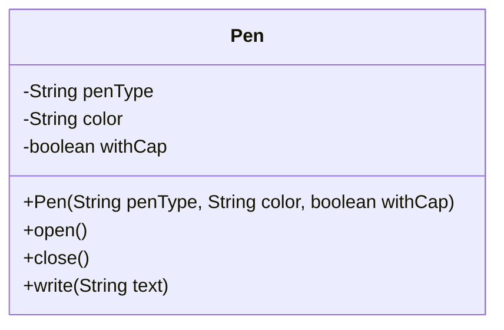
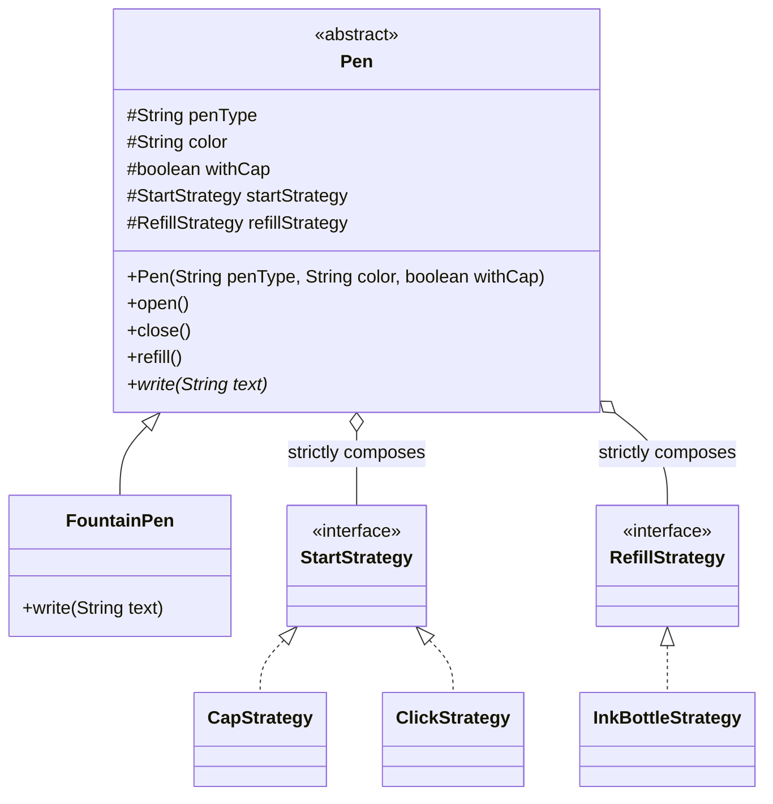
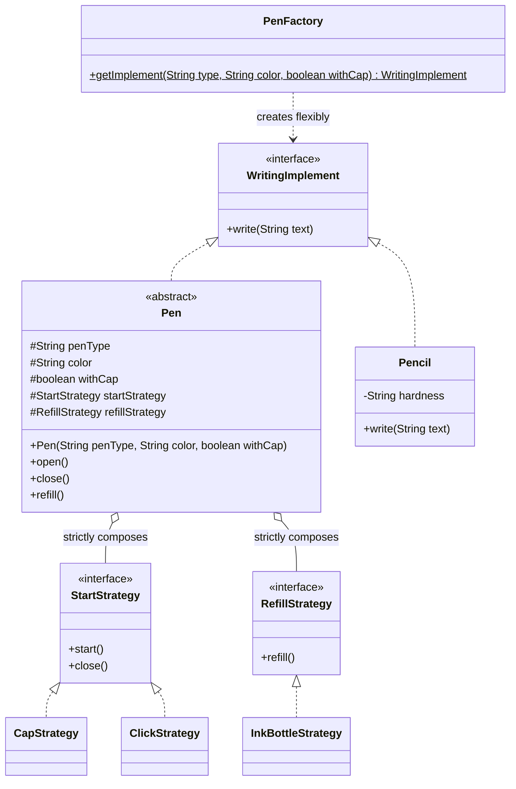
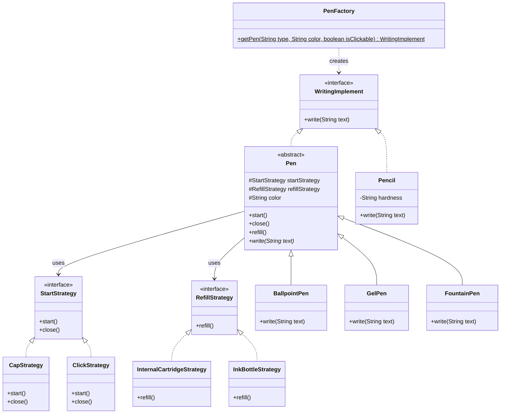

# 🖋️ Pen Design System: Comprehensive SDE-2 Interview Guide

This repository contains the Object-Oriented Design (OOD) evolution of a Pen System, mapping a rigid monolith into a heavily decoupled architecture using the **Strategy Pattern**, **Factory Pattern**, and **Liskov Substitution Principle (LSP)**.

---

## 🧨 Step 1: V0 - The Basic Monolith Approach (What to avoid)

**The Problem:** Most juniors start by creating a massive `Pen` class with attributes like `boolean withCap`. When they write the `open()` method, they write dirty `if(withCap) { ... } else { ... }` logic. 
**Why it fails:** This violates the **Open/Closed Principle (OCP)**. If a twist-to-open pen is introduced later, you have to break open the core class and inject another chaotic `if-else` block. 

### 💻 V0 Code & Main Execution
```java
public class Pen {
    private String penType;
    private String color;
    private boolean withCap;

    public Pen(String penType, String color, boolean withCap) {
        this.penType = penType;
        this.color = color;
        this.withCap = withCap;
    }

    public void open() {
        if (withCap) System.out.println("Removing cap");
        else System.out.println("Clicking pen");
    }

    public void close() {
        if (withCap) System.out.println("Putting cap back on");
        else System.out.println("Retracting nib");
    }

    public void write(String text) {
        System.out.println("Writing in " + color + ": " + text);
    }
}

public class Main {
    public static void main(String[] args) {
        Pen gelPen = new Pen("gel", "blue", true);
        gelPen.open();
        gelPen.write("This is a V0 Pen");
        gelPen.close();
    }
}
```

### 📊 V0 UML Architecture


---

## 🛠️ Step 2: V1 - Introducing Strategies (Decoupling)

**The Fix:** We extract the volatile `open()` and `close()` behaviors out using the **Strategy Design Pattern**. We do the same for refilling.
Now, the `Pen` class delegates behavior blindly. We can natively add a perfectly functioning `TwistStrategy` tomorrow without ever touching or rewriting the `Pen` logic!

### 💻 V1 Code & Main Execution
```java
// 1. Strategies
public interface StartStrategy {
    void start();
    void close();
}

public class CapStrategy implements StartStrategy {
    public void start() { System.out.println("Removing the cap..."); }
    public void close() { System.out.println("Putting the cap back tightly."); }
}

public class ClickStrategy implements StartStrategy {
    public void start() { System.out.println("Clicking the top button to deploy nib."); }
    public void close() { System.out.println("Clicking the top button to retract nib."); }
}

public interface RefillStrategy {
    void refill();
}

public class InkBottleStrategy implements RefillStrategy {
    public void refill() { System.out.println("Drawing fresh ink from the glass bottle."); }
}

// 2. Abstract Pen
public abstract class Pen {
    protected String penType;
    protected String color;
    protected boolean withCap;
    
    // Behaviors are delegated (Strategy Pattern)
    protected StartStrategy startStrategy;
    protected RefillStrategy refillStrategy;

    public Pen(String penType, String color, boolean withCap) {
        this.penType = penType;
        this.color = color;
        this.withCap = withCap;
    }

    public void open() { startStrategy.start(); }
    public void close() { startStrategy.close(); }
    public void refill() { refillStrategy.refill(); }
    
    public abstract void write(String text);
}

// 3. Concrete Pens
public class FountainPen extends Pen {
    public FountainPen(String color, boolean withCap) {
        super("fountain", color, withCap);
        // Look! Strategy is assigned dynamically based on the withCap flag!
        this.startStrategy = withCap ? new CapStrategy() : new ClickStrategy();
        this.refillStrategy = new InkBottleStrategy();
    }

    @Override
    public void write(String text) {
        System.out.println("FountainPen writing in " + color + ": " + text);
    }
}

public class Main {
    public static void main(String[] args) {
        // Now it perfectly matches our API: fountain, color, withCap!
        Pen fountainPen = new FountainPen("Black", true);
        fountainPen.open();
        fountainPen.write("Executing pure Strategy Patterns!");
        fountainPen.refill();
        fountainPen.close();
    }
}
```

### 📊 V1 UML Architecture


---

## 🏛️ Step 3: V2 - Liskov Substitution Principle (LSP)

**The Problem:** Later, the business asks to support a `Pencil`. A pencil doesn't have a cap, click mechanism, or ink refilling. Forcing it to `extend Pen` violates **LSP** because it forces inherited broken/useless behaviors.
**The Fix:** We introduce a highly abstract `WritingImplement` interface containing merely `write()`. Both `Pen` and `Pencil` implement this safely. 

> **💡 The Golden Interview Sentence:**
> *"I decoupled the volatile opening and refilling behaviors from the Pen entity using the **Strategy Pattern** to protect the class from OCP violations. I then abstracted the highest-level contract into a `WritingImplement` interface so entirely disparate tools, like a Pencil, could safely substitute anywhere in the application using **LSP**."*

### 💻 V2 Code & Factory Execution
```java
// 1. The Unified Interface
public interface WritingImplement {
    void write(String text);
}

// 2. The Refactored Abstract Pen ensures it implements the core protocol
public abstract class Pen implements WritingImplement {
    protected String penType;
    protected String color;
    protected boolean withCap;
    
    // Strategies (OCP Protected)
    protected StartStrategy startStrategy;
    protected RefillStrategy refillStrategy;

    public Pen(String penType, String color, boolean withCap) {
        this.penType = penType;
        this.color = color;
        this.withCap = withCap;
    }

    public void open() { startStrategy.start(); }
    public void close() { startStrategy.close(); }
    public void refill() { refillStrategy.refill(); }
}

// 3. The LSP Compliant Pencil
public class Pencil implements WritingImplement {
    private String hardness;

    public Pencil(String hardness) {
        this.hardness = hardness;
    }

    @Override
    public void write(String text) {
        System.out.println("Pencil (" + hardness + ") sketching safely: " + text);
    }
}

// 4. The Unified Application Factory
public class PenFactory {
    public static WritingImplement getImplement(String type, String color, boolean withCap) {
        if (type.equalsIgnoreCase("PENCIL")) {
            return new Pencil("HB");
        } else if (type.equalsIgnoreCase("FOUNTAIN")) {
            // FountainPen natively inherits from Pen AND WritingImplement
            return new FountainPen(color, withCap); 
        }
        throw new IllegalArgumentException("Unknown implement type: " + type);
    }
}

// 5. Main Execution Demo
public class Main {
    public static void main(String[] args) {
        System.out.println("--- Testing Complete LSP Polymorphism ---");
        
        WritingImplement implement1 = PenFactory.getImplement("FOUNTAIN", "Black", true);
        WritingImplement implement2 = PenFactory.getImplement("PENCIL", null, false);
        
        // This is safe everywhere in the application!
        implement1.write("Executing from a purely Strategy-wrapped Pen!");
        implement2.write("Executing from a completely distinct Pencil object!");
    }
}
```

### 📊 V2 Complete Architectural UML Diagram


---

## 📊 4. Final Unified System UML


