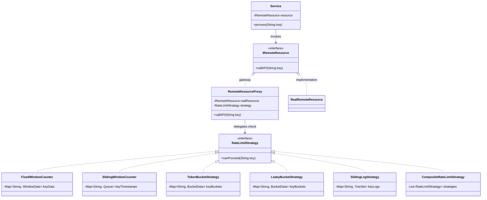
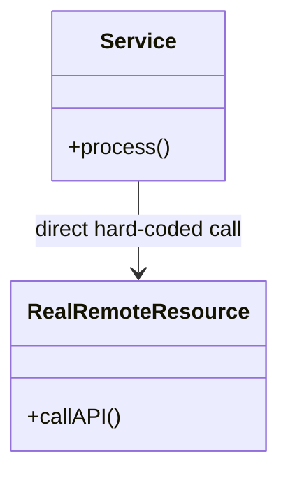
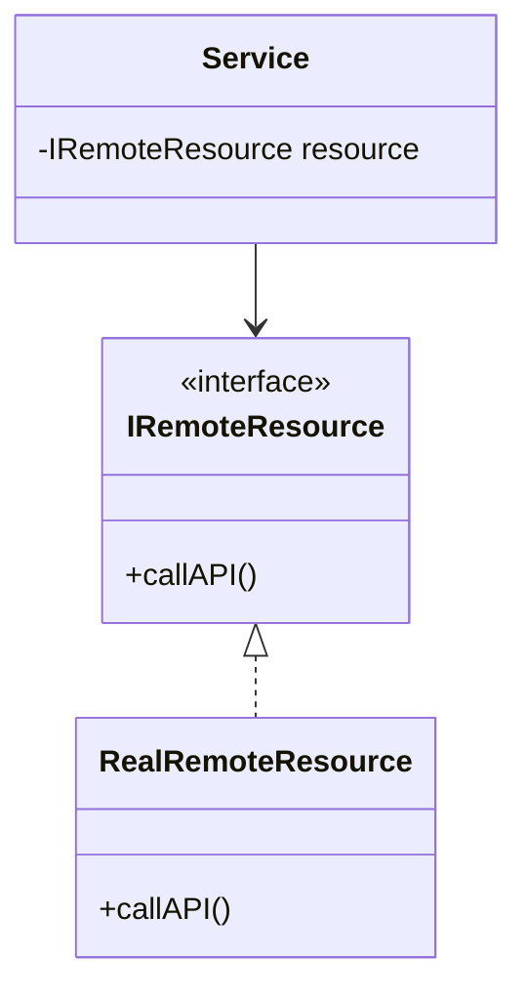
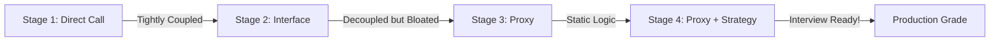
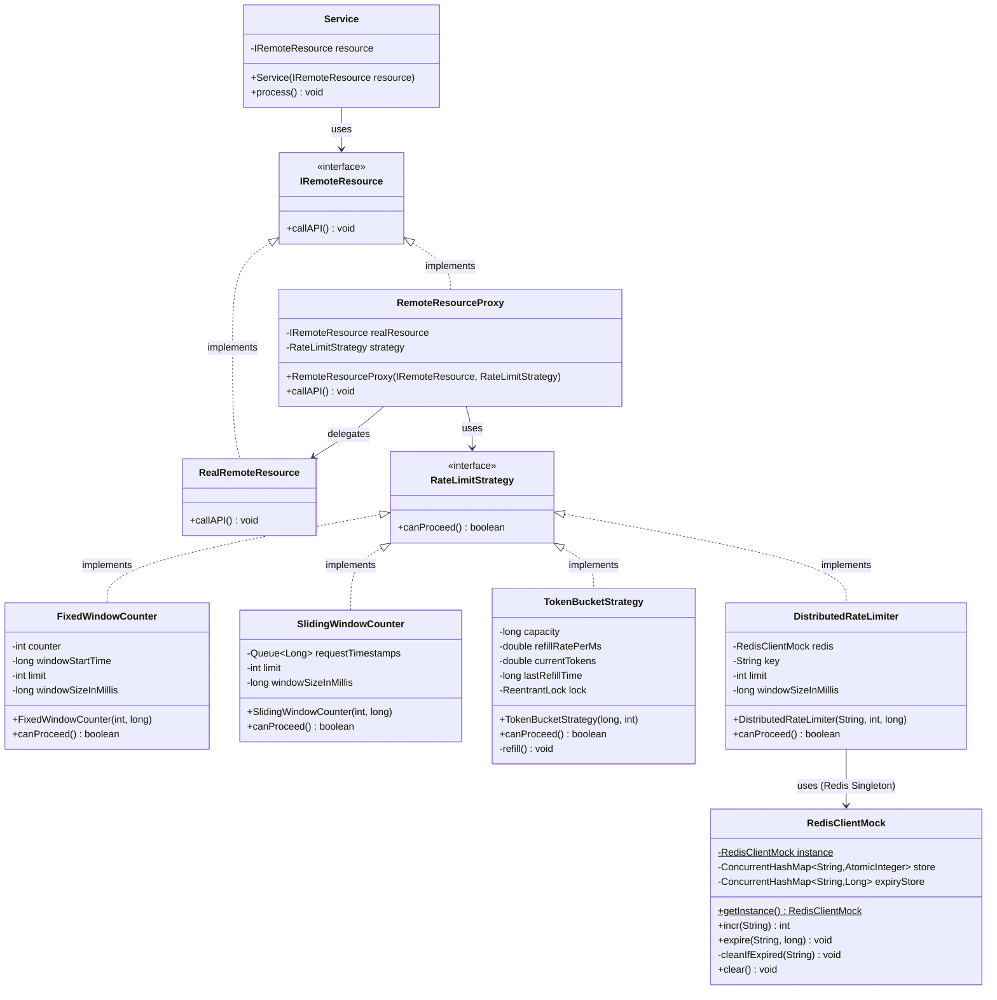
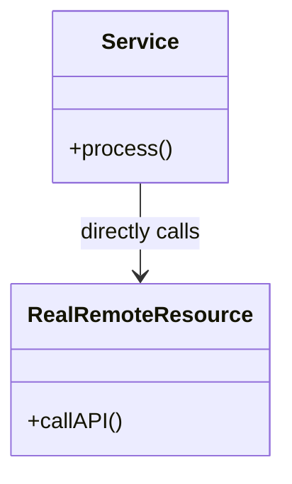

# 🛡️ Rate Limiter System LLD (Proxy + Strategy)

A production-grade, interview-ready Rate Limiter designed to protect external APIs. This project demonstrates how to use the **Proxy** and **Strategy** design patterns to build a flexible, maintainable, and decoupled system.

---

# 🛡️ Pluggable Rate Limiting System (External Resource Protection)

This system is designed specifically for protecting **paid external resources**. It uses the **Proxy** and **Strategy** design patterns to achieve a highly pluggable, per-key, and tiered rate limiting solution.

---

## 🎨 Professional UML Design


---

## 🧠 Design Decisions & SOLID Principles

### 1. Proxy Pattern (Structural)
**Why?** We wrap the `RealRemoteResource` with a `RemoteResourceProxy`. 
- **Separation of Concerns**: The business service doesn't know it's being rate-limited.
- **Transparency**: The Proxy implements the `IRemoteResource` interface, making it a drop-in replacement.
- **Single Responsibility (SRP)**: The real resource focus on networking; the proxy focuses on protection.

### 2. Strategy Pattern (Behavioral)
**Why?** We inject different algorithms into the Proxy.
- **Open/Closed Principle (OCP)**: We can add new algorithms (like Leaky Bucket) by implementing the `RateLimitStrategy` interface without changing the Proxy or Service code.
- **Interchangeability**: The algorithm can be swapped at runtime (e.g., switching to Token Bucket for better burst support).

### 3. Per-Key Rate Limiting
**Why?** The `canProceed(String key)` method allows the system to distinguish between **Tenants, Users, or API Keys**, ensuring that one noisy neighbor doesn't exhaust the quota for others.

---

## 📊 Comparison of Algorithms (Trade-offs)

| Algorithm | Pros | Cons | Best For... |
| :--- | :--- | :--- | :--- |
| **Fixed Window** | Low memory, very fast. | Boundary problem: Can allow 2x traffic at edges. | Low precision, high scale. |
| **Sliding Window** | Smoother than Fixed Window. | Needs more memory to store timestamps. | General usage. |
| **Token Bucket** | Handles bursts well, high performance. | Complex refill math. | API protection with burst allowance. |
| **Leaky Bucket** | Ensures constant output rate. | Rejects bursts immediately if bucket is full. | Smoothing traffic to unstable backends. |
| **Sliding Log** | Perfectly smooth, 100% accurate. | Extreme memory usage (stores every event). | High accuracy, low volume requirements. |

---

## 🚀 How to Use (Composite Limits)

To support rules like **"5 requests per minute AND 100 per hour"**, use the `CompositeRateLimitStrategy`:

```java
CompositeRateLimitStrategy tieredLimit = new CompositeRateLimitStrategy();
tieredLimit.addStrategy(new FixedWindowCounter(5, 60000));     // 5/min
tieredLimit.addStrategy(new FixedWindowCounter(100, 3600000)); // 100/hr

IRemoteResource protectedAPI = new RemoteResourceProxy(new RealRemoteResource(), tieredLimit);
protectedAPI.callAPI("UserT1");
```


## 🏗️ 1. Architectural Design Theory

### 🎭 The Proxy Pattern (The Gatekeeper)
The **Proxy Pattern** is the star of this design. It acts as a middleman between your application and a remote resource (like the Stripe API or OpenAI). 

**Instructor's Key Rule:**
> "If you have a scenario where you need to implement Caching, Retry mechanisms, Lazy initialization, Authentication, or **Rate Limiting**, you should ALWAYS use the Proxy Pattern."

In our system, the `RemoteResourceProxy` wraps the actual API call. Before the call is made, it performs a "check" using a strategy.

- We plug in different algorithms (Fixed Window, Sliding Window, Token Bucket) without ever changing the Proxy code.

---

## 🎓 2. Design Evolution: Why This Architecture?

If you explain this step-by-step in an interview, you demonstrate **Senior-level Design Thinking**.

### 🧱 2.1 Stage 1: Before Proxy (The Tight-Coupling Mess) ❌

Initially, your service might call the external API directly.

**Visualizing Stage 1:**


**The Code:**
```java
public void process() {
    // Problem: Service is doing business logic AND API handling
    realRemoteResource.callAPI(); 
}
```

**❌ The Problems:**
1. **Tight Coupling:** If the API details change, you must rewrite the Service.
2. **Duplication:** Every service that needs the API has to copy-paste rate-limiting logic.
3. **Bloated Logic:** Business services should NOT care about 429 errors or window counters.

---

### 💡 2.2 Stage 2: Introducing Interfaces (Standardization) ⚙️

We remove the direct dependency and depend on an abstraction.

**Visualizing Stage 2:**


**Why we do this:**
- We can now swap the `RealRemoteResource` with any other class that implements the interface.
- **But wait!** Where do we put the rate-limiting code?
   - In `Service`? ❌ (Still bloated).
   - In `RealRemoteResource`? ❌ (That class should only do API networking).

---

### ⏳ 2.4 The Timeline of Change



---

### ⚙️ 2.5 What Happens in Code (The Implementation Steps)

To set this up correctly, follow these 4 simple steps in your code:

**🔹 Step 1: Create the Real Object**
```java
IRemoteResource real = new RealRemoteResource();
```

**🔹 Step 2: Wrap it with the Proxy**
```java
// We pass the real object INTO the proxy
IRemoteResource proxy = new RemoteResourceProxy(real, new TokenBucketStrategy(...));
```

**🔹 Step 3: Inject the Proxy into your Service**
```java
// Service doesn't know it has a proxy! It just sees an IRemoteResource
Service service = new Service(proxy);
```

**🔹 Step 4: Execute**
```java
service.process(); // Internally calls resource.callAPI() -> goes to Proxy first!
```

---

### 🔄 2.6 The execution Flow
1. **Service** calls `resource.callAPI()`.
2. The reference points to the **Proxy** object.
3. **Proxy** runs `strategy.canProceed()`.
4. If **Allowed**: Proxy calls `realResource.callAPI()`.
5. If **Blocked**: Proxy returns/throws a 429 error.

---

## 🧠 3. FAQ: Why use both an Interface AND a Proxy?

This is the most common question in interviews. Here is the **Masterclass Answer**:

> **"A Proxy IS-A RemoteResource."**

By making the Proxy implement the same interface as the real resource, we achieve **Transparency**. We can hand the Service a Proxy object, and the Service won't even know it's being rate-limited. It just calls `.callAPI()` as usual.

---

## 🌟 4. Next-Level Teaching Analogies

### 🍔 The Swiggy Analogy
- **Service:** You (The Hungry Customer).
- **IRemoteResource:** The "Food Provider" interface.
- **RealRemoteResource:** The actual Restaurant.
- **Proxy:** Swiggy.
- **Logic:** You call Swiggy (Proxy). Swiggy checks if you've ordered too much recently (Rate Limit). If OK, Swiggy calls the Restaurant (Real Resource) for you.

### 💳 The Credit Card Analogy
- **Service:** A Merchant (Shopkeeper).
- **IRemoteResource:** A Payment Source.
- **RealRemoteResource:** Your Bank Account.
- **Proxy:** Your Credit Card.
- **Logic:** The Merchant doesn't touch your bank account. They touch the Card (Proxy). The Card checks if you've exceeded your limit. If not, it pulls money from the Bank.

---

## 📐 5. Why is this a "Structural Pattern"?

The Proxy Pattern is a **Structural Design Pattern** because it focuses on how classes and objects are **composed** to form larger structures. It provides a placeholder or surrogate for another object to control access to it, effectively changing the "structure" of the call stack without changing the "behavior" of the business logic.

---

## 📊 2. FULL UML (Detailed with Attributes & Methods)



---
---


---


## 💻 3. COMPLETE SOURCE CODE

### 3.1 Proxy & Service Layer

#### [IRemoteResource.java](file:///Users/mdkaif/Desktop/LLD/rate_limiter/src/com/ratelimiter/proxy/IRemoteResource.java)
```java
package com.ratelimiter.proxy;

public interface IRemoteResource {
    void callAPI();
}
```

#### [RealRemoteResource.java](file:///Users/mdkaif/Desktop/LLD/rate_limiter/src/com/ratelimiter/proxy/RealRemoteResource.java)
```java
package com.ratelimiter.proxy;

public class RealRemoteResource implements IRemoteResource {
    @Override
    public void callAPI() {
        System.out.println("[RealResource] Calling real external API...");
    }
}
```

#### [RemoteResourceProxy.java](file:///Users/mdkaif/Desktop/LLD/rate_limiter/src/com/ratelimiter/proxy/RemoteResourceProxy.java)
```java
package com.ratelimiter.proxy;

import com.ratelimiter.strategies.RateLimitStrategy;

public class RemoteResourceProxy implements IRemoteResource {
    private final IRemoteResource realResource;
    private final RateLimitStrategy strategy;

    public RemoteResourceProxy(IRemoteResource realResource, RateLimitStrategy strategy) {
        this.realResource = realResource;
        this.strategy = strategy;
    }

    @Override
    public void callAPI() {
        if (strategy.canProceed()) {
            realResource.callAPI();
        } else {
            System.err.println("429 Too Many Requests - Rejected by Proxy");
        }
    }
}
```

#### [Service.java](file:///Users/mdkaif/Desktop/LLD/rate_limiter/src/com/ratelimiter/proxy/Service.java)
```java
package com.ratelimiter.proxy;

public class Service {
    private final IRemoteResource resource;

    public Service(IRemoteResource resource) {
        this.resource = resource;
    }

    public void process() {
        System.out.println("Processing business logic inside Service...");
        resource.callAPI();
    }
}
```

---

### 3.2 Rate Limiting Strategies

#### [RateLimitStrategy.java](file:///Users/mdkaif/Desktop/LLD/rate_limiter/src/com/ratelimiter/strategies/RateLimitStrategy.java)
```java
package com.ratelimiter.strategies;

public interface RateLimitStrategy {
    boolean canProceed();
}
```

#### [FixedWindowCounter.java](file:///Users/mdkaif/Desktop/LLD/rate_limiter/src/com/ratelimiter/strategies/FixedWindowCounter.java)
```java
package com.ratelimiter.strategies;

public class FixedWindowCounter implements RateLimitStrategy {
    private int counter;
    private long windowStartTime;
    private final int limit;
    private final long windowSizeInMillis;

    public FixedWindowCounter(int limit, long windowSizeInMillis) {
        this.limit = limit;
        this.windowSizeInMillis = windowSizeInMillis;
        this.windowStartTime = System.currentTimeMillis();
    }

    @Override
    public synchronized boolean canProceed() {
        long now = System.currentTimeMillis();
        if (now - windowStartTime >= windowSizeInMillis) {
            counter = 0;
            windowStartTime = now;
        }
        if (counter < limit) {
            counter++;
            return true;
        }
        return false;
    }
}
```

#### [SlidingWindowCounter.java](file:///Users/mdkaif/Desktop/LLD/rate_limiter/src/com/ratelimiter/strategies/SlidingWindowCounter.java)
```java
package com.ratelimiter.strategies;

import java.util.LinkedList;
import java.util.Queue;

public class SlidingWindowCounter implements RateLimitStrategy {
    private final Queue<Long> requestTimestamps = new LinkedList<>();
    private final int limit;
    private final long windowSizeInMillis;

    public SlidingWindowCounter(int limit, long windowSizeInMillis) {
        this.limit = limit;
        this.windowSizeInMillis = windowSizeInMillis;
    }

    @Override
    public synchronized boolean canProceed() {
        long now = System.currentTimeMillis();
        while (!requestTimestamps.isEmpty() && now - requestTimestamps.peek() >= windowSizeInMillis) {
            requestTimestamps.poll();
        }
        if (requestTimestamps.size() < limit) {
            requestTimestamps.offer(now);
            return true;
        }
        return false;
    }
}
```

#### [TokenBucketStrategy.java](file:///Users/mdkaif/Desktop/LLD/rate_limiter/src/com/ratelimiter/strategies/TokenBucketStrategy.java)
```java
package com.ratelimiter.strategies;

import java.util.concurrent.locks.ReentrantLock;

public class TokenBucketStrategy implements RateLimitStrategy {
    private final long capacity;
    private final double refillRatePerMs;
    private double currentTokens;
    private long lastRefillTime;
    private final ReentrantLock lock = new ReentrantLock();

    public TokenBucketStrategy(long capacity, int refillRatePerSecond) {
        this.capacity = capacity;
        this.refillRatePerMs = (double) refillRatePerSecond / 1000.0;
        this.currentTokens = capacity;
        this.lastRefillTime = System.currentTimeMillis();
    }

    @Override
    public boolean canProceed() {
        lock.lock();
        try {
            refill();
            if (currentTokens >= 1.0) {
                currentTokens -= 1.0;
                return true;
            }
            return false;
        } finally {
            lock.unlock();
        }
    }

    private void refill() {
        long now = System.currentTimeMillis();
        long timeElapsed = now - lastRefillTime;
        double tokensToAdd = timeElapsed * refillRatePerMs;
        currentTokens = Math.min(capacity, currentTokens + tokensToAdd);
        lastRefillTime = now;
    }
}
```

---

### 3.3 Infrastructure & Distributed Support

#### [DistributedRateLimiter.java](file:///Users/mdkaif/Desktop/LLD/rate_limiter/src/com/ratelimiter/strategies/DistributedRateLimiter.java)
```java
package com.ratelimiter.strategies;

import com.ratelimiter.infrastructure.RedisClientMock;

public class DistributedRateLimiter implements RateLimitStrategy {
    private final RedisClientMock redis;
    private final String key;
    private final int limit;
    private final long windowSizeInMillis;

    public DistributedRateLimiter(String key, int limit, long windowSizeInMillis) {
        this.redis = RedisClientMock.getInstance();
        this.key = key;
        this.limit = limit;
        this.windowSizeInMillis = windowSizeInMillis;
    }

    @Override
    public boolean canProceed() {
        int currentCount = redis.incr(key);
        if (currentCount == 1) {
            redis.expire(key, windowSizeInMillis);
        }
        return currentCount <= limit;
    }
}
```

#### [RedisClientMock.java](file:///Users/mdkaif/Desktop/LLD/rate_limiter/src/com/ratelimiter/infrastructure/RedisClientMock.java)
```java
package com.ratelimiter.infrastructure;

import java.util.concurrent.ConcurrentHashMap;
import java.util.concurrent.atomic.AtomicInteger;

public class RedisClientMock {
    private static RedisClientMock instance;
    private final ConcurrentHashMap<String, AtomicInteger> store = new ConcurrentHashMap<>();
    private final ConcurrentHashMap<String, Long> expiryStore = new ConcurrentHashMap<>();

    private RedisClientMock() {}

    public static synchronized RedisClientMock getInstance() {
        if (instance == null) instance = new RedisClientMock();
        return instance;
    }

    public int incr(String key) {
        cleanIfExpired(key);
        return store.computeIfAbsent(key, k -> new AtomicInteger(0)).incrementAndGet();
    }

    public void expire(String key, long windowSizeInMillis) {
        expiryStore.putIfAbsent(key, System.currentTimeMillis() + windowSizeInMillis);
    }

    private void cleanIfExpired(String key) {
        Long expiry = expiryStore.get(key);
        if (expiry != null && System.currentTimeMillis() > expiry) {
            store.remove(key);
            expiryStore.remove(key);
        }
    }
}
```

---

### 3.4 Main Driver

#### [Main.java](file:///Users/mdkaif/Desktop/LLD/rate_limiter/src/com/ratelimiter/Main.java)
```java
package com.ratelimiter;

import com.ratelimiter.proxy.*;
import com.ratelimiter.strategies.*;
import java.util.concurrent.*;

public class Main {
    public static void main(String[] args) throws InterruptedException {
        System.out.println("🚀 Rate Limiter Pro Simulation 🚀");

        // Example: Token Bucket with Concurrency
        testConcurrentStrategy("Token Bucket (Concurrency Test)", 
                               new TokenBucketStrategy(5, 1), 10);
    }

    private static void testConcurrentStrategy(String name, RateLimitStrategy strategy, int threadCount) throws InterruptedException {
        System.out.println("\n--- " + name + " ---");
        IRemoteResource real = new RealRemoteResource();
        IRemoteResource proxy = new RemoteResourceProxy(real, strategy);
        Service service = new Service(proxy);

        ExecutorService executor = Executors.newFixedThreadPool(threadCount);
        for (int i = 0; i < threadCount; i++) executor.submit(service::process);
        executor.shutdown();
        executor.awaitTermination(10, TimeUnit.SECONDS);
    }
}
```

---

## 📈 4. Why This Design is "Pro"

### ✅ 1. Decoupling
The `Service` layer doesn't even know rate limiting exists. It just calls `resource.callAPI()`.

### ✅ 2. Flexibility (Strategy Pattern)
Want to switch from **Fixed Window** to **Token Bucket**? Just change one line!

### ✅ 3. Single Responsibility
- **Proxy**: Manages access control.
- **Strategy**: Manages the math.
- **Service**: Manages business logic.

---

## 💡 5. When to use the Proxy Pattern?
The instructor's "Masterclass" takeaway: Use Proxy for **Caching, Retries, Lazy Loading, Authentication, and Rate Limiting.**
