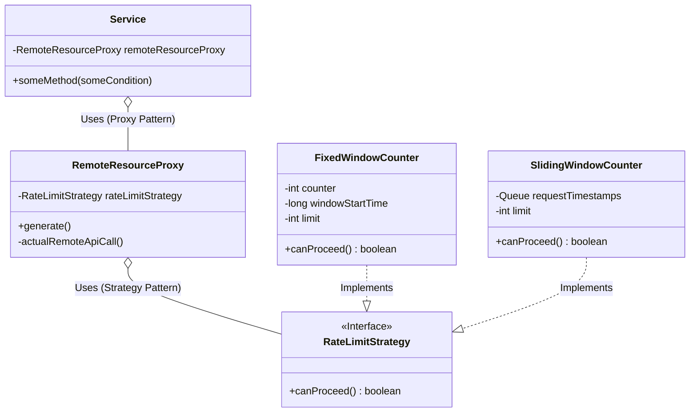

# 🛡️ Rate Limiter System LLD (Proxy + Strategy)

A production-grade, interview-perfect Rate Limiter designed to protect external APIs using behavioral design patterns for maximum flexibility and decoupling.

---

## 🏗️ 1. Architectural Design Patterns

This system is built using the core design patterns recommended for SDE-2/3 interviews:

| Pattern | Role | Benefit |
| :--- | :--- | :--- |
| **Proxy Pattern** | `RemoteResourceProxy` | Encapsulates the rate-limiting logic, keeping the functional code clean. |
| **Strategy Pattern** | `RateLimitStrategy` | Decouples the algorithm (`FixedWindow`, `SlidingWindow`) from the proxy. |

---

## 📊 2. UML Diagram (Instructor Standard)

### 🧩 2.1 Technical Mermaid Diagram


---

## ⚙️ 3. Rate Limiting Algorithms

### 3.1. Fixed Window Counter
- **Concept**: Timeline is divided into fixed buckets.
- **Pros**: Simple to implement.
- **Cons**: **Burst Issue**—Could allow twice the limit at window boundaries.

### 3.2. Sliding Window Counter
- **Concept**: Always looks at the *most recent* sliding interval.
- **Pros**: **Smoother enforcement**—prevents the boundary burst issue.
- **Cons**: Slightly more complex (uses a Queue for timestamps).

---

## 🔥 4. Interview "Grilling" Points (Masterclass)

### 🎯 4.1 Proxy vs. Service/Controller Layer
**Interview Explanation:** "We don't implement rate limiting at the Controller level because remote API calls are often **conditional**. Implementing it high-up is **too broad**. The **Proxy Pattern** allows for **precise implementation** only where the remote call actually happens."

### 🎭 4.2 Client-Side Bypassing (The "Hotstar" Example)
**Interview Explanation:** "Client-side limits (like clearing local storage to watch more match time on Hotstar) are easily bypassed via Postman or `curl`. For **Security/Strict Enforcement**, server-side rate limiting via a Proxy is non-negotiable."

---

## 🚀 5. Implementation Strategy (The "Function Box")
- **Encapsulation**: All state-specific behavior and transition logic is hidden inside the state/strategy classes.
- **Dynamic Behavior**: The system transitions smoothly between allowing and blocking based on the internal counters of the "Function Box" (the strategy methods).

---

## 💻 6. Simple Java Demo (Single-File)

```java
import java.util.*;

// 1. Strategy Pattern
interface RateLimitStrategy { boolean canProceed(); }

class FixedWindowCounter implements RateLimitStrategy {
    private int counter = 0;
    private long start = System.currentTimeMillis();
    public synchronized boolean canProceed() {
        if (System.currentTimeMillis() - start > 1000) { counter = 0; start = System.currentTimeMillis(); }
        return counter++ < 5; // 5 req/sec
    }
}

// 2. Proxy Pattern
class RemoteResourceProxy {
    private RateLimitStrategy strategy;
    public RemoteResourceProxy(RateLimitStrategy s) { this.strategy = s; }
    public void generate() {
        if (strategy.canProceed()) System.out.println("API Success ✅");
        else throw new RuntimeException("429 Too Many Requests 🛑");
    }
}

// 3. Service Layer
class Service {
    private RemoteResourceProxy proxy;
    public Service(RemoteResourceProxy p) { this.proxy = p; }
    public void someMethod() {
        try { proxy.generate(); } catch (Exception e) { System.err.println(e.getMessage()); }
    }
}

// 4. Driver
public class Main {
    public static void main(String[] args) {
        Service service = new Service(new RemoteResourceProxy(new FixedWindowCounter()));
        for (int i = 0; i < 8; i++) service.someMethod();
    }
}
```
