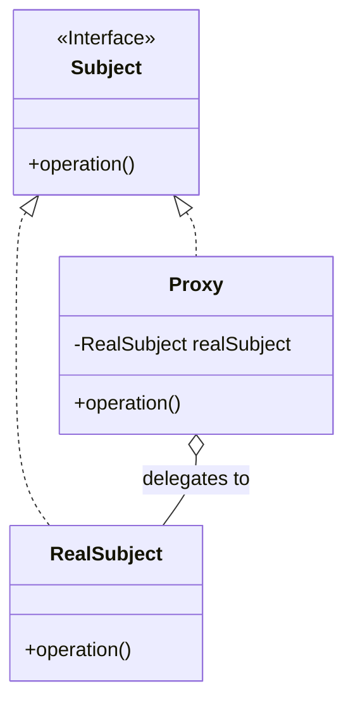
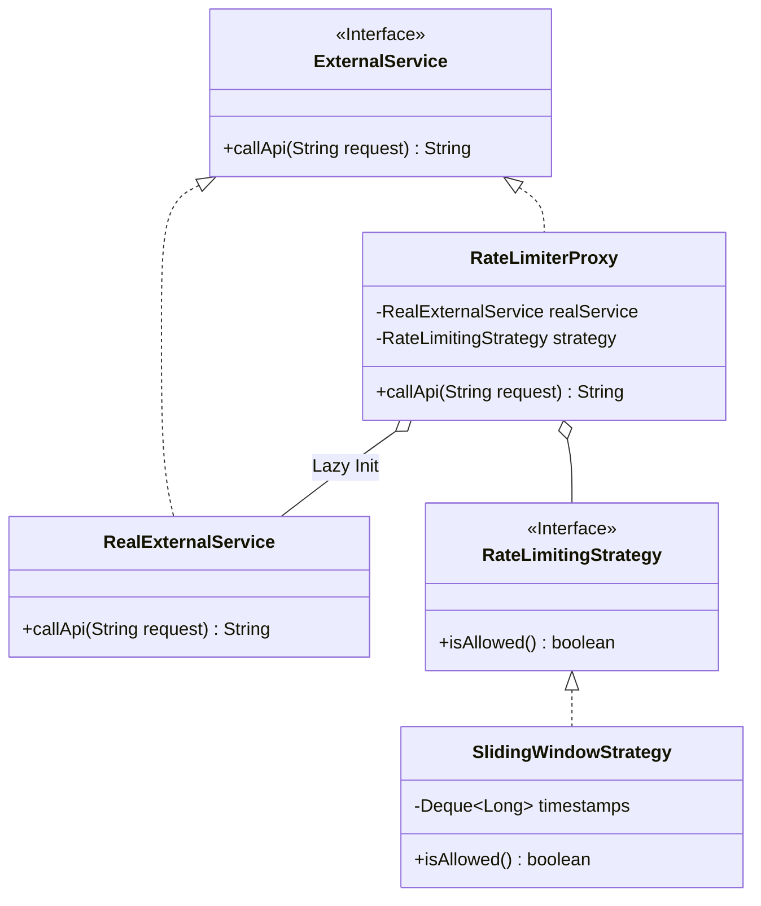

# 🛡️ Rate Limiter System & Proxy Design Pattern (Complete Guide)

A production-ready, thread-safe Rate Limiter implementation using the **Proxy** and **Strategy** design patterns. This guide covers the full implementation, architectural rationale, and deep-dive notes for the Proxy pattern.

---

## 1. 🔍 Proxy Design Pattern - Deep Dive

### 📋 Overview
The **Proxy Design Pattern** is a **structural design pattern** that creates a **proxy object** (reference) to act as an intermediary for a real object. 

**Key Objectives:**
- **Access Control**: Validate requests before they reach the real object.
- **Lazy Initialization**: Delay the creation of expensive objects until they are actually needed.
- **Extra Functionality**: Add logging, caching, or rate limiting without modifying the core business logic.

### 🏦 Real-World Example: ATM Proxy
An ATM acts as a proxy for your bank account. It handles PIN validation and balance checks locally before delegating the final transaction to the bank's central system.

### 📊 Proxy Pattern UML


---

## 2. 🏗️ Rate Limiter Architecture

### 🛡️ Design Strategy
- **Proxy Pattern**: `RateLimiterProxy` wraps the `RealExternalService`.
- **Strategy Pattern**: `RateLimitingStrategy` allows swapping algorithms (e.g., Sliding Window, Token Bucket).
- **Thread-Safety**: Uses `ConcurrentLinkedDeque` and Double-Checked Locking for lazy initialization.

### 📊 System UML Diagram


---

## 💻 3. Full Java Implementation

### 3.1 Core Rate Limiter Logic
```java
// RateLimiterProxy.java
public class RateLimiterProxy implements ExternalService {
    private volatile RealExternalService realService;
    private final RateLimitingStrategy strategy;

    public RateLimiterProxy(RateLimitingStrategy strategy) {
        this.strategy = strategy;
    }

    @Override
    public String callApi(String request) {
        if (strategy.isAllowed()) {
            if (realService == null) {
                synchronized (this) {
                    if (realService == null) {
                        realService = new RealExternalService();
                    }
                }
            }
            return realService.callApi(request);
        }
        return "429 Too Many Requests - Limit Exceeded";
    }
}
```

### 3.2 Main Simulation Code
```java
// Main.java
public class Main {
    public static void main(String[] args) throws InterruptedException {
        SlidingWindowStrategy strategy = new SlidingWindowStrategy(3, 5); // 3 req / 5 sec
        ExternalService proxy = new RateLimiterProxy(strategy);

        ExecutorService executor = Executors.newFixedThreadPool(5);
        for (int i = 1; i <= 10; i++) {
            executor.submit(() -> {
                System.out.println(proxy.callApi("Request"));
            });
        }
        executor.shutdown();
    }
}
```

---

## 🔥 4. Interview "Killer Lines" (Proxy Pattern)

> [!IMPORTANT]
> "Proxy pattern isn't just a wrapper; it's a **gatekeeper**. It manages the lifecycle and access permissions of the real object, ensuring that expensive resources are only initialized for valid, authorized requests."

> [!TIP]
> "By combining Proxy with the Strategy pattern, we decouple the **protection logic** (Proxy) from the **algorithm** (Strategy), making the system highly extensible."

---

## 🚀 5. How to Run
```bash
bash run_rate_limiter.sh
```
