# Event-Driven Trading System - Low Level Design

## 🧠 10-Second Viva Summary
> “This is an event-driven trading system where market data flows into a pluggable strategy engine. Strategies use indicators to generate orders, which pass through a chain of risk rules and are executed via an execution engine using broker adapters. The system uses Strategy, Observer, Chain of Responsibility, and Adapter patterns, with normalized entities for orders, trades, and positions.”

---

## 🎯 How To Draw This (Important)
👉 **Don't try to draw everything randomly.**
👉 **Draw in 3 layers:**
1. **Core Flow (top)**
2. **Engines (middle)**
3. **Data & DB (bottom)**

---

## 🧩 Complete System UML Diagram

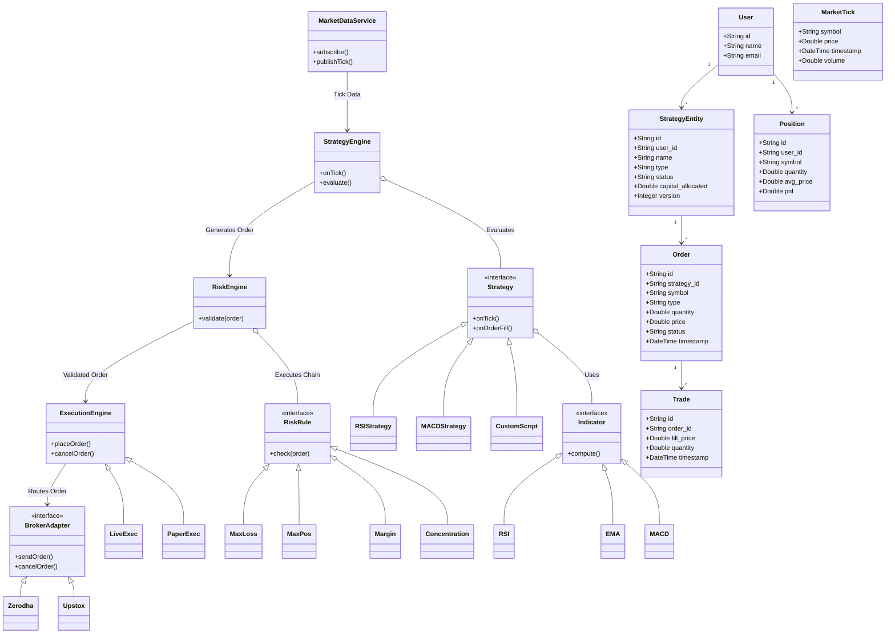

---

## 🧱 Component Breakdown

### 🟦 1. Core Architecture (Top Layer)

The highest level event-driven flow of core operations in the system.

```mermaid
flowchart TD
    MDS[MarketDataService<br/>subscribe()<br/>publishTick()] -->|Tick Data| SE
    SE[StrategyEngine<br/>onTick()<br/>evaluate()] -->|Generates Order| RE
    RE[RiskEngine<br/>validate(order)] -->|Validated Order| EE
    EE[ExecutionEngine<br/>placeOrder()] -->|Routes Order| BA
    BA[BrokerAdapter<br/>sendOrder()<br/>cancelOrder()]
```

### 🟨 2. Strategy Side (Pluggable Design)

Utilizes the **Strategy Pattern** to swap algorithms on the fly to fulfill conditions.

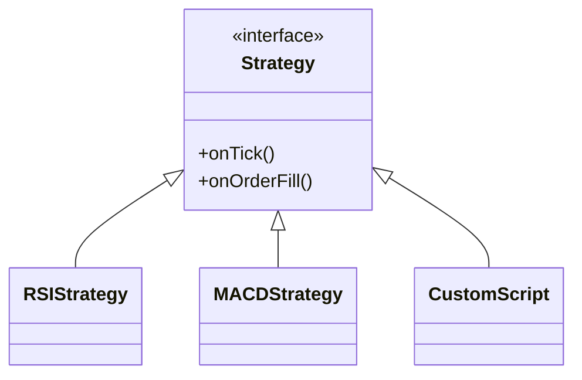

### 📊 Indicators (Composition)

Each strategy contains one or more indicators.

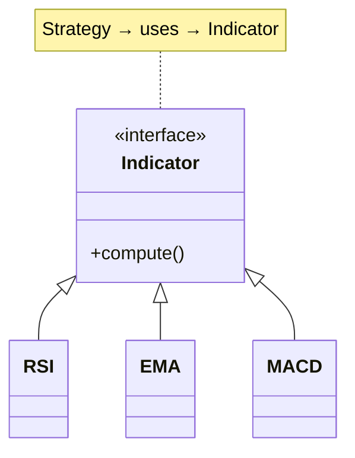

### 🟥 3. Risk Engine (Chain of Responsibility)

Utilizes **Chain of Responsibility Pattern** to filter out orders if they violate predefined risk management rules.

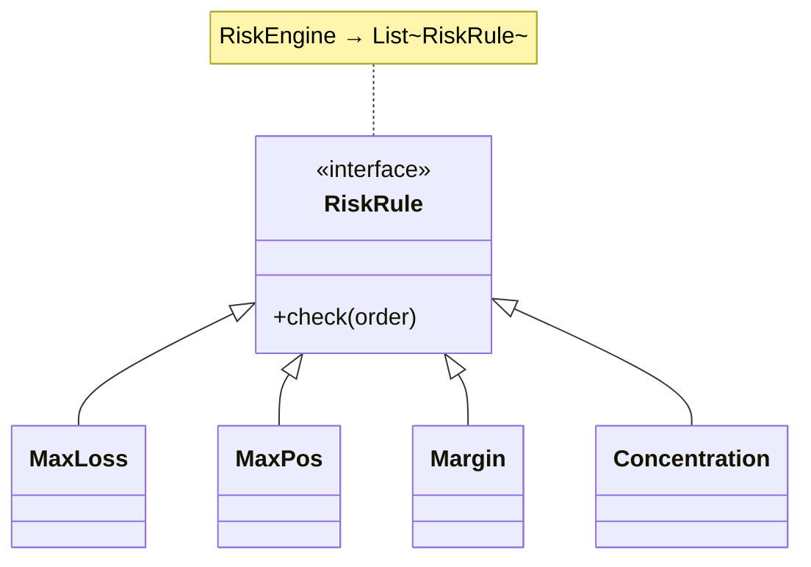

### 🟩 4. Execution Engine

Exhibits **Polymorphism** where strategies are untethered to the execution mode.

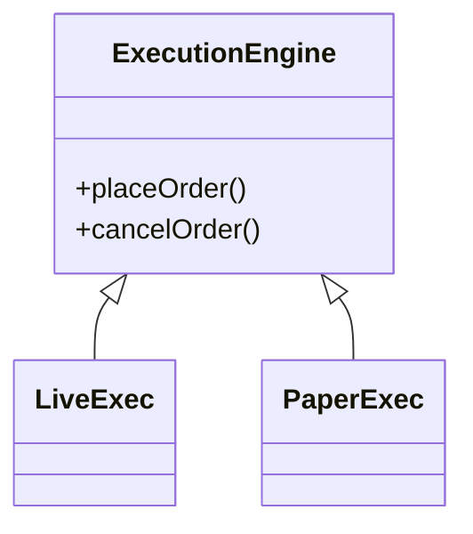

### 🟪 5. Broker Adapter

Utilizes the **Adapter Pattern** to interface cleanly with unique external APIs.

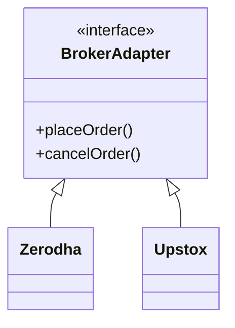

---

## 🗄️ 6. Database / Entities

### Conceptual Entity Overview
| Entity | Attributes | Scope / Details |
|---|---|---|
| **User** | `id`, `name`, `email` | Standard application user |
| **StrategyEntity** | `id`, `user_id`, `name`, `type`, `status` (DRAFT/LIVE), `capital_allocated`, `version` | Represents the persistent configuration of strategies mapped to a runtime `Strategy` |
| **Position** | `id`, `user_id`, `symbol`, `quantity`, `avg_price`, `pnl` | Stores open market positions in real-time |
| **Order** | `id`, `strategy_id`, `symbol`, `type` (MARKET/LIMIT), `quantity`, `price`, `status`, `timestamp` | Triggered intent generated via strategies |
| **Trade** | `id`, `order_id`, `fill_price`, `quantity`, `timestamp` | Represents real settled transactions resulting financially from an order |
| **MarketTick** | `symbol`, `price`, `timestamp`, `volume` | Tick data representation for historical charting/testing |

### Schema Relationships
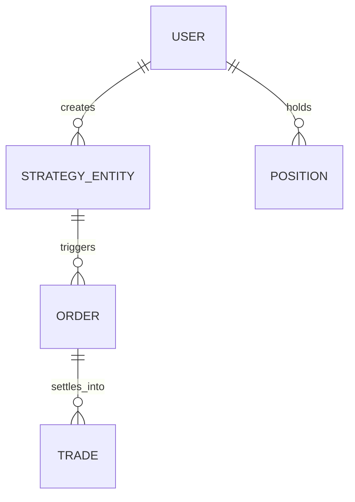

## 🚀 Future Options
* Map components perfectly to production level interface/class structures in Java
* Prepare Mock Interview queries based directly on the decisions made in the diagram

---
---

# Hotel Management System - Low Level Design

## 🧠 10-Second Viva Summary
> “Hotel system manages booking lifecycle: availability → booking → payment → notification, with payment implemented using Strategy pattern and clean relational mapping between user, room, and hotel.”

---

## 🎯 How To Draw This (Important)
👉 **Don't try to draw everything randomly.**
👉 **Draw in 3 layers:**
1. **Core Flow (top)**
2. **Engines / Domains (middle)**
3. **Data & DB (bottom)**

---

## 🧩 Complete System UML Diagram

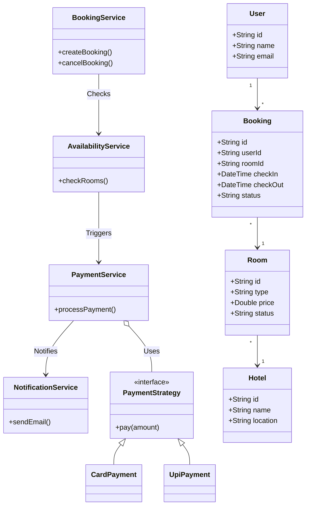

---

## 🧱 Component Breakdown

### 🟦 1. Core Flow (Top Layer)
```mermaid
flowchart TD
    BS[BookingService<br/>createBooking()<br/>cancelBooking()] --> AS
    AS[AvailabilityService<br/>checkRooms()] --> PS
    PS[PaymentService<br/>processPayment()] --> NS
    NS[NotificationService<br/>sendEmail()]
```

### 🟨 2. Domain Classes
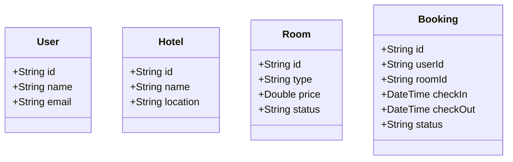

### 🟧 3. Payment Strategy (Important)
Utilizes the **Strategy Pattern** to handle multiple payment methods gracefully.
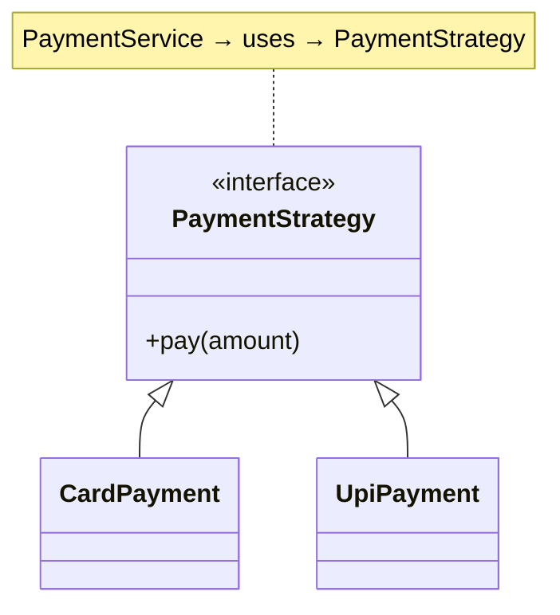

### 🟥 4. Relationships
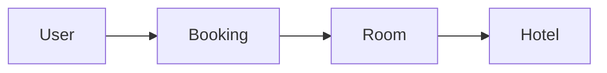

---

## 🗄️ 5. Database / Entities

### Conceptual Entity Overview
| Entity | Attributes |
|---|---|
| **User** | `id`, `name`, `email` |
| **Hotel** | `id`, `name`, `location` |
| **Room** | `id`, `hotel_id`, `type`, `price`, `status` |
| **Booking** | `id`, `user_id`, `room_id`, `checkIn`, `checkOut`, `status` |
| **Payment** | `id`, `booking_id`, `amount`, `status` |

### Schema Relationships
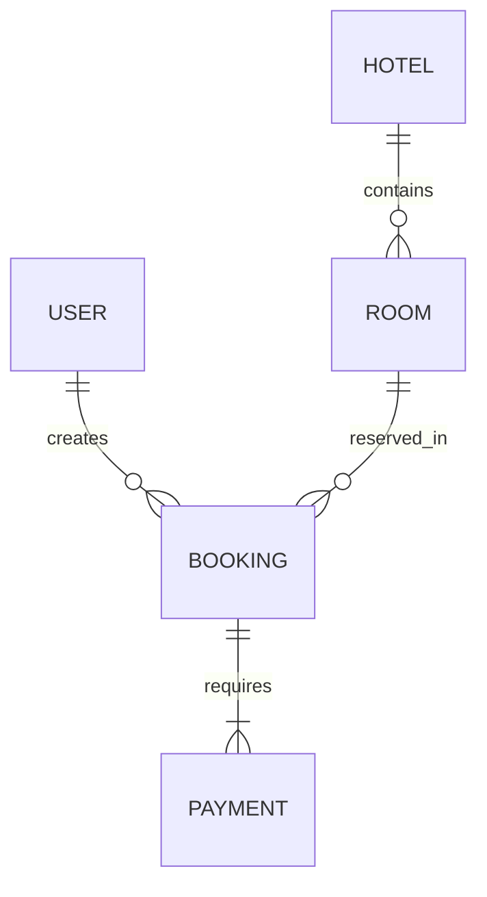

---
---

# Hospital Management System - Low Level Design

## 🧠 10-Second Viva Summary
> “Hospital system handles patient flow: appointment → doctor assignment → billing → pharmacy, using Strategy pattern for billing and maintaining medical records linked to patients.”

---

## 🎯 How To Draw This (Important)
👉 **Don't try to draw everything randomly.**
👉 **Draw in 3 layers:**
1. **Core Flow (top)**
2. **Engines / Domains (middle)**
3. **Data & DB (bottom)**

---

## 🧩 Complete System UML Diagram

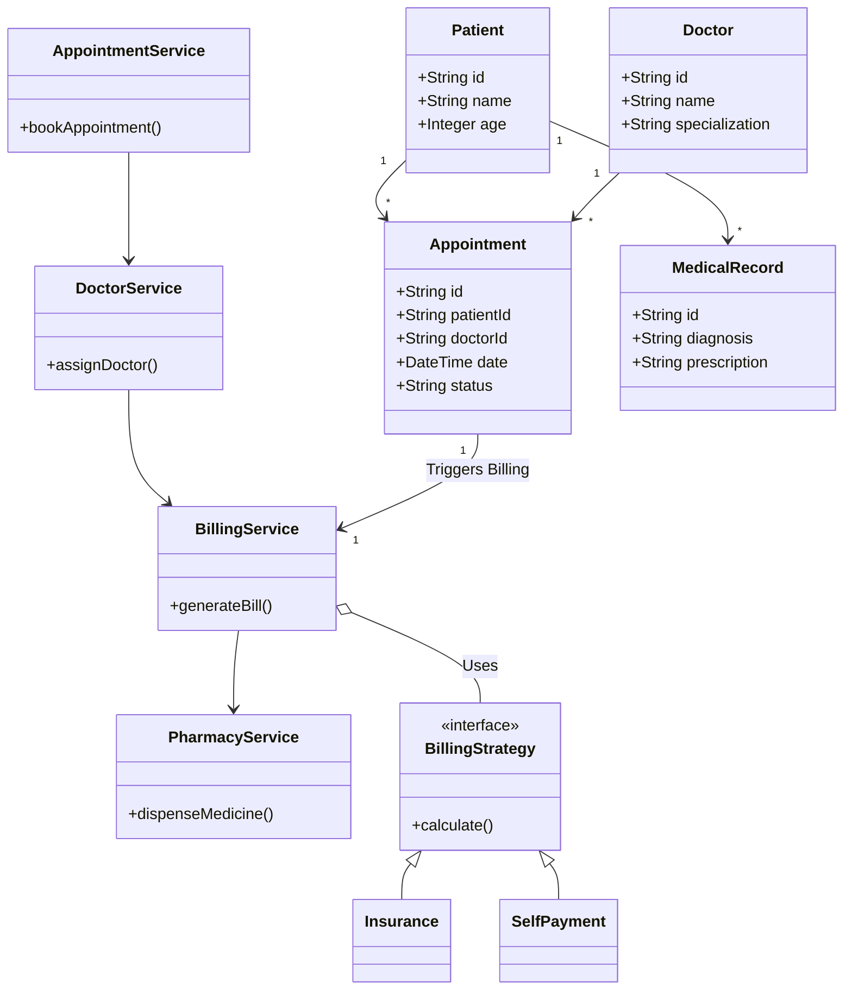

---

## 🧱 Component Breakdown

### 🟦 1. Core Flow
```mermaid
flowchart TD
    AS[AppointmentService<br/>bookAppointment()] --> DS
    DS[DoctorService<br/>assignDoctor()] --> BS
    BS[BillingService<br/>generateBill()] --> PS
    PS[PharmacyService<br/>dispenseMedicine()]
```

### 🟨 2. Domain Classes
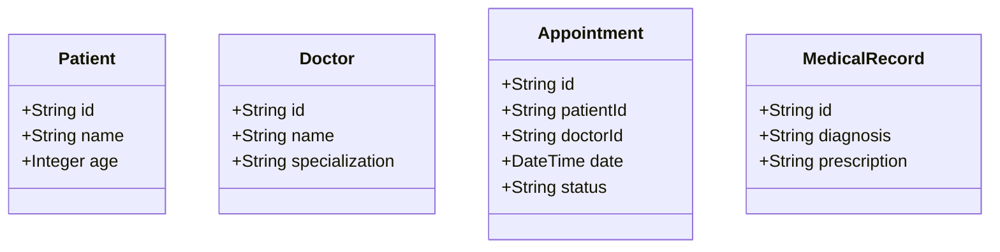

### 🟥 3. Billing Strategy
Utilizes **Strategy Pattern** for differing payment logics.
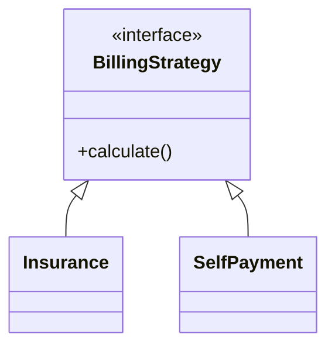

### 🟩 4. Relationships
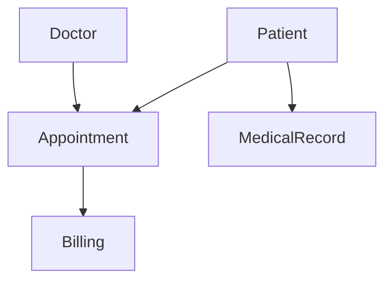

---

## 🗄️ 5. Database / Entities

### Conceptual Entity Overview
| Entity | Attributes |
|---|---|
| **Patient** | `id`, `name`, `age` |
| **Doctor** | `id`, `name`, `specialization` |
| **Appointment** | `id`, `patient_id`, `doctor_id`, `date`, `status` |
| **MedicalRecord**| `id`, `patient_id`, `diagnosis`, `prescription` |
| **Billing** | `id`, `appointment_id`, `amount`, `status` |

### Schema Relationships
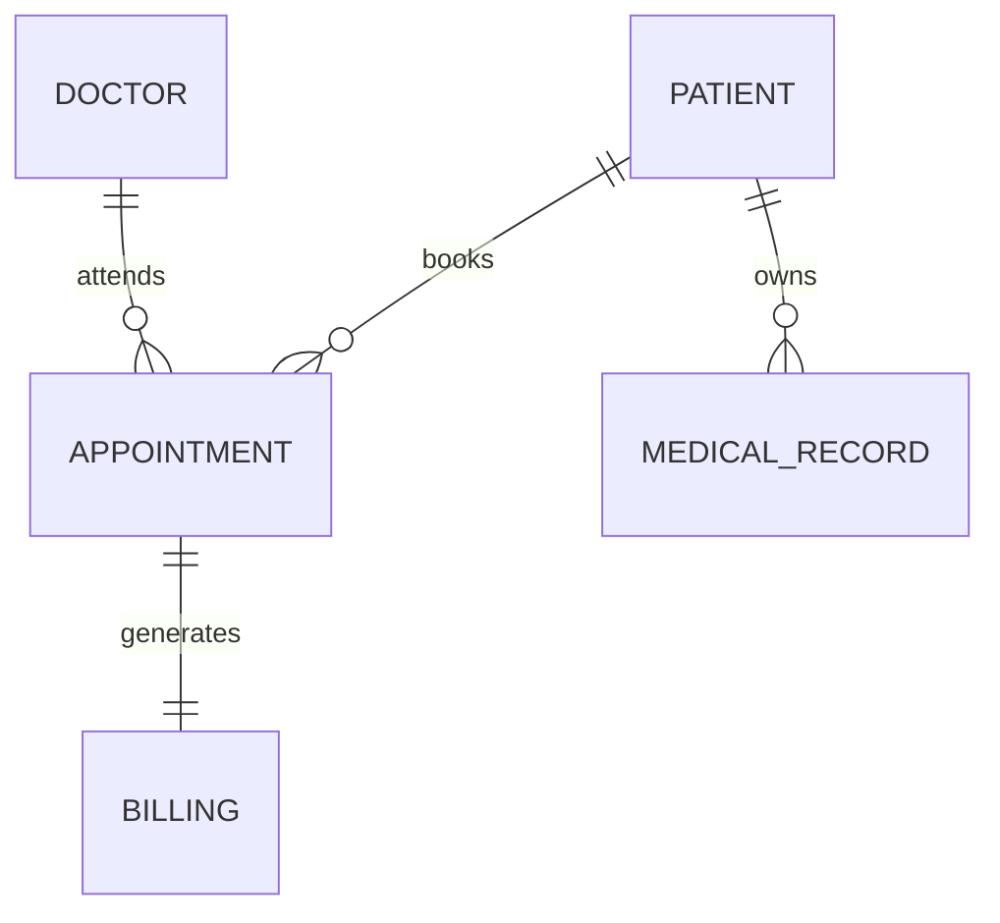

---

## 🚀 Quick Comparison (Interview Gold)
| System | Key Pattern | Flow |
|---|---|---|
| **Trading** | Strategy + Adapter + Chain | Tick → Order |
| **Hotel** | Strategy | Booking → Payment |
| **Hospital** | Strategy | Appointment → Billing |
