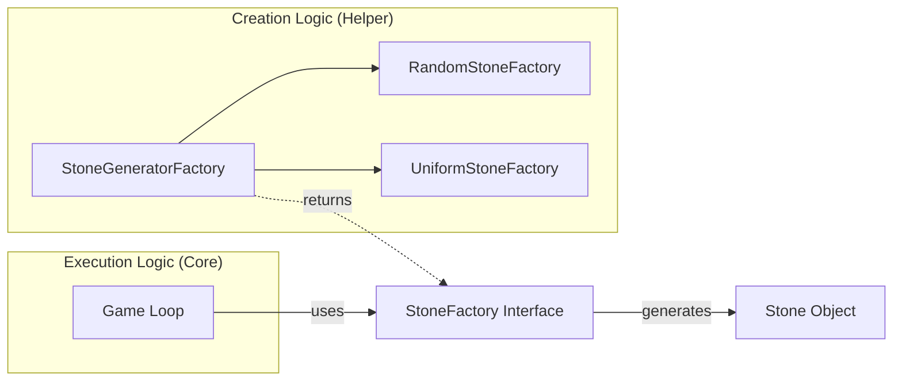

# Class 4: Factory Design Pattern

This session explores the **Factory Design Pattern** through the lens of a game design scenario: **"Dodge the Stones."**

---

## 🎮 The Story: Dodge the Stones

In our game, a character moves forward and must dodge three types of stones: `SmallStone`, `MediumStone`, and `LargeStone`.

```java
// Product Interface
interface Stone { void display(); }

// Concrete Products
class SmallStone implements Stone { public void display() { System.out.println("🪨 Small Stone"); } }
class MediumStone implements Stone { public void display() { System.out.println("⛰️ Medium Stone"); } }
class LargeStone implements Stone { public void display() { System.out.println("🏔️ Large Stone"); } }

// Client code directly instantiating (VERBOSE & COUPLED)
new SmallStone();
new MediumStone();
new LargeStone();
```

**Why is this bad?**
It tightly couples the game logic to specific stone classes. If we change a constructor or add a new stone type, we have to modify the core game loop. This violates the **Open/Closed Principle**.

---

## 🛠️ Step 1: Simple Factory Solution

To decouple stone creation, we introduce a **Simple Factory**.

```java
public class StoneFactory {
    public static Stone createStone(String type) {
        switch (type.toLowerCase()) {
            case "small": return new SmallStone();
            case "medium": return new MediumStone();
            case "large": return new LargeStone();
            default: throw new IllegalArgumentException("Unknown stone type");
        }
    }
}

// Client Usage
Stone stone = StoneFactory.createStone("small");
```

---

## 🚀 Step 2: Advanced Requirements (Factory Method)

The game developers now want different **generation strategies**:
1.  **Random Generation**: Stones appear unpredictably.
2.  **Uniform Generation**: Stones appear in a fixed sequence (`Small → Medium → Large`).

This leads us to the **Factory Method Pattern**.

### 1. The Interface
Every generation strategy must implement this interface:

```java
public interface StoneFactory {
    Stone generateStone();
}
```

### 2. Concrete Strategy: Random
```java
public class RandomStoneFactory implements StoneFactory {
    public Stone generateStone() {
        int random = (int) (Math.random() * 3);
        switch (random) {
            case 0: return new SmallStone();
            case 1: return new MediumStone();
            case 2: return new LargeStone();
            default: throw new RuntimeException("Unexpected state");
        }
    }
}
```

### 3. Concrete Strategy: Uniform
This strategy ensures stones appear in a repeating sequence (`Small → Medium → Large`).

```java
public class UniformStoneFactory implements StoneFactory {
    private int counter = 0; // MUST be non-static for state isolation

    public Stone generateStone() {
        Stone stone;
        // Mathematical Trick: Use Modulo (%) to cycle through 0, 1, 2
        switch (counter % 3) {
            case 0: stone = new SmallStone(); break;
            case 1: stone = new MediumStone(); break;
            case 2: stone = new LargeStone(); break;
            default: throw new RuntimeException("Unexpected state");
        }
        
        // Cycle the counter: 0 -> 1 -> 2 -> 0 ...
        counter = (counter + 1) % 3;
        return stone;
    }
}
```

---

## 🏗️ Step 3: The Stone Generator Factory (Strategy Selection)

The core requirement is that the client chooses the **algorithm** once, and then the loop runs **without asking for arguments**.

```java
public class StoneGeneratorFactory {
    public static StoneFactory getStoneFactory(String type) {
        if ("random".equalsIgnoreCase(type)) {
            return new RandomStoneFactory();
        } else if ("uniform".equalsIgnoreCase(type)) {
            return new UniformStoneFactory();
        } else {
            throw new IllegalArgumentException("Unknown factory type");
        }
    }
}

// --- CLIENT LOGIC ---

// 1. SELECT Strategy ONCE (Decision Phase)
StoneFactory factory = StoneGeneratorFactory.getStoneFactory("uniform");

// 2. The Loop (Execution Phase)
while (gameIsRunning) {
    // ZERO-ARGUMENT CALL: The client doesn't specify 'what' to create anymore.
    // The factory 'remember' the strategy and state internally.
    Stone stone = factory.generateStone();
    stone.display();
}
```

---

## 🏗️ Architectural Segregation: Why this matters

The core benefit of the Factory pattern is the **Segregation of Creation from Execution**.

### 🗺️ The Design Map


### 🗝️ Key Nuances:
1.  **Eager Selection, Lazy Generation**: The generation logic (The Factory) is selected **once** at the start. The actual objects (The Stones) are generated **one-by-one** on-demand.
2.  **Stateless vs Stateful**: 
    - `RandomStoneFactory` is stateless (each call is independent).
    - `UniformStoneFactory` is **stateful** (it needs to remember the previous stone to pick the next in sequence).
3.  **Encapsulation**: If a `Stone` constructor changes (e.g., adding `color` or `speed`), we only update the Factory. The thousands of lines of code in the Game Loop remain untouched.

---

## 🎙️ Interview & Design Insights

### 🛡️ Why use this?
1.  **Encapsulation**: Creation logic is hidden from the client.
2.  **Extensibility**: Adding a `LevelBasedFactory` is easy and won't break the game loop.
3.  **State Management**: By keeping the `counter` **non-static** in `UniformStoneFactory`, we ensure that two parallel games don't mess up each other's stone sequences.

### 🏢 Real-world Application
This specific "Stone Generation" problem is a classic **Machine Coding** interview question (asked at companies like **Swiggy**).

---

## 📝 Assignments & Deadlines
- **Deadline**: Monday before the next class.
- **Tasks**: Complete SOLID principles assignment and the new Design Pattern assignments.
- **Goal**: Be ready to explain any implementation during class.
