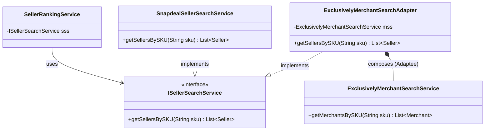
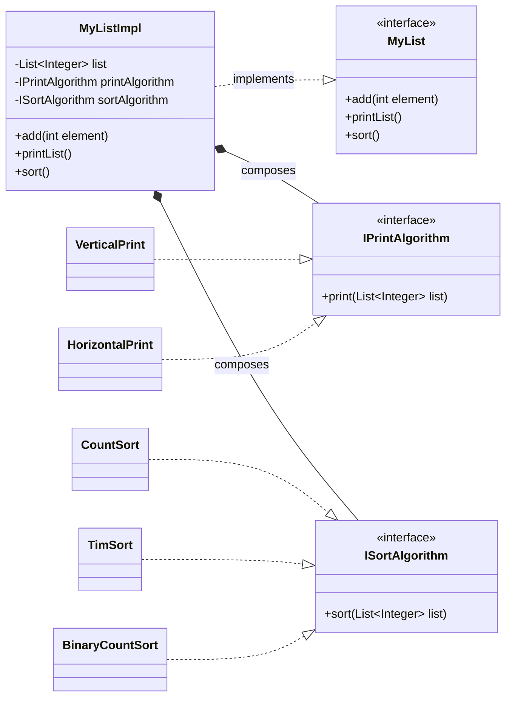

# System Design Concepts: Dependency Injection & Adapter Pattern

This document outlines the evolutionary journey of building a Seller Search and Ranking system, focusing on resolving architectural issues through Design Patterns.

---

## 🏗️ Context: Seller Search Service
Imagine a platform like Snapdeal where we have two main sides:
- **Buyer Side**: Products matching user details.
- **Seller Side**: Products matching unique codes (SKU/SUPC).

We need a service to help sellers search for products:
1. `getSellerBySKU(sku)`: For specific product types.
2. `getSellerBySUPC(supc)`: For specific items in storage.

---

## 🔴 Phase 1: The Problem (Tight Coupling)

Initially, our `SellerRankingService` (the client) was directly responsible for creating the `SellerSearchService`.

### Code Implementation
```java
class SellerRankingService {
    void rankingFunc(String sku) {
        // ❌ PROBLEM: Creating a concrete class inside another concrete class
        SellerSearchService sss = new SellerSearchService();
        sss.getSellerBySKU(sku);
    }
}
```

### 🚩 The Issue
- **Tight Coupling**: `SellerRankingService` is "tied" to a specific implementation of `SellerSearchService`.
- **Violation of Dependency Inversion**: High-level modules should not depend on low-level modules; both should depend on abstractions.
- **Testing Difficulty**: Hard to mock the search service for unit testing.

---

## 🟢 Phase 2: The Solution (Dependency Injection)

To solve this, we introduce an **Interface** (Abstraction) and inject the dependency via the constructor.

### Code Implementation
```java
// 1. Define the Abstraction
interface ISellerSearchService {
    List<Seller> getSellerBySKU(String sku);
    Seller getSellerBySUPC(String supc);
}

// 2. Concrete Implementation for Snapdeal
class SnapdealSearchService implements ISellerSearchService {
    public List<Seller> getSellerBySKU(String sku) { /* logic */ return new ArrayList<>(); }
    public Seller getSellerBySUPC(String supc) { /* logic */ return null; }
}

// 3. Client depends on Abstraction
class SellerRankingService {
    private ISellerSearchService searchService;
    
    // ✅ Injection via Constructor
    public SellerRankingService(ISellerSearchService searchService) {
        this.searchService = searchService;
    }

    void rankingFunc(String sku) {
        List<Seller> list = searchService.getSellerBySKU(sku);
    }
}
```

### ✨ Improvements
- **Loose Coupling**: The ranking service doesn't care *which* search service it uses, as long as it follows the interface.
- **Extensibility**: Easily swap Snapdeal with another provider without changing the ranking logic.

---

## 🟠 Phase 3: The New Challenge (Incompatibility)

What if we want to integrate **Exclusively**, a new service? 
Exclusively has a `MerchantSearchService` that does the same thing but has **different method names**:
- Method: `getMerchantBySKU(sku)` (Instead of `getSellerBySKU`)

### The Conflict
Our `SellerRankingService` calls `searchService.getSellerBySKU(sku)`. It cannot call `getMerchantBySKU(sku)` because it doesn't match the `ISellerSearchService` interface.

---

## 🔵 Phase 4: The Final Solution (Adapter Pattern)

The **Adapter Pattern** bridges the gap between two incompatible interfaces. It acts as a wrapper that converts the "Merchant" interface into the "Seller" interface our system expects.

### ❌ The Problematic Solution (Modifying the Original Service)

One approach might be to modify the newly acquired `ExclusivelyMerchantService` to force it to implement our `ISellerSearchService` interface.

```java
// ❌ This is considered a BAD approach
public class ExclusivelyMerchantService implements ISellerSearchService {

    // ... Existing Exclusively methods ...
    public List<Merchant> getMerchantsBySKU(String sku) { /* ... */ return new ArrayList<>(); }

    // Forced Implementation to satisfy ISellerSearchService
    @Override
    public List<Seller> getSellerBySKU(String sku) {
        // We have to modify this existing class or add a new method
        List<Merchant> merchants = this.getMerchantsBySKU(sku);
        // Convert Merchant to Seller (which might not be straightforward)
        return convertMerchantsToSellers(merchants);
    }
    
    // We'd also need to implement all OTHER methods from ISellerSearchService...
}
```

**Why this is problematic**:
1.  **Violates Open-Closed Principle (OCP)**: It modifies existing, previously working code.
2.  **Risk of Breakage**: It might break other parts of the existing Exclusively system that rely on this class.
3.  **Low Cohesion**: It mixes the concerns of two completely different systems (Snapdeal and Exclusively) directly inside a core service.

### ✅ The Better Solution (Using Adapter Pattern)

Instead of touching `ExclusivelyMerchantService`, we build a "translator" wrapper around it.

```java
// The "Incompatible" Service (Left untouched)
class ExclusivelyMerchantService {
    public List<Merchant> getMerchantsBySKU(String sku) {
        System.out.println("Searching via Exclusively API...");
        return new ArrayList<>();
    }
}

// ✅ THE BETTER APPROACH: The Adapter
public class ExclusivelyMerchantServiceAdapter implements ISellerSearchService {

    // Holds a reference to the incompatible service
    private ExclusivelyMerchantService merchantService;

    public ExclusivelyMerchantServiceAdapter(ExclusivelyMerchantService merchantService) {
        this.merchantService = merchantService;
    }

    @Override
    public List<Seller> getSellerBySKU(String sku) {
        // 🤝 Delegation: Call the existing merchant method
        List<Merchant> merchants = merchantService.getMerchantsBySKU(sku);
        // Translate the result
        return convertMerchantsToSellers(merchants);
    }

    @Override
    public Seller getSellerBySUPC(String supc) {
        // Implement adapter logic or throw UnsupportedOperationException
        return null; // Simplified for example
    }

    private List<Seller> convertMerchantsToSellers(List<Merchant> merchants) {
        System.out.println("Translating Merchant objects to Seller objects...");
        return new ArrayList<>(); // Conversion logic here
    }
}
```

#### 📊 Architecture Visualization


#### 💻 Usage Integration: Interchangeable Services

```java
// Scenario 1: Using Snapdeal's native service
ISellerSearchService snapdealService = new SnapdealSellerSearchService();
SellerRankingService rankingService1 = new SellerRankingService(snapdealService);
rankingService1.rankSellers("SKU-123");

// Scenario 2: Using Exclusively's service through the Adapter
ExclusivelyMerchantService exclusivelyService = new ExclusivelyMerchantService();
ISellerSearchService adapter = new ExclusivelyMerchantServiceAdapter(exclusivelyService);
SellerRankingService rankingService2 = new SellerRankingService(adapter);
rankingService2.rankSellers("SKU-999");
```

### 🔌 The "Plug Converter" Analogy
Think of this architecture like an electrical plug converter when traveling:
- **The Client (Wall Socket)**: `SellerRankingService` expects an `ISellerSearchService` standard.
- **The Adaptee (Foreign Appliance)**: `ExclusivelyMerchantService` has the wrong shape (methods).
- **The Adapter (Plug Converter)**: `ExclusivelyMerchantServiceAdapter` changes the shape.

**How it helps**:
1.  **Implements the Expected Interface**: The clients (`SellerRankingService`) remain completely unaware they are talking to a separate company's system.
2.  **Internal Translation**: It internally uses the `ExclusivelyMerchantService`, physically translating `Merchant` data into `Seller` data.
3.  **Plug-and-Play**: It unifies different implementations, allowing `ExclusivelyMerchantService` to be "plugged in" to the Snapdeal ecosystem without changing a single line of the Exclusively core code or the Snapdeal client code.

### ✨ Summary of Correct Approach:
1.  **Zero Modification (OCP Adherence)**: Doesn't modify the existing `ExclusivelyMerchantService` class.
2.  **Seamless Integration**: Implements the `ISellerSearchService` interface exactly as Snapdeal's system expects.
3.  **Clean Delegation**: Delegates calls to the `ExclusivelyMerchantService` and handles necessary type conversions in a dedicated class.

> [!NOTE]
> **Pragmatism over Perfection**: The Adapter has a hard dependency (violating Dependency Inversion) on the concrete `ExclusivelyMerchantService`. The instructor identified this as an acceptable trade-off for several reasons:
> 1.  **Specific Purpose**: The wrapper is designed *specifically* for `ExclusivelyMerchantService`. It’s not meant to be a generic adapter.
> 2.  **Tight Coupling Necessity**: The adapter *needs* to know the exact method names and signatures of Exclusively's service to perform its translation correctly.
> 3.  **Limited Scope**: This solves a specific integration problem between two existing systems. We don't want to provide flexibility here.
> 4.  **Encapsulation of Complexity**: While the adapter has a hard dependency, it encapsulates this complexity entirely inside itself. This allows the rest of the Snapdeal system (the Client) to remain loosely coupled.
> 
> **The Instructor's Insight**:
> *"Correct, we are going to make an object of a concrete class, not of an interface, which means that the dependency inversion will be violated. And that is fine. Why? Because this wrapper class that we are writing, it is specific to the exclusively merchant service class. This is going to have a hard dependency and which is also expected because we do not want to provide a flexibility here."*

---

## 🛡️ Phase 5: Proxy Pattern

A **Proxy** is a wrapper that acts as an agent for another object to control access to it.

### 🎯 Purpose
- **Security**: Check permissions before calling the real object.
- **Extra Logic**: Add behavior like retrying operations automatically.
- **Lazy Initialization**: Delay expensive object creation until it's actually accessed.
- **Exception Handling**: Centrally handle errors from the real object.

### 🔄 Proxy vs. Adapter Deep Dive

While both patterns look similar structurally, the instructor emphasized that they serve entirely different purposes.

#### 🤝 Structural Similarities
1.  Both are **Wrapper classes**.
2.  Both **implement an interface** expected by the client.
3.  Both **delegate calls** to an underlying (wrapped) object.

#### ⚔️ Functional Differences & Examples

| Feature | Adapter (Translation) | Proxy (Access Control) |
| :--- | :--- | :--- |
| **Primary Goal** | Make incompatible interfaces work together. | Control access to an existing object (Security, Laziness, Caching). |
| **Interface Logic** | **Changes** the method calls (Translates `A()` into `B()`). | Maintains the **same** method calls (Calls `A()` -> `A()`). |

##### The Adapter Example
**Purpose**: You want to use an existing class, but its interface doesn't match what you need.
```java
// Adapter changes the method shape: targetMethod() -> differentMethodName()
public class AdapterExample implements TargetInterface {
    private ExistingAilmentsClass existingObject;

    public void targetMethod() {
        // Translation occurs here. Client doesn't know about differentMethodName.
        existingObject.differentMethodName();
    }
}
```

##### The Proxy Example
**Purpose**: You want to add functionality (like lazy loading or caching) *before* or *after* the main object's operation.
```java
// Proxy keeps the method shape: sharedMethod() -> sharedMethod()
public class ProxyExample implements SharedInterface {
    private RealObject realObject;

    public void sharedMethod() {
        // Interception logic (e.g., Lazy Initialization)
        if (realObject == null) {
            realObject = new RealObject(); 
        }
        // Access control check or logging could go here
        
        realObject.sharedMethod(); // Delegates to exact same method
        
        // Logging or Caching could go here
    }
}
```

#### 📌 Contextual Recap
-   **Why Adapter?**: `ExclusivelyMerchantServiceAdapter` is an Adapter because it receives `getSellerBySKU` and translates it into `getMerchantBySKU`. It bridges incompatible systems.
-   **Where Proxy Fits**: A Proxy could be used to wrap our `SnapdealSellerSearchService` to add **Caching** (saving repeated SKU searches) or **Access Control** (ensuring only Premium Sellers can search certain SUPCs) without changing the Snapdeal code.

---

## 🧩 Phase 6: Strategy Pattern (The MyList Example)

### 📋 Introduction: The MyList Requirement
At 1:11:32, the instructor introduced a classic design problem: Building a custom list class called `MyList`.

**The Requirements**:
- Use the Java Collections framework internally.
- The list specifically holds **Integer** data.
- Must implement three core functionalities:
    1.  `add(int element)`: To append elements.
    2.  `printList()`: To print the list vertically (each element on a new line).
    3.  `sort()`: To sort the list in ascending order.
- **Design Constraint**: The implementation *must* strictly follow SOLID principles.

#### 💻 Client Usage Snapshot
The client expects to instantiate and use this custom list exactly like this:
```java
MyList list = new MyList();
list.add(10);
list.add(5);
list.add(20);

list.sort();      // Expected: Ascending Sort
list.printList(); // Expected: Vertical Print
```

### 🔴 The Problem: Inheritance Explosion

If we try to solve this using Inheritance by creating different classes for different printing and sorting combinations, we fall into a trap.

#### ❌ The Initial Approach (Problematic)
```java
class VerticalList extends MyList {
    @Override
    public void printList() { /* Vertical printing implementation */ }
    
    @Override
    public void sort() { /* Implement CountSort for 0, 1, 2 data */ }
}

class HorizontalList extends MyList {
    @Override
    public void printList() { /* Horizontal printing implementation */ }
    
    @Override
    public void sort() { /* Implement TimSort for general integer data */ }
}
```

#### 🚩 The Breakdown (The "Client" Scenarios)
The instructor presented real-world scenarios showing where this fails:
1. **Client 1**: Wants **Vertical Print** + **CountSort** (Data is only 0s, 1s, 2s). -> *We use `VerticalList`.*
2. **Client 2**: Wants **Horizontal Print** + **TimSort** (Data is varied). -> *We use `HorizontalList`.*
3. **Client 3 (New)**: Wants **Horizontal Print** + **CountSort** (Data is binary 0s and 1s). -> *Uh oh.*

**The Inheritance Trap**: 
To satisfy Client 3, we must create a *new* intersection subclass (e.g., `HorizontalCountList`). As combinations of print/sort grow, subclasses multiply rapidly (A Cartesian product explosion). This violates the **Open-Closed Principle** because adding a new combination requires modifying the system by adding new classes that duplicate existing logic.

---

### 🟢 The Solution: Strategy Pattern
Decouple the "What" (the list) from the "How" (the algorithm). We use **Composition** instead of Inheritance.

#### 1. Define Strategy Interfaces
```java
public interface IPrintAlgorithm {
    void print(List<Integer> list);
}

public interface ISortAlgorithm {
    void sort(List<Integer> list);
}
```

#### 2. Concrete Strategies (The Algorithms)
```java
// --- PRINT STRATEGIES ---
class VerticalPrint implements IPrintAlgorithm {
    @Override
    public void print(List<Integer> list) {
        list.forEach(System.out::println);
    }
}

class HorizontalPrint implements IPrintAlgorithm {
    @Override
    public void print(List<Integer> list) {
        System.out.println(list.stream().map(Object::toString)
                               .collect(Collectors.joining(" ")));
    }
}

// --- SORT STRATEGIES ---
class CountSort implements ISortAlgorithm {
    @Override
    public void sort(List<Integer> list) {
        // Efficient implementation for small range
    }
}

class TimSort implements ISortAlgorithm {
    @Override
    public void sort(List<Integer> list) {
        Collections.sort(list); // Java's built-in TimSort
    }
}
```

#### 3. Context Class (The MyList Interface & Implementation)
To truly decouple code, the instructor emphasized programming to an interface. The client should only interact with `MyList`, oblivious to its underlying structural components (`MyListImpl`).

```java
// The Interface Exposed to Clients
public interface MyList {
    void add(int element);
    void printList();
    void sort();
}

// The Concrete Implementation utilizing Strategy
public class MyListImpl implements MyList {
    private List<Integer> list;
    
    // Composing the Strategy Interfaces
    private ISortAlgorithm sortAlgorithm;
    private IPrintAlgorithm printAlgorithm;

    public MyListImpl(ISortAlgorithm sortAlgorithm, IPrintAlgorithm printAlgorithm) {
        this.list = new ArrayList<>();
        this.sortAlgorithm = sortAlgorithm;
        this.printAlgorithm = printAlgorithm;
    }

    @Override
    public void add(int element) {
        list.add(element);
    }

    @Override
    public void printList() {
        printAlgorithm.print(this.list); // Delegation
    }

    @Override
    public void sort() {
        sortAlgorithm.sort(this.list);   // Delegation
    }
    
    // Changing behavior at runtime!
    public void setSortAlgorithm(ISortAlgorithm sortAlgorithm) {
        this.sortAlgorithm = sortAlgorithm;
    }

    public void setPrintAlgorithm(IPrintAlgorithm printAlgorithm) {
        this.printAlgorithm = printAlgorithm;
    }
}
```

#### 📊 Architecture Visualization


#### 💻 Client Usage & Flexibility
```java
// Client initializes via Interface but provides specific implementations
MyList list = new MyListImpl(new CountSort(), new VerticalPrint());
list.add(3); list.add(1); list.add(2);

// Client code is completely agnostic to whether list is Vertical/Horizontal
list.sort();      
list.printList(); 

// Dynamic Runtime Change! We cast to access the concrete setter
((MyListImpl)list).setSortAlgorithm(new TimSort());
list.sort();
list.printList();
```

### ✨ Instructor's Key Takeaways
1.  **Interface Programming**: `MyList` allows clients to work with a list without caring about the concrete class holding the data or rendering it.
2.  **Composition Over Inheritance**: `MyListImpl` uses composition to hold varied combinations of algorithms without creating rigid subclass structures (`VerticalList`, `HorizontalList`, etc.).
3.  **Run-Time Swapping**: Algorithm behavior can be dynamically changed after instantiation via trivial setter methods.
4.  **OCP Adherence**: When a new sorting algorithm algorithm is invented tomorrow, you just create a new class implementing `ISortAlgorithm`—zero existing files are modified.
5.  **Single Responsibility**: The lists only hold data; the Strategy classes uniquely define logic.

---

## 📝 Final Summary
| Pattern | Primary Use Case |
| :--- | :--- |
| **Dependency Injection** | Decoupling object creation from its usage. |
| **Adapter** | Bridging incompatible interfaces (The "Translator" / "Plug Converter"). |
| **Proxy** | Controlling access/adding logic to an object without changing its interface. |
| **Strategy** | Swapping interchangeable algorithms dynamically via Composition instead of Inheritance. |

