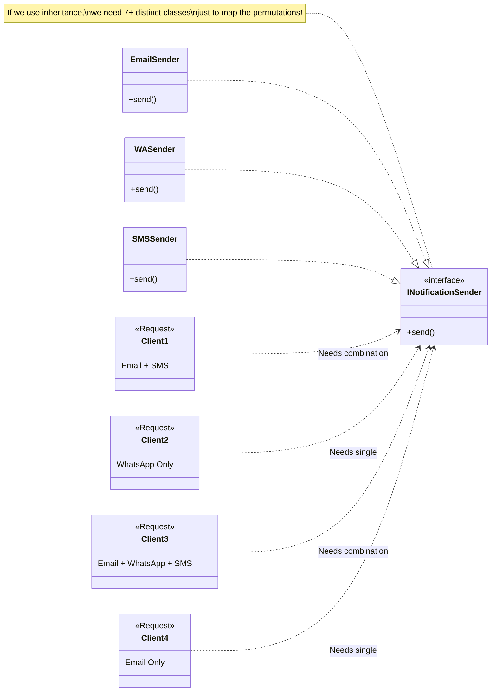
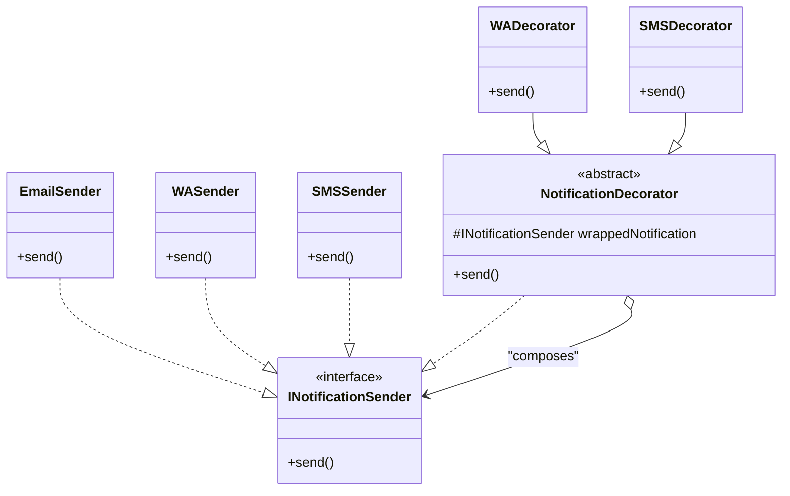

# Class 7: Observer Design Pattern

**TL;DR**: The Observer Pattern is a structural design pattern that lets you define a subscription mechanism to notify multiple objects about any events that happen to the object they're observing. It is heavily analogous to the Publish-Subscribe (Pub-Sub) model used in modern microservices (e.g., Kafka, RabbitMQ).

---

## 🎮 The Scenario: Monster Death Event

Imagine a video game where killing a monster triggers multiple sub-systems. When the `Monster` state becomes `DEAD`, three things must happen:
1.  **Background** should change.
2.  **Music** should change (e.g., victory theme).
3.  **Player State** should update (e.g., increase XP or add achievements).

We have specific handlers for each:
-   `BackgroundHandler`
-   `MusicHandler`
-   `PlayerStateHandler`
-   `MonsterHandler` (Manages monster state)

### 🔴 Problem 1: Rigid Coupling (The Naive Approach)
In an initial, problematic implementation, you might see this hardcoded inside the main game loop:

```java
// Inside the main game loop
if (monster.getState() == State.DEAD) {
    backgroundHandler.changeBackground();
    musicHandler.changeMusic();
    playerStateHandler.updateState();
}
```

**Why it fails:**
*   **Violates SRP**: The main game loop (or whatever class holds this logic) becomes responsible for orchestrating *every* system triggered by the monster's death.
*   **Violates OCP**: If we add a new system (e.g., `AchievementHandler`), we have to physically open this class and add a new `achievementHandler.unlock()` line to the `if` block.

---

### 🟡 Problem 2: Centralizing Notification (The `UpdateOnDeath` Patch)
To clean up the `MonsterHandler` and the game loop, the instructor introduced an intermediate step: wrapping all the dependent handlers into a single class called `UpdateOnDeath`.

#### The Centralized Wrapper
```java
class UpdateOnDeath {
    private BackgroundHandler backgroundHandler;
    private MusicHandler musicHandler;
    private PlayerStateHandler playerStateHandler;

    public UpdateOnDeath(BackgroundHandler backgroundHandler, 
                         MusicHandler musicHandler, 
                         PlayerStateHandler playerStateHandler) {
        this.backgroundHandler = backgroundHandler;
        this.musicHandler = musicHandler;
        this.playerStateHandler = playerStateHandler;
    }

    public void update() {
        backgroundHandler.changeBackground();
        musicHandler.changeMusic();
        playerStateHandler.updateState();
    }
}
```

#### The Cleaner MonsterHandler
```java
class MonsterHandler {
    private UpdateOnDeath updateOnDeath;

    public MonsterHandler(UpdateOnDeath updateOnDeath) {
        this.updateOnDeath = updateOnDeath;
    }

    public void setStateToDead() {
        // ... internal monster state logic ...
        updateOnDeath.update(); // Centralized notification
    }
}
```

**The 7 Architectural Failures of `UpdateOnDeath`**:
While this cleans up the `MonsterHandler`, the instructor explicitly pointed out that this intermediate patch is deeply flawed:

1.  **Violates SRP**: The `UpdateOnDeath` class currently manages *three* distinct types of updates (background, music, player state). This gives it multiple distinct reasons to change.
2.  **Violates OCP**: If we need to add a new effect (e.g., `SoundEffectHandler`), we are forced to physically open and modify the `UpdateOnDeath` class constructor and `update()` method.
3.  **Tight Coupling**: `UpdateOnDeath` is permanently bound to specific concrete handler classes rather than an interface.
4.  **Lack of Flexibility**: You cannot easily add or remove these update behaviors *at runtime* based on dynamic game conditions.
5.  **Complex Dependency Graph**: The `MonsterHandler` now depends on `UpdateOnDeath`, which in turn depends on *all* specific handler classes. If any handler breaks or blocks, the entire chain fails.
6.  **Testability Concerns**: Due to tight coupling, it is exceptionally hard to mock and unit test `UpdateOnDeath` in absolute isolation.
7.  **Scalability Problems**: As the game grows (adding UI updates, server logging, achievement unlocks), this class will rapidly balloon into an unmaintainable "God Object/Method".

> [!NOTE] 
> **The Iterative Nature of Design**: The instructor used this stepping-stone to prove an important point: *Software design is iterative.* Even when a patch appears to clean up code (like getting logic out of `MonsterHandler`), it can reveal deeper structural rot. This necessitates deploying robust, advanced Design Patterns.

---

## 🟢 The Solution: Observer Pattern (Publish-Subscribe)
To truly decouple these systems, we implement the **Observer Pattern**. 
This consists of two primary roles:
1.  **The Subject (Publisher)**: The object generating the event (The Monster).
2.  **The Observers (Subscribers)**: The objects waiting for an event to happen (The various Handlers).

### 1. The Subject & Observer Infrastructures
We establish a contract. Any class that wants to listen must implement `IObserver`. Any class that generates events must extend or implement a `Subject` blueprint.

```java
interface IObserver {
    void update();
}

class Subject {
    // A generic list of listeners. The Subject doesn't care WHAT they are, 
    // only that they implemented the `update()` contract.
    private List<IObserver> observers = new ArrayList<>();

    public void addObserver(IObserver observer) {
        observers.add(observer);
    }

    public void removeObserver(IObserver observer) {
        observers.remove(observer);
    }

    protected void notifyObservers() {
        for (IObserver observer : observers) {
            observer.update(); // Broadcast the event
        }
    }
}
```

### 2. The Concrete Subject (Publisher)
Our `MonsterHandler` now inherits the generic `Subject` capabilities.

```java
class MonsterHandler extends Subject {
    
    public void setStateToDead() {
        System.out.println("Monster state changed to DEAD.");
        // Notify all subscribers that the state changed!
        // MonsterHandler doesn't know who is listening or what they will do.
        notifyObservers(); 
    }
}
```

### 3. The Concrete Observers (Subscribers)
Every dependent handler implements the `IObserver` interface, dictating what it does when `update()` is triggered.

```java
class BackgroundHandler implements IObserver {
    @Override
    public void update() {
        changeBackground();
    }

    private void changeBackground() {
        System.out.println("Background changed to scary red theme.");
    }
}

class MusicHandler implements IObserver {
    @Override
    public void update() {
        System.out.println("Music changed to victory fanfare.");
    }
}

class PlayerStateHandler implements IObserver {
    @Override
    public void update() {
        System.out.println("Player awarded 500 XP.");
    }
}
```

### 4. Game Integration (Wiring it together)
When the game initializes, the Observers simply "subscribe" to the Subject.

```java
public class GameEngine {
    public static void main(String[] args) {
        MonsterHandler monster = new MonsterHandler();
        
        // 1. Initialize Handlers (Subscribers)
        BackgroundHandler bgHandler = new BackgroundHandler();
        MusicHandler musicHandler = new MusicHandler();
        PlayerStateHandler playerHandler = new PlayerStateHandler();
        
        // 2. Subscribe them to the Monster (Publisher)
        monster.addObserver(bgHandler);
        monster.addObserver(musicHandler);
        monster.addObserver(playerHandler);
        
        // 3. Event occurs
        // The monster dies. It blindly broadcasts this. 
        // The handlers react instantly.
        monster.setStateToDead(); 
    }
}
```

---

## 🔄 Advanced Concept 1: Passing State Context
A common question arises: *How does the Observer know what exactly changed?* (e.g., The player needs to know exactly how much XP they gained). The instructor provided two industry-standard solutions to pass state from Subject to Observer:

1.  **The Push Model**: The Subject sends the necessary state directly inside the `update()` method argument.
    ```java
    interface IObserver {
        void update(State newState); // Or update(Subject context)
    }
    ```
2.  **The Pull Model**: The Observer maintains a reference to the Subject. When `update()` is triggered with no arguments, the Observer simply calls a getter on the Subject to fetch the state it cares about.

---

## 🏛️ Advanced Concept 2: Integrating Legacy Code (Adapter + Observer)
A frequent real-world problem: What if `BackgroundHandler` is a piece of legacy code inside a read-only library file? We **cannot** modify it to add `implements IObserver`.

**The Solution**: We fuse the **Adapter Pattern** with the **Observer Pattern**.

```java
// 1. The old legacy class we CANNOT modify
class BackgroundHandler {
    public void changeBackground() {
        System.out.println("Executing legacy background shift...");
    }
}

// 2. The Observer Contract we MUST implement
interface IObserver {
    void update();
}

// 3. The Adapter Wrapper
class BackgroundHandlerAdapter implements IObserver {
    private BackgroundHandler legacyHandler; // Hard dependency for precise translation

    public BackgroundHandlerAdapter(BackgroundHandler legacyHandler) {
        this.legacyHandler = legacyHandler;
    }

    @Override
    public void update() {
        // We translate the standard Observer call into the legacy method call
        legacyHandler.changeBackground();
    }
}
```

#### The Integration
Now, the core loop can subscribe the legacy code perfectly!
```java
// We wrap the legacy object inside our adapter before subscribing it
BackgroundHandler oldCode = new BackgroundHandler();
monster.addObserver(new BackgroundHandlerAdapter(oldCode));
```
By stacking patterns, we integrate unmodifiable legacy systems into a modern Publish-Subscribe architecture without breaking OCP or violating third-party libraries.

---

## ✨ Instructor's Key Takeaways

1.  **Ubiquitous in Game Dev**: The instructor noted that this pattern is exceptionally common in Game Development due to its fundamentally event-driven nature (Clicks, Collisions, Deaths, Timers).
2.  **Microservices Analogy**: This exact architectural flow maps directly to the **Publish-Subscribe (Pub-Sub)** model used heavily in microservice messaging queues (like Apache Kafka and RabbitMQ). A service publishes a message to a topic, and any number of agnostic microservices subscribed to that topic react independently.
3.  **True OCP Achieved**: If we want to add an `AchievementHandler` tomorrow, we write the class `class AchievementHandler implements IObserver`, and call `monster.addObserver(new AchievementHandler())`. The `MonsterHandler` and `Subject` list are literally never touched.

---
---

# Part 2: Introduction to Decorator Pattern

To transition into the **Decorator Pattern**, the instructor posed a new architectural challenge: **The Notification System**.

## 🔴 The Problem: Dynamic Behavior Addition 

**Initial Setup**: We have a basic `INotificationSender` interface and several concrete implementations that perfectly follow SRP.

```java
interface INotificationSender {
    void send();
}

class EmailSender implements INotificationSender {
    @Override
    public void send() {
        System.out.println("Sending Email...");
    }
}

class WASender implements INotificationSender {
    @Override
    public void send() {
        System.out.println("Sending WhatsApp...");
    }
}

class SMSSender implements INotificationSender {
    @Override
    public void send() {
        System.out.println("Sending SMS...");
    }
}
```

A basic client simply uses a Factory to retrieve the sender they need:
```java
INotificationSender sender = NotificationFactory.create("email");
sender.send(); 
```

### The Challenge Statement
A client initially only wants emails. Months later, they request WhatsApp capability added *to the exact same object*. Later, they want SMS added as well. 

How do we add new functionalities (behaviors) to an *existing object* at *runtime* without:
1.  Changing its underlying structure?
2.  Violating the **Open-Closed Principle (OCP)**?
3.  Causing an **Inheritance Explosion** (e.g., creating `EmailAndWASender.java`, `EmailAndSMSAndWASender.java`)?

### 📊 Visualizing the Client Chaos (Inheritance Explosion)
The instructor mapped out on the whiteboard exactly why basic inheritance fails here. Different clients want fundamentally different, layered combinations:



### The Desired (But Unsolved) API State
The instructor hinted at a design pattern that would allow developers to write code exactly like this:

```java
// 1. Core Object
INotificationSender sender = NotificationFactory.create("email");
sender.send(); // System: "Sending Email..."

// 2. Dynamically "Decorating" the object
sender = addWhatsAppNotifier(sender);
sender.send(); // System: "Sending Email...", "Sending WhatsApp..."

// 3. Layering another behavior
sender = addSMSNotifier(sender);
sender.send(); // System: "Sending Email...", "Sending WhatsApp...", "Sending SMS..."
```

> [!NOTE]
> **Real-World Analogies**: 
> 1.  **Gaming**: A base RPG character finding a magic ring. The ring *dynamically adds* "+5 Fire Damage" to their existing attack behavior.
> 2.  **UI Frameworks**: Taking a raw text component and dynamically wrapping it in a Scrollbar, and then wrapping that entire block in a Border without rewriting the base text component class.

---

## 🟢 The Solution: Decorator Pattern (Wrappers)

To solve dynamic behavior addition, we use the **Decorator Pattern**. The core mechanic of this pattern relies on creating "Wrapper" classes. 

### 📊 Visualizing the Decorator Architecture
Based on the whiteboard diagram, here is the architectural structure of the Decorator Pattern resolving our Notification problem:



As visualized above, Decorator classes must follow two strict rules:
1.  They must **implement the core interface** (`INotificationSender`) so the client trusts them (the dotted dependency arrow).
2.  They must **compose (contain) an object of that same interface** inside themselves (the solid aggregation arrow).

### 1. The Abstract Base Decorator (Preventing Boilerplate)
To prevent repeating the composition logic (`wrappedNotification`) in *every single* concrete wrapper we make, we create an **Abstract Base Decorator** class. 

```java
// The Base Wrapper Architect
public abstract class NotificationDecorator implements INotificationSender {
    // 1. Compose: It holds a wrapped sender (protected so children can use it if needed)
    protected INotificationSender wrappedNotification;

    public NotificationDecorator(INotificationSender notification) {
        this.wrappedNotification = notification;
    }

    // 2. Implement: The default behavior is simply to delegate down the chain
    public void send() {
        wrappedNotification.send();
    }
}
```

### 2. The Concrete Decorators
Now, building new features is incredibly fast and clean. We simply extend the base decorator and inject our specific logic.

```java
// WhatsApp Decorator Wrapper
public class WhatsAppDecorator extends NotificationDecorator {
    
    public WhatsAppDecorator(INotificationSender notification) {
        super(notification); // Pass the wrapped object up to the base class
    }

    @Override
    public void send() {
        // ALWAYS delegate to the wrapped object first via super
        super.send(); 
        
        // THEN execute this wrapper's specific new behavior
        System.out.println("...Also sending WhatsApp notification.");
    }
}

// SMS Decorator Wrapper
public class SMSDecorator extends NotificationDecorator {
    
    public SMSDecorator(INotificationSender notification) {
        super(notification);
    }

    @Override
    public void send() {
        // Delegate down the chain
        super.send();
        
        // Add new behavior
        System.out.println("...Also sending SMS notification.");
    }
}
```

### 3. The Final Unleashed API (Client Usage)
Now, we can fulfill the exact API the instructor challenged us with. We can stack behaviors infinitely at runtime like Russian Nesting Dolls:

```java
public class NotificationClient {
    public static void main(String[] args) {
        
        // 1. The Core Base Object
        INotificationSender sender = new EmailSender();
        sender.send(); 
        // Output: "Sending Email..."
        
        System.out.println("---");
        
        // 2. Client dynamically adds WhatsApp capabilities
        sender = new WhatsAppDecorator(sender);
        sender.send(); 
        // Output: 
        // "Sending Email..."
        // "...Also sending WhatsApp notification."

        System.out.println("---");
        
        // 3. Client layers on SMS capabilities
        sender = new SMSDecorator(sender);
        sender.send(); 
        // Output: 
        // "Sending Email..."
        // "...Also sending WhatsApp notification."
        // "...Also sending SMS notification."
    }
}
```

### 🏆 Why This Architecture Wins
*   **Total OCP Compliance**: If a client demands a new `PushNotificationSender` tomorrow, we just create a new `PushDecorator`. We **never** touch the `EmailSender`, `WhatsAppDecorator`, or `SMSDecorator` classes.
*   **Destroys Inheritance Explosions**: Instead of creating 7+ tightly-coupled subclasses like `EmailAndSMSExporter`, we created exactly 3 modular Decorator components that can be mixed and matched into infinite permutations at runtime.
*   **Dynamic Flexibility**: We can add (`new WhatsAppDecorator(sender)`) or remove decorators dynamically based purely on the shifting state of the live application.
