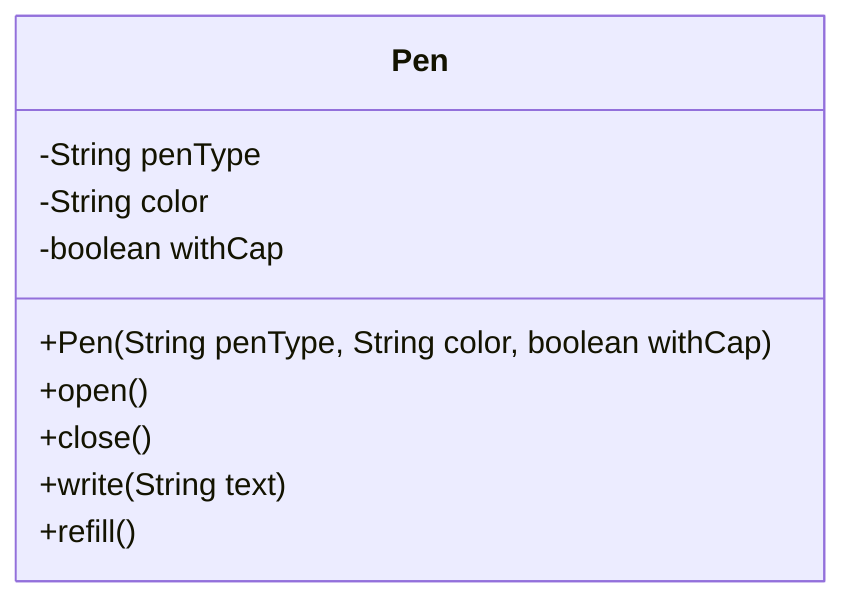
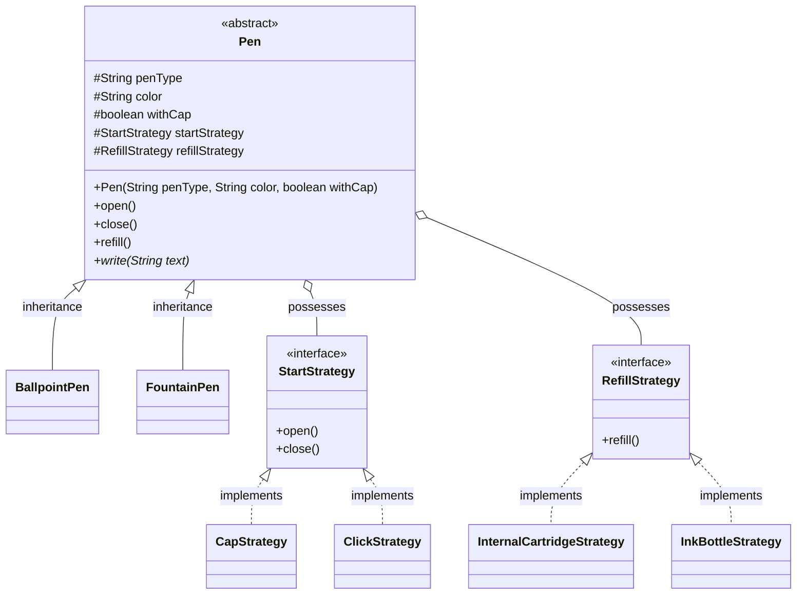
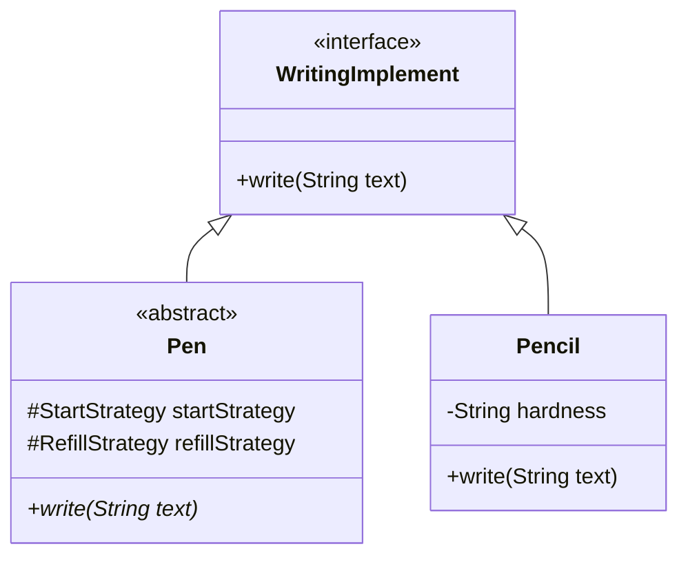
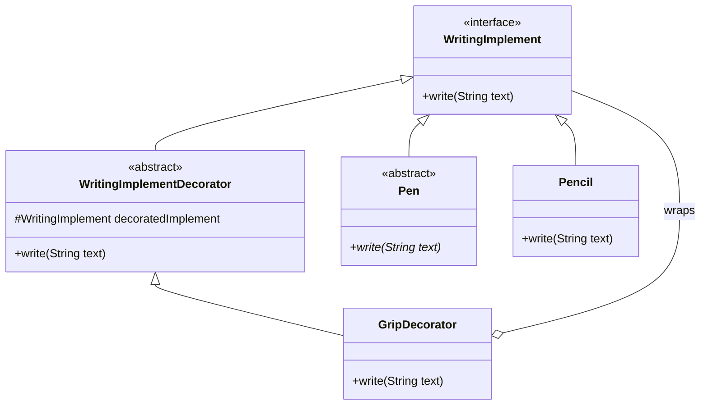
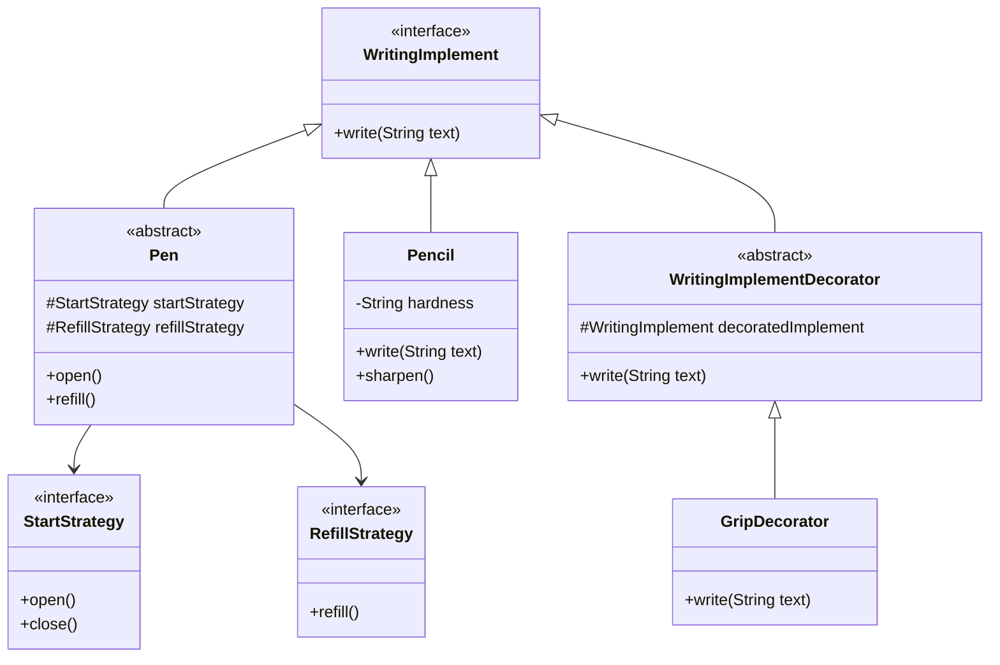
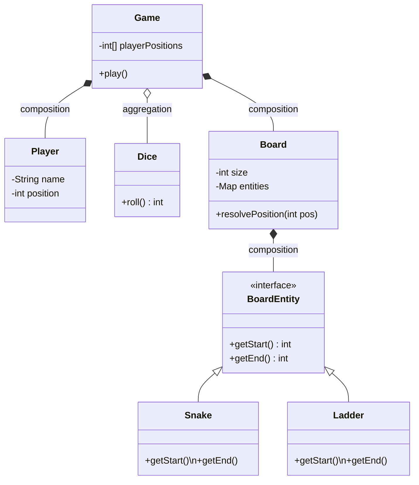
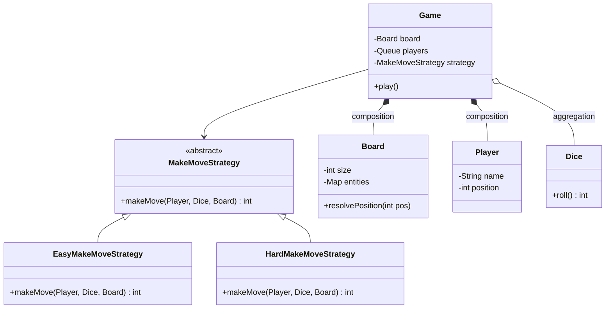
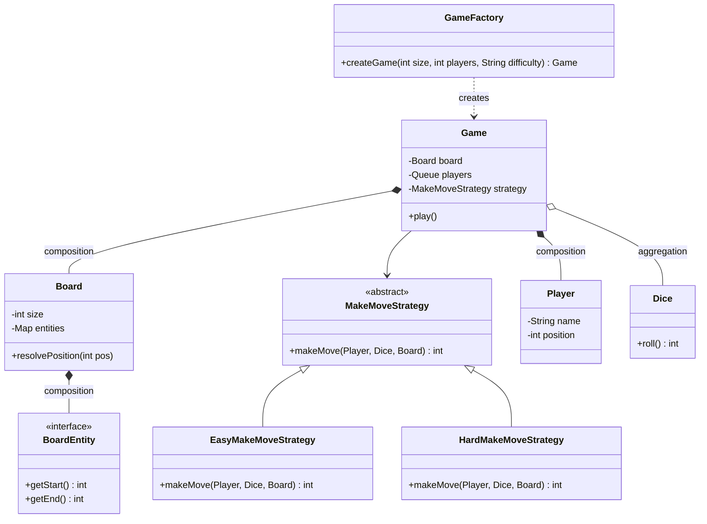
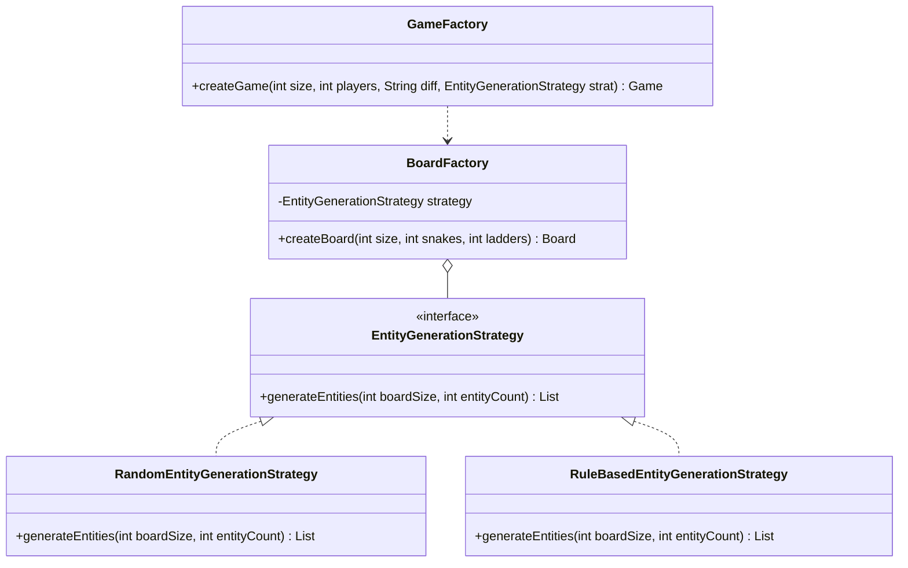
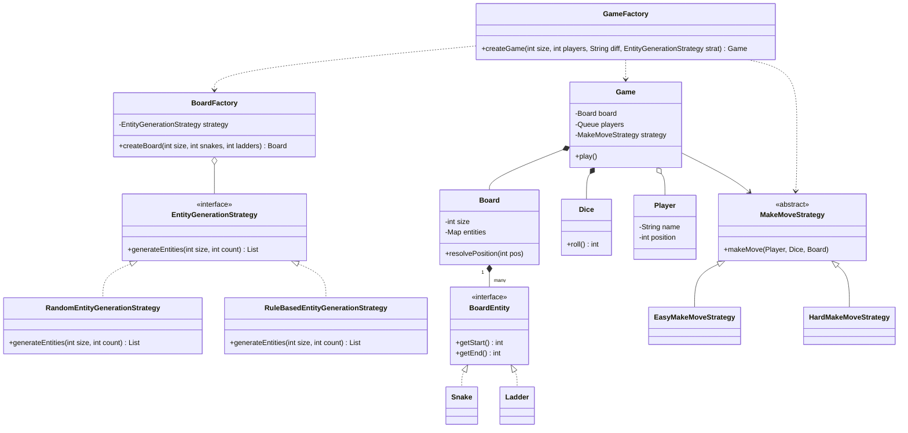

# Class 9: Object-Oriented Design - Pen System & Snake and Ladder

This session explores the iterative process of designing complex systems, focusing on clean abstractions, design patterns, and adhering to SOLID principles.

---

# 🖋️ Part 1: Pen Design System Evolution

The goal is to design a pen system that supports multiple types of pens (Ballpoint, Gel, Fountain) with different writing and refilling behaviors.

### 🧱 1. Requirements & Core Entities
- **Different pen types**: Ball, Gel, Fountain.
- **Varying writing behaviors**: Each pen writes differently.
- **Refill mechanisms**: Internal cartridge vs. Ink bottle.
- **Extensibility**: Add tools like Pencils (LSP) and features like a "Grip" (Decorator).

### 🎲 2. Phase 0: Basic Implementation (Violating OCP)
Initially, using a single `Pen` class with an Enum is problematic because any new pen type or behavior requires modifying core logic.

```java
class Pen {
    private String penType;
    private String color;
    private boolean withCap;

    public Pen(String penType, String color, boolean withCap) {
        this.penType = penType;
        this.color = color;
        this.withCap = withCap;
    }

    public void open() {
        if (withCap) System.out.println("Removing cap");
        else System.out.println("Clicking pen");
    }
    public void close(){
        if(withCap) System.out.println("Putting cap back on");
        else System.out.println("Retracting nib");
    }
    public void write(String text){
        System.out.println("Writing: " + text);
    }
    public void refill(){
        System.out.println("Refilling pen");
    }
}

class Main {
    public static void main(String[] args) {
        Pen gelPen = new Pen("gel", "blue", true);
        gelPen.open();
        gelPen.write("Hello Phase 0!");
        gelPen.close();
    }
}
```

> [!WARNING]
> This design violates the **Open-Closed Principle**. Adding a new mechanism (e.g., a twist-to-open pen) would require changing existing methods.

#### 📊 V0 UML — Single Rigid Class



---


### 🚀 3. Phase 1: Strategy Pattern Integration
To decouple behaviors (opening, refilling) from the pen itself, we use the **Strategy Pattern**.

#### 🔹 Complete Phase 1 Code (Applying Strategies)
```java
// 1. Start Strategy Interface and Concrete Implementations
interface StartStrategy {
    void open();
    void close();
}

class CapStrategy implements StartStrategy {
    public void open() { System.out.println("Removing cap"); }
    public void close() { System.out.println("Putting cap back on"); }
}

class ClickStrategy implements StartStrategy {
    public void open() { System.out.println("Clicking to reveal nib"); }
    public void close() { System.out.println("Clicking to retract nib"); }
}

// 2. Refill Strategy Interface and Concrete Implementations
interface RefillStrategy {
    void refill();
}

class InternalCartridgeStrategy implements RefillStrategy {
    public void refill() { System.out.println("Replacing internal ink cartridge"); }
}

class InkBottleStrategy implements RefillStrategy {
    public void refill() { System.out.println("Drawing ink from bottle"); }
}

// 3. Abstract Pen holding the Strategies
abstract class Pen {
    // Basic API attributes
    protected String penType;
    protected String color;
    protected boolean withCap;
    
    // Behaviors are delegated (this avoids the huge if-else blocks!)
    protected StartStrategy startStrategy;
    protected RefillStrategy refillStrategy;

    public Pen(String penType, String color, boolean withCap) {
        this.penType = penType;
        this.color = color;
        this.withCap = withCap;
    }

    public abstract void write(String text);
    
    public void open() { startStrategy.open(); }
    public void close() { startStrategy.close(); }
    public void refill() { refillStrategy.refill(); }
    
    // Dynamically swap behavior if needed
    public void setStartStrategy(StartStrategy startStrategy) {
        this.startStrategy = startStrategy;
    }
}

// 4. Concrete Pen Types Setting their Default Strategies Using API Variables
class GelPen extends Pen {
    public GelPen(String color, boolean withCap) {
        super("gel", color, withCap);
        // Look! Strategy is assigned dynamically based on the withCap flag!
        this.startStrategy = withCap ? new CapStrategy() : new ClickStrategy();
        this.refillStrategy = new InternalCartridgeStrategy();
    }
    @Override public void write(String text) { System.out.println("Gel pen writing in " + color + ": " + text); }
}

class FountainPen extends Pen {
    public FountainPen(String color, boolean withCap) {
        super("fountain", color, withCap);
        this.startStrategy = withCap ? new CapStrategy() : new ClickStrategy();
        this.refillStrategy = new InkBottleStrategy();
    }
    @Override public void write(String text) { System.out.println("Fountain smooth writing in " + color + ": " + text); }
}

class Main {
    public static void main(String[] args) {
        // Now it perfectly matches our API: gel, color, withCap!
        Pen p = new GelPen("Blue", true);
        p.open();
        p.write("Strategy Pattern is working!");
        p.close();
    }
}
```

#### 📊 V1 UML — Complete Strategy Pattern



---


### ✅ 4. Phase 2: Liskov Substitution Principle (Pencils)
To allow Pencils to be used interchangeably with Pens, we introduce the `WritingImplement` interface.

```java
interface WritingImplement { 
    void write(String text); 
}

// Pen now globally implements the unified interface!
abstract class Pen implements WritingImplement {
    // ... (existing Pen strategies and attributes from above) ...
}

// Pencil also natively implements the unified interface!
class Pencil implements WritingImplement {
    @Override
    public void write(String text) { System.out.println("Pencil writing: " + text); }
}

class Main {
    public static void main(String[] args) {
        WritingImplement pen = new GelPen("Black", false);
        WritingImplement pencil = new Pencil();

        // Both can be used interchangeably!
        pen.write("LSP: Writing via Interface (Pen)");
        pencil.write("LSP: Writing via Interface (Pencil)");
    }
}
```

#### 📊 V2 UML — LSP with WritingImplement Interface



---


### ✨ 5. Phase 3: Decorator Pattern (Adding Grip)
A **Decorator Pattern** allows dynamically adding "features" like a Grip without subclassing every pen type.

```java
// 1. The Abstract Decorator (Implements the base interface AND wraps it)
abstract class WritingImplementDecorator implements WritingImplement {
    protected WritingImplement decoratedImplement;

    public WritingImplementDecorator(WritingImplement implement) {
        this.decoratedImplement = implement;
    }

    // Delegates the call to the wrapped object by default
    @Override
    public void write(String text) {
        decoratedImplement.write(text);
    }
}

// 2. The Concrete Decorator (Adds the new custom feature!)
class GripDecorator extends WritingImplementDecorator {
    public GripDecorator(WritingImplement implement) { 
        super(implement); 
    }

    @Override
    public void write(String text) {
        System.out.println("Firm grip applied...");
        // After applying the new behavior, proceed with normal writing
        super.write(text);
    }
}

// 3. Client Execution (Main Logic)
class DecoratorDemo {
    public static void main(String[] args) {
        // Create a standard Gel Pen (from Phase 1 & 2)
        WritingImplement basicPen = new GelPen("blue", true);
        
        // Dynamically wrap the standard pen inside the Grip Decorator!
        WritingImplement ergonomicPen = new GripDecorator(basicPen);
        
        // Execute - It will now print the grip application BEFORE writing!
        ergonomicPen.write("Hello Decorator Flow!");
    }
}
```

#### 📊 V3 UML — Decorator Pattern (Grip)




### 📋 UML-like Class Structure (Pen System)

| Class / Interface | Type | Role | Methods / Properties |
| :--- | :--- | :--- | :--- |
| `WritingImplement` | Interface | Core Abstraction | `write(text)` |
| `Pen` | Abstract | Base class for pens | `startStrategy`, `refillStrategy`, `open()`, `refill()` |
| `Pencil` | Class | LSP Implementation | `hardness`, `write(text)`, `sharpen()` |
| `StartStrategy` | Interface | Strategy Pattern | `open()`, `close()` |
| `RefillStrategy` | Interface | Strategy Pattern | `refill()` |
| `GripDecorator` | Class | Decorator Pattern | `decoratedImplement`, `write(text)` |

### 📊 Visual UML Diagram (Pen System)




---


## 🎲 Part 2: Comprehensive Notes on Object-Oriented Design (Snake & Ladder)

⸻

### 🎯 1. How to Approach LLD Problems (What Sir Emphasized First)

Before even writing code, focus on the thinking process. There are two ways to approach design:

🔹 **Top-Down Approach**: Start from high-level entities like `Game`, `Board`, `Player` and break them into smaller components.

🔹 **Bottom-Up Approach**: Start from small components like `Dice`, movement logic, position updates and combine them. The client contains the main game loop:

```java
// Client — Bottom-Up view of the game loop
Game game = GameFactory.createGame(100, 2, "EASY");

while (true) {                                          // game loop
    Player current = queue.poll();                      // pick current player
    int finalPos = strategy.makeMove(current, dice, board);  // roll + move
    board.resolveSnakeAndLadder(finalPos);              // apply snake/ladder
    if (current.position == board.getSize()) break;     // win condition
    queue.offer(current);                               // rotate turn
}
```

> [!NOTE]
> #### 🔑 Key Insight: The `while` loop is a **Delegator**, not a Doer
>
> The loop itself has **zero business logic**. Every line inside it is a delegation call:
>
> | Line | Delegates To | What it does |
> | :--- | :--- | :--- |
> | `queue.poll()` | `Queue<Player>` | Decides whose turn it is |
> | `strategy.makeMove(...)` | `MakeMoveStrategy` | Rolls dice + calculates new position |
> | `board.resolveSnakeAndLadder(...)` | `Board` | Applies snake/ladder effect |
> | `queue.offer(current)` | `Queue<Player>` | Rotates the turn to the next player |
>
> This is **Delegation over Implementation** — the `while` loop is just the conductor; the real work lives inside the collaborator objects.


> [!IMPORTANT]
> **Interview Insight**: In machine coding rounds (~2 hours), focus on scoping properly, avoiding over-engineering, and not adding unnecessary features like login systems or analytics. **"Do NOT build what is not asked."**


⸻

### 🧱 2. Identifying Core Entities and Relationships

#### Core Entities
- **Game**: The central controller.
- **Board**: Manages the grid and entities.
- **Player**: Represents participants.
- **Dice**: Handles randomization.
- **Snake / Ladder**: Board entities for position mapping.

#### Relationships
- **Composition**: `Game` contains `Board`, `Players`, and `Dice`. These objects exist only for a game instance and are tightly coupled with the `Game` lifecycle.

#### 🔄 Turn Handling (Queue Insight)
The best structure for managing turns is a **Queue<Player>**.
- **FIFO**: Natural turn order.
- **Easy Rotation**: Remove from front → play turn → add back to end.

⸻

### 🎲 3. Basic Class Design (V0 – Simple Version)

```java
class Player {
    String name;
    int position;

    public Player(String name) {
        this.name = name;
        this.position = 0;
    }
}

class Dice {
    private Random random = new Random();
    public int roll() { return random.nextInt(6) + 1; }
}

interface BoardEntity {
    int getStart();
    int getEnd();
}

class Snake implements BoardEntity {
    private int start, end;
    public Snake(int start, int end) { this.start = start; this.end = end; }
    public int getStart() { return start; }
    public int getEnd() { return end; }
}

class Ladder implements BoardEntity {
    private int start, end;
    public Ladder(int start, int end) { this.start = start; this.end = end; }
    public int getStart() { return start; }
    public int getEnd() { return end; }
}

class Board {
    private int size;
    private Map<Integer, BoardEntity> entities = new HashMap<>();

    public Board(int size) { this.size = size; }
    public void addEntity(BoardEntity entity) { entities.put(entity.getStart(), entity); }

    public int resolvePosition(int position) {
        if (entities.containsKey(position)) {
            return entities.get(position).getEnd();
        }
        return position;
    }
    public int getSize() { return size; }
}

class Game {
    private Board board;
    private List<Player> players;
    private Dice dice = new Dice();

    public Game(Board board, List<Player> players) {
        this.board = board;
        this.players = players;
    }

    public void play() {
        while (true) {
            for (Player p : players) {
                int roll = dice.roll();
                int next = p.position + roll;
                if (next <= board.getSize()) {
                    p.position = board.resolvePosition(next);
                }
                if (p.position == board.getSize()) {
                    System.out.println(p.name + " wins!"); return;
                }
            }
        }
    }
}

class Main {
    public static void main(String[] args) {
        Board board = new Board(100);
        board.addEntity(new Snake(10, 2));
        board.addEntity(new Ladder(5, 15));
        
        Game game = new Game(board, List.of(new Player("P1")));
        game.play();
    }
}
```

#### 📊 V0 UML — Core Entities Only



⸻


### 🚀 4. Game Class and the Strategy Pattern

#### The Problem in V0
In a basic implementation, the `Game` class handles move logic, difficulty, and rule changes. This violates **Single Responsibility Principle (SRP)** and is not flexible.

#### Introducing Strategy Pattern
Move logic should be decoupled. This allow changing rules (Easy vs. Hard) without touching the `Game` class (**OCP**).

```java
abstract class MakeMoveStrategy {
    public abstract int makeMove(Player player, Dice dice, Board board);
}

class EasyMakeMoveStrategy extends MakeMoveStrategy {
    @Override
    public int makeMove(Player player, Dice dice, Board board) {
        int roll = dice.roll();
        int newPosition = player.position + roll;
        if (newPosition <= board.getSize()) {
            newPosition = board.resolvePosition(newPosition);
        }
        player.position = newPosition;
        // Extra turn if 6
        if (roll == 6) return makeMove(player, dice, board);
        return player.position;
    }
}

class HardMakeMoveStrategy extends MakeMoveStrategy {
    @Override
    public int makeMove(Player player, Dice dice, Board board) {
        int sixCount = 0;
        int roll;
        do {
            roll = dice.roll();
            if (roll == 6) sixCount++;
            else break;
        } while (sixCount < 3);

        if (sixCount == 3) return player.position; // Lose turn

        int newPosition = player.position + roll;
        if (newPosition <= board.getSize()) {
            newPosition = board.resolvePosition(newPosition);
        }
        player.position = newPosition;
        return newPosition;
    }
}
```

#### 📊 V1 UML — Strategy Pattern Introduced




#### Updated Game Class
```java
class Game {
    private Board board;
    private Queue<Player> players;
    private MakeMoveStrategy strategy;

    public Game(Board board, List<Player> players, MakeMoveStrategy strategy) {
        this.board = board;
        this.players = new LinkedList<>(players);
        this.strategy = strategy;
    }

    public void play() {
        while (true) {
            Player current = players.poll();
            strategy.makeMove(current, new Dice(), board);
            System.out.println(current.name + " at " + current.position);
            if (current.position == board.getSize()) {
                System.out.println(current.name + " wins!");
                break;
            }
            players.offer(current);
        }
    }
}

class Main {
    public static void main(String[] args) {
        // V1: Strategy injection
        Game game = new Game(new Board(100), List.of(new Player("P1")), new EasyMakeMoveStrategy());
        game.play();
    }
}
```

⸻

### 🏭 5. Factory Method (Game Creation)

```java
class GameFactory {
    public static Game createGame(int size, int playerCount, String difficulty) {
        Board board = new Board(size);
        List<Player> players = new ArrayList<>();
        for (int i = 1; i <= playerCount; i++) {
            players.add(new Player("P" + i));
        }

        MakeMoveStrategy strategy = difficulty.equalsIgnoreCase("EASY") 
            ? new EasyMakeMoveStrategy() 
            : new HardMakeMoveStrategy();

        return new Game(board, players, strategy);
    }
}
```

#### 📊 V2 UML — Factory Method + Full Architecture



⸻

### 🧩 6. Entity Generation Strategy & Board Factory

To segregate the logic of generating snakes and ladders from the board creation, we use the **Strategy Pattern**. This allows us to have different rules for placing entities (e.g., random placement vs. rule-based placement on alternate rows).

#### 🔹 Entity Generation Strategy Interface
```java
public interface EntityGenerationStrategy {
    List<BoardEntity> generateEntities(int boardSize, int entityCount);
}
```

#### 🔹 Concrete Strategies
```java
public class RandomEntityGenerationStrategy implements EntityGenerationStrategy {
    @Override
    public List<BoardEntity> generateEntities(int EntityGenerationStrategy entityCount) {
        // Implement random generation logic ensuring valid placements
        return new ArrayList<>();
    }
}

public class RuleBasedEntityGenerationStrategy implements EntityGenerationStrategy {
    @Override
    public List<BoardEntity> generateEntities(int boardSize, int entityCount) {
        // Implement rule-based logic (e.g., place entities on every alternate row)
        return new ArrayList<>();
    }
}
```

#### 🔹 Board Factory
The `BoardFactory` utilizes this strategy to create the board:
```java
public class BoardFactory {
    private EntityGenerationStrategy strategy;

    public BoardFactory(EntityGenerationStrategy strategy) {
        this.strategy = strategy;
    }

    public Board createBoard(int size, int snakeCount, int ladderCount) {
        List<BoardEntity> snakes = strategy.generateEntities(size, snakeCount);
        List<BoardEntity> ladders = strategy.generateEntities(size, ladderCount);
        
        Board board = new Board(size);
        for (BoardEntity snake : snakes) board.addEntity(snake);
        for (BoardEntity ladder : ladders) board.addEntity(ladder);
        
        return board;
    }
}
```

#### 🔹 Updated Game Factory
The `GameFactory` now delegates board creation to `BoardFactory`:
```java
public class GameFactory {
    public static Game createGame(int boardSize, int playerCount, String difficulty, EntityGenerationStrategy strategy) {
        BoardFactory boardFactory = new BoardFactory(strategy);
        Board board = boardFactory.createBoard(boardSize, 5, 5); // Example counts
        
        List<Player> players = new ArrayList<>();
        for (int i = 1; i <= playerCount; i++) {
            players.add(new Player("P" + i));
        }

        MakeMoveStrategy moveStrategy = difficulty.equalsIgnoreCase("EASY") 
            ? new EasyMakeMoveStrategy() 
            : new HardMakeMoveStrategy();

        return new Game(board, players, moveStrategy);
    }
}

class Main {
    public static void main(String[] args) {
        // V2/V3: Factory Orchestration
        Game game = GameFactory.createGame(10, 2, "HARD", new RandomEntityGenerationStrategy());
        game.play();
    }
}
```

#### 📊 V3 UML — Board & Entity Generation



⸻

### 🔥 Final Interview Takeaways
- 🚀 **Extensibility**: Easily add AI players, new board rules, new difficulty modes, or **new board generation strategies**.

⸻

### 📋 UML-like Class Structure (Snake & Ladder)

| Class / Interface | Role | Key Responsibility | Relationships |
| :--- | :--- | :--- | :--- |
| `Game` | Controller | Manages game lifecycle and turns | Composed of `Board`, `Players`, `MakeMoveStrategy` |
| `Board` | Manager | Manages grid size and board entities | Contains map of `BoardEntity` |
| `Player` | Entity | Represents a player on the board | Has a `position` |
| `Dice` | Utility | Provides random move values | Used by `MakeMoveStrategy` |
| `BoardEntity` | Interface | Logic for Snakes and Ladders | `getStart()`, `getEnd()` |
| `MakeMoveStrategy` | Strategy | Decouples movement rules | Operates on `Player`, `Dice`, `Board` |
| `EntityGenerationStrategy` | Strategy | Decouples entity placement logic | Used by `BoardFactory` |
| `BoardFactory` | Factory | Creates `Board` with specific entities | Uses `EntityGenerationStrategy` |
| `GameFactory` | Factory | Creates game instances by difficulty | Uses `BoardFactory`, Orchestrates object wiring |

### 📊 Visual UML Diagram (Snake & Ladder)




---
