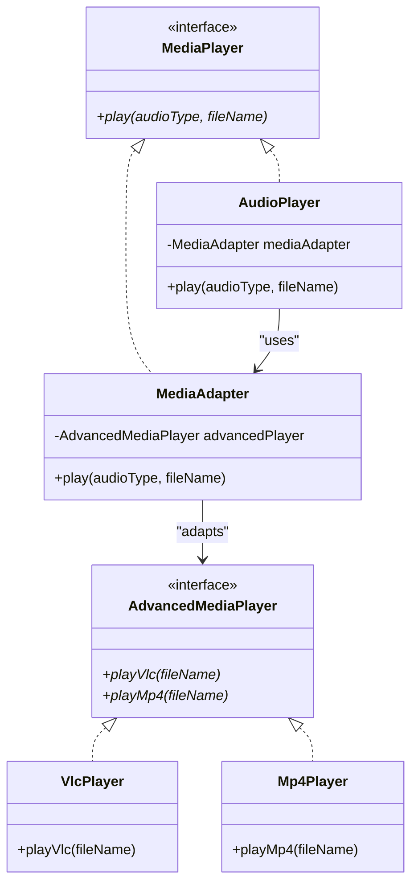

# 🔌 Adapter Pattern – Notion Style (viva-Ready)

The **Adapter Pattern** is a **Structural Design Pattern** that allows incompatible interfaces to work together. It acts as a bridge between two independent interfaces.

👉 **Think**:
- **Universal Travel Adapter**: You have an Indian plug (Client), but the hotel wall has a European socket (Adaptee). The travel adapter (Adapter) bridges the gap.
- **Translator**: A French speaker and a Hindi speaker cannot talk directly. A translator (Adapter) listens to one and speaks the other's language.

---

## 📊 UML Diagram (Visual Understanding)



---

## 🧩 Core Components

| Component | Role | Description |
| :--- | :--- | :--- |
| **Target (MediaPlayer)** | **Expected Interface** | The interface the client wants to use. |
| **Client (AudioPlayer)** | **User** | The class that needs to talk to the incompatible service. |
| **Adaptee (AdvancedPlayer)** | **Legacy / Third-Party** | The existing class that is incompatible with the Target. |
| **Adapter (MediaAdapter)** | **The Bridge** | Implements Target and calls Adaptee methods internally. |

---

## 💻 Complete Java Implementation (Media Player)

```java
// 1. Target Interface (What Client expects)
interface MediaPlayer {
    void play(String audioType, String fileName);
}

// 2. Advanced Interface (Adaptee Interface)
interface AdvancedMediaPlayer {
    void playVlc(String fileName);
    void playMp4(String fileName);
}

// 3. Concrete Adaptees
class VlcPlayer implements AdvancedMediaPlayer {
    @Override
    public void playVlc(String fileName) {
        System.out.println("Playing vlc file. Name: " + fileName);
    }
    @Override public void playMp4(String fileName) { }
}

class Mp4Player implements AdvancedMediaPlayer {
    @Override public void playVlc(String fileName) { }
    @Override
    public void playMp4(String fileName) {
        System.out.println("Playing mp4 file. Name: " + fileName);
    }
}

// 4. The Adapter (Bridges MediaPlayer to AdvancedMediaPlayer)
class MediaAdapter implements MediaPlayer {
    AdvancedMediaPlayer advancedPlayer;

    public MediaAdapter(String type) {
        if (type.equalsIgnoreCase("vlc")) advancedPlayer = new VlcPlayer();
        else if (type.equalsIgnoreCase("mp4")) advancedPlayer = new Mp4Player();
    }

    @Override
    public void play(String type, String file) {
        if (type.equalsIgnoreCase("vlc")) advancedPlayer.playVlc(file);
        else if (type.equalsIgnoreCase("mp4")) advancedPlayer.playMp4(file);
    }
}

// 5. Concrete Target (AudioPlayer)
class AudioPlayer implements MediaPlayer {
    MediaAdapter mediaAdapter;

    @Override
    public void play(String audioType, String fileName) {
        if (audioType.equalsIgnoreCase("mp3")) {
            System.out.println("Playing mp3 file. Name: " + fileName);
        } else if (audioType.equalsIgnoreCase("vlc") || audioType.equalsIgnoreCase("mp4")) {
            mediaAdapter = new MediaAdapter(audioType);
            mediaAdapter.play(audioType, fileName);
        } else {
            System.out.println("Invalid media. " + audioType + " format not supported");
        }
    }
}

// 6. Main Class (Client)
public class Main {
    public static void main(String[] args) {
        AudioPlayer audioPlayer = new AudioPlayer();
        audioPlayer.play("mp3", "beyond_the_horizon.mp3");
        audioPlayer.play("mp4", "alone.mp4");
        audioPlayer.play("vlc", "far_far_away.vlc");
    }
}
```

---

## 🔥 Why use Adapter? (Interview Edge)

1. **Reusability**: Use legacy classes without touching their source code.
2. **SRP (Single Responsibility)**: Separate the interface/data conversion from the main business logic.
3. **OCP (Open-Closed Principle)**: You can add new adapters/adaptees without breaking existing client code.

---

## 🏗️ Real Interview Story (How to explain)
"In our system, we switched to a new Payment Gateway (Stripe) while still supporting our old one (PayPal). Both had completely different method names for `authorize()` and `capture()`. I didn't want to write `if-else` blocks in our checkout logic. I created a `PaymentAdapter`. Now the checkout logic just calls `payment.charge()`, and the adapter handles the translation to Stripe or PayPal correctly."

---
*Created for viva preparation using Scaler LLD session notes.*
