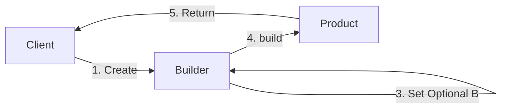

# 🏗️ Builder Pattern – Notion Style (viva-Ready)

The **Builder Pattern** is a **Creational Design Pattern** used to construct complex objects step-by-step. It helps avoid "Telescoping Constructors" (constructors with 10+ parameters).

👉 **Think**:
- **Custom Pizza**: You start with a base (Mandatory). Then you add cheese, toppings, or extra sauce (Optional) one by one. You only get the final pizza when you say "Build!".
- **PC Build**: You select CPU and RAM (Mandatory), then decide if you want a GPU, RGB lights, or Liquid Cooling (Optional).

---

## 📊 Interaction Flow (Visual Understanding)



---

## 🧩 Why Use Builder? (Viva Hotseat! 🔥)

| Problem | Builder Solution |
| :--- | :--- |
| **Too many parameters** | Step-by-step method chaining. |
| **Inconsistent State** | Object is created only at the final `.build()` step. |
| **Immutability** | Product fields are `final` and have no setters. |
| **Validation** | Logic can be added inside `build()` to check constraints. |

---

## 💻 Complete Java Implementation (User Profile)

```java
// 1. Main Product Class (Immutable)
public final class User {
    private final String firstName;
    private final String lastName;
    private final String email;
    private final int age;

    private User(UserBuilder builder) {
        this.firstName = builder.firstName;
        this.lastName = builder.lastName;
        this.email = builder.email;
        this.age = builder.age;
    }

    @Override
    public String toString() {
        return "User { Name: " + firstName + " " + lastName + ", Email: " + email + ", Age: " + age + " }";
    }

    // 2. Static Inner Builder Class
    public static class UserBuilder {
        private final String firstName; // Mandatory
        private final String lastName;  // Mandatory
        private String email = "N/A";
        private int age = 0;

        public UserBuilder(String firstName, String lastName) {
            this.firstName = firstName;
            this.lastName = lastName;
        }

        public UserBuilder email(String email) { this.email = email; return this; }
        public UserBuilder age(int age) { this.age = age; return this; }

        public User build() {
            if (age < 0) throw new IllegalArgumentException("Age cannot be negative!");
            return new User(this);
        }
    }
}

// 3. Main Class (Client)
public class Main {
    public static void main(String[] args) {
        User user = new User.UserBuilder("John", "Doe")
                        .email("john@example.com")
                        .age(30)
                        .build();
        System.out.println(user);
    }
}
```

---

## 🔥 Fluent Interface (Interview Edge)
The pattern uses **Fluent API** (method chaining). Each setter in the builder returns `this` (the builder itself), allowing you to write:
`new User.UserBuilder("A", "B").email("x@y.com").age(25).build();`

---

## 🏗️ Real Interview Story (How to explain)
"In my previous project, we had a `HttpRequest` class with 15+ optional headers and config fields. Using regular constructors made the code unreadable (`null, null, true, null...`). I refactored it using a **Builder pattern**. This made the code self-documenting and allowed us to add validation logic (like checking for mandatory Auth headers) right inside the `.build()` method."

---
*Created for viva preparation using Scaler LLD session notes.*
