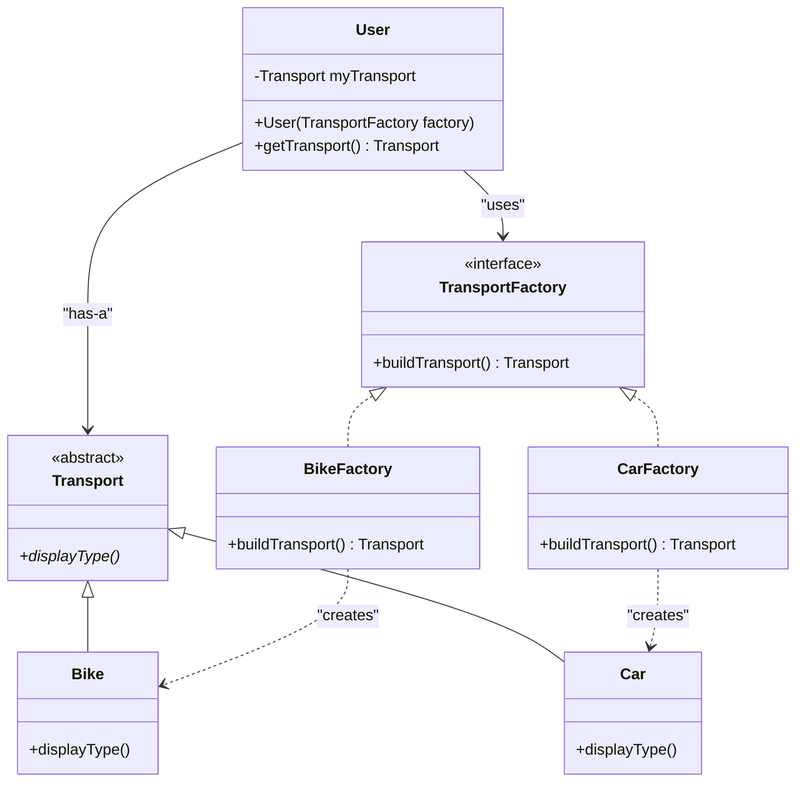

# 🏭 Factory Method Pattern – Notion Style (viva-Ready)

The **Factory Method Pattern** is a Creational Design Pattern that provides an interface for creating objects in a superclass but allows subclasses to alter the type of objects that will be created.

👉 **Think**:
- **You (Client)**: Want a transport (Bike or Car).
- **Factory Interface**: The dealer who knows how to "build" transport.
- **Concrete Factory**: A specialized team (BikeTeam / CarTeam) that builds the specific transport.
- **Benefit**: You don't call `new Bike()`. You ask the factory, so you are decoupled from the concrete classes.

---

## 📊 UML Diagram (Visual Understanding)



---

## 🧩 Core Components

| Component | Role | Description |
| :--- | :--- | :--- |
| **Product (Transport)** | **Interface / Abstract** | Defines the behavior of the objects the factory creates. |
| **Concrete Product** | **Implementation** | The actual object being created (e.g., `Bike`, `Car`). |
| **Creator (Factory)** | **Interface** | Declares the factory method (`buildTransport()`). |
| **Concrete Creator** | **Specialized Factory** | Overrides the factory method to return a specific product. |

---

## 💻 Code Implementation (Transport System)

### 1. The Product Layer
```java
abstract class Transport {
    public abstract void displayType();
}

class Bike extends Transport {
    public void displayType() { System.out.println("I am a Bike"); }
}

class Car extends Transport {
    public void displayType() { System.out.println("I am a Car"); }
}
```

### 2. The Factory Layer
```java
interface TransportFactory {
    Transport buildTransport();
}

class BikeFactory implements TransportFactory {
    public Transport buildTransport() { return new Bike(); }
}

class CarFactory implements TransportFactory {
    public Transport buildTransport() { return new Car(); }
}
```

### 3. The Client Layer (User)
```java
class User {
    private Transport myTransport;

    // Dependency Injection: User doesn't know which concrete factory is used
    public User(TransportFactory factory) {
        myTransport = factory.buildTransport();
    }

    public Transport getTransport() { return myTransport; }
}
```

---

## 🔥 Why use Factory Method? (Interview Edge)

1. **Decoupling**: The Client (`User`) is decoupled from Concrete Products (`Bike`, `Car`). It only knows the `Transport` interface.
2. **OCP (Open-Closed Principle)**: You can add a new transport (e.g., `Bus`) and its factory (`BusFactory`) without changing any existing code.
3. **DIP (Dependency Inversion Principle)**: Depend on abstractions (`TransportFactory`), not concretions (`BikeFactory`).

---

## 🏗️ Real Interview Story (How to explain)
"In my project, we had different types of database connectors (MySQL, PostgreSQL). Initially, we were using `if-else` to create them. This violated **OCP**. I refactored it using the **Factory Method pattern**. I created a `DatabaseFactory` interface. Now, if we need to support a new database, we just add a new factory class without touching the core logic. This made our code much more maintainable."

---
*Created for viva preparation using Scaler LLD session notes.*
