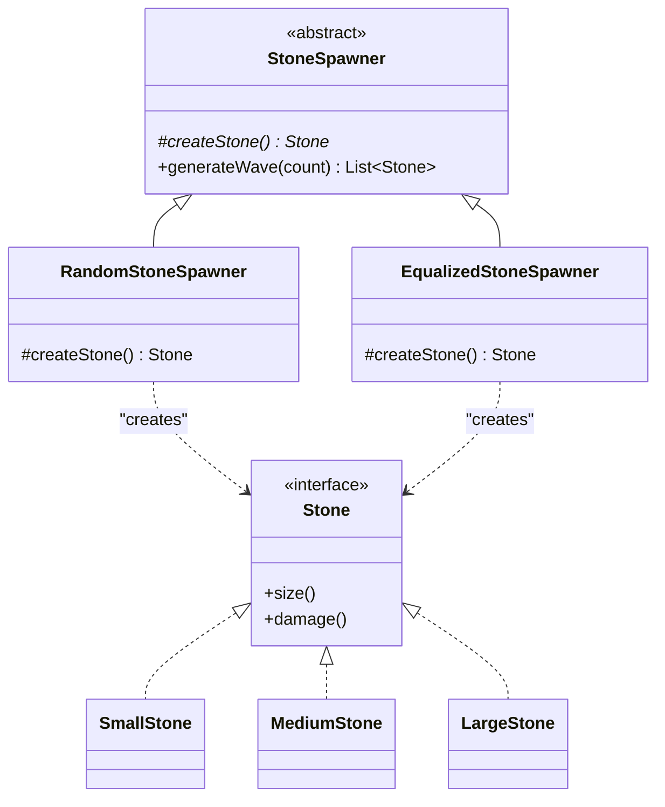

# 🏭 Factory Method Design Pattern

**Intent:** Define an interface for creating an object, but let subclasses decide which class to instantiate. Factory Method lets a class defer instantiation to subclasses.

---

## 🪨 Part A: The Simple Factory (A Pragmatic First Move)

### 1. The Problem
Imagine you are building an action game where the player dodges `Stones` (`SmallStone`, `MediumStone`, `LargeStone`).
*   Do we see `new SmallStone()`, `new MediumStone()` scattered across gameplay code?
*   When a new size appears, must we edit many files to add `if/switch` logic?
*   Would centralizing "which concrete class to instantiate" make our gameplay code easier to read?

### 2. The Simple Factory Solution
Move all "new" logic into one place: a utility cluster with a single static method. Client code depends only on the `Stone` abstraction.

```java
// Stone domain
enum StoneType { SMALL, MEDIUM, LARGE; }

interface Stone {
    String size();
    int damage();
}

final class SmallStone implements Stone {
    public String size() { return "SMALL"; }
    public int damage() { return 5; }
}

final class MediumStone implements Stone {
    public String size() { return "MEDIUM"; }
    public int damage() { return 10; }
}

final class LargeStone implements Stone {
    public String size() { return "LARGE"; }
    public int damage() { return 18; }
}

// Simple Factory (utility)
final class StoneFactory {
    private StoneFactory() {} // Prevent instantiation

    public static Stone create(StoneType t) {
        return switch (t) {
            case SMALL -> new SmallStone();
            case MEDIUM -> new MediumStone();
            case LARGE -> new LargeStone();
        };
    }
}

// Client Snippet
class WaveLogicV0 {
    Stone spawnOne(StoneType t) {
        return StoneFactory.create(t); // Gameplay decoupled from concretes
    }
}
```

**Pros**: Centralizes `new`, hides concretes, provides a single edit point for new sizes.
**Cons**: The factory grows into a massive `switch` statement. It also provides NO support for differing creation *policies* (e.g., spawn randomly vs. spawn equal quotas).

---

## 🚀 Part B: The Factory Method (When Creation Policy Varies)

### 1. New Requirement
*   Game Instance A: Spawn stones in a **Random** mix.
*   Game Instance B: Spawn **Equal numbers** of each size step-by-step.
*   *Can we keep the "generate wave" algorithm identical and swap ONLY the stone-selection policy?*

### 2. Insight & Solution
Put the fixed algorithm in a base creator (`StoneSpawner`). Inside that algorithm, call an overridable factory method (`createStone()`) that subclasses implement differently.

```java
import java.util.*;
import java.util.concurrent.ThreadLocalRandom;

// Creator: owns the algorithm, defers instantiation to subclasses
abstract class StoneSpawner {

    // ---- Factory Method ----
    protected abstract Stone createStone();

    // Fixed algorithm that uses the factory method
    public final List<Stone> generateWave(int count) {
        List<Stone> wave = new ArrayList<>(count);
        for (int i = 0; i < count; i++) {
            Stone s = createStone(); // <-- polymorphic creation
            wave.add(s);
        }
        return wave;
    }
}

// Concrete Creators (Different Creation Policies)

// Policy 1: Random distribution
final class RandomStoneSpawner extends StoneSpawner {
    @Override protected Stone createStone() {
        int pick = ThreadLocalRandom.current().nextInt(3);
        return switch (pick) {
            case 0 -> new SmallStone();
            case 1 -> new MediumStone();
            default -> new LargeStone();
        };
    }
}

// Policy 2: Equal round-robin distribution
final class EqualizedStoneSpawner extends StoneSpawner {
    private int idx = 0;
    @Override protected Stone createStone() {
        Stone s = switch (idx) {
            case 0 -> new SmallStone();
            case 1 -> new MediumStone();
            default -> new LargeStone();
        };
        idx = (idx + 1) % 3;
        return s;
    }
}

// Client Demo
class WaveLogicV1 {
    public static void main(String[] args) {
        StoneSpawner random = new RandomStoneSpawner();
        StoneSpawner equal = new EqualizedStoneSpawner();

        // The algorithm `generateWave` is reused flawlessly!
        System.out.println("Random: " + random.generateWave(3));
        System.out.println("Equalized: " + equal.generateWave(3));
    }
}
```

---

## ✈️ Complex Example: Fighter Jet Producers
You are modeling a combat simulator that builds a fleet of jets based on Generation requests (Gen 4, Gen 5). Different manufacturers (HAL vs Lockheed Martin) fulfill the *same* request with *different* concrete models.

```java
enum Generation { GEN4, GEN4_PLUS, GEN5 }

interface FighterJet {
    String model();
    Generation generation();
    String manufacturer();
}

// Concrete Products
final class TejasMk1 implements FighterJet { /* ... returns GEN4, HAL */ }
final class F35A implements FighterJet { /* ... returns GEN5, Lockheed */ }
// ... other models

// --- Creator Interface (Factory Method) ---
interface FighterJetFactory {
    FighterJet createJet(Generation gen);
}

// --- Concrete Creators: Decide the mapping ---
final class HALFactory implements FighterJetFactory {
    @Override public FighterJet createJet(Generation gen) {
        return switch (gen) {
            case GEN4 -> new TejasMk1();
            case GEN4_PLUS -> new TejasMk2();
            case GEN5 -> throw new UnsupportedOperationException("Gen 5 not available");
        };
    }
}

final class LockheedMartinFactory implements FighterJetFactory {
    @Override public FighterJet createJet(Generation gen) {
        return switch (gen) {
            case GEN4 -> new F15EX();
            case GEN5 -> new F35A();
            default -> new F15EX();
        };
    }
}

// --- Algorithm depending purely on the Factory Interface ---
final class MissionPlanner {
    List<FighterJet> planFleet(FighterJetFactory factory, List<Generation> demand) {
        var result = new ArrayList<FighterJet>();
        // The algorithm uses the factory method:
        for (var g : demand) result.add(factory.createJet(g)); 
        return result;
    }
}
```

---

## 📊 UML Diagram



---

## 🎙️ Frequently Asked Interview Questions (Viva)

#### Q1: What is the main difference between a Simple Factory and the Factory Method Pattern?
**Answer**: A **Simple Factory** is just a utility class with a static method grouping `new` statements (often with a massive `switch` case). It hides constructors, but its creation logic cannot be easily swapped or extended. 
The **Factory Method Pattern** defines an abstract class or interface with a core algorithm, but *defers the object instantiation* (`createStone()`) to its subclasses, allowing policies to vary per creator instance seamlessly.

#### Q2: What forces us to move from a Simple Factory to the Factory Method Pattern?
**Answer**: We move to Factory Method when the **creation policy** needs to vary dynamically per instance. For example, if we need to spawn stones based on a "Random Mix" vs "Strict Quota/Equalized", we can keep the spawning loop inside the base class but override the actual selection policy via subclasses.

#### Q3: Why does Factory Method inherently support the Open/Closed Principle?
**Answer**: If a new creation policy is introduced (e.g., `WeightedStoneSpawner` or a new subset manufacturer like `SukhoiFactory`), we do not need to edit existing `generateWave` or `planFleet` algorithms. We simply write a new subclass extending the factory base and swap it at composition time.

#### Q4: Name a few real-world examples besides games where Factory Method shines.
**Answer**: 
1. **Exporters**: Base class fixes validation/streaming, while `createWriter()` is overridden to provide `CsvWriter`, `XlsxWriter`, or `JsonWriter`.
2. **Dialogs**: Base `render()` builds the UI algorithm, while `createButton()` is overridden to return Windows vs MacOS styled buttons.
3. **Maze Games**: `createMaze()` fixes the architecture, but `makeRoom()` or `makeDoor()` is deferred to `EnchantedMazeGame` vs `BombedMazeGame`.

---
*Created for viva preparation using notes from Scaler LLD sessions.*
