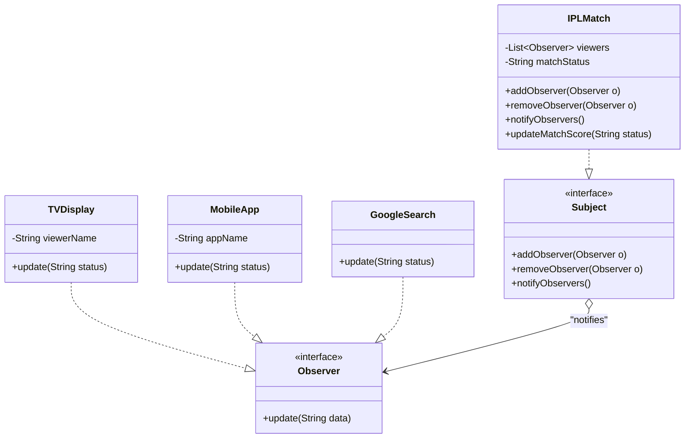

# 🧠 Observer Pattern – Notion Style (viva-Ready)

The **Observer Pattern** is a behavioral design pattern where one object (**Subject**) notifies multiple objects (**Observers**) automatically whenever its state changes.

👉 **Think**:
- **Subject** = YouTube Channel
- **Observers** = Subscribers
- When a new video is uploaded → everyone gets notified 🔔

---

## 📊 UML (Visual Understanding)



---

## 🧩 Components

| Component | Role | Description |
| :--- | :--- | :--- |
| **Subject (Publisher)** | **Observable** | Maintains list of observers and notifies them on change. |
| **Observer (Subscriber)** | **Listener** | Defines the `update()` contract to receive notifications. |
| **Concrete Subject** | **Real Data Holder** | The actual object being watched (e.g., `IPLMatch`). |
| **Concrete Observer** | **Monitor** | The actual systems reacting to changes (e.g., `TVDisplay`). |

---

## 💻 Code Implementation (IPL Match)

### 1. Interfaces
```java
// Observer Interface
interface Observer {
    void update(String matchStatus);
}

// Subject Interface
interface Subject {
    void addObserver(Observer observer);
    void removeObserver(Observer observer);
    void notifyObservers();
}
```

### 2. Concrete Subject
```java
class IPLMatch implements Subject {
    private List<Observer> viewers = new ArrayList<>();
    private String matchStatus;

    public void addObserver(Observer o) { viewers.add(o); }
    public void removeObserver(Observer o) { viewers.remove(o); }

    public void notifyObservers() {
        for (Observer o : viewers) {
            o.update(matchStatus);
        }
    }

    public void updateMatchScore(String matchStatus) {
        this.matchStatus = matchStatus;
        notifyObservers(); // 🔥 Broadcast the change
    }
}
```

---

## ⚡ Push vs Pull (Interview Edge)

### Push Model (Used here)
- **Subject** sends data directly via `update(String data)`.
- **Pros**: Observer gets data instantly without calling back.

### Pull Model
- **Subject** calls `update()` with no arguments.
- **Observer** then fetches data via `subject.getState()`.

---

## 🔥 Next Level: Advanced Interview Content

---

## 🔥 Thumb Rules (Must Remember)

✔ Always have **Subject + Observer** interface
✔ Subject keeps **List of observers**
✔ On state change → call **notifyObservers()**
✔ Observer must implement **update()**
✔ **Loose coupling** (no tight dependency)

---

## 🚀 "Next Level" Interview Content

### ⚔️ Observer vs Publisher-Subscriber (Pub-Sub)
| Case | Observer Pattern | Pub-Sub Pattern |
| :--- | :--- | :--- |
| **Middleman** | No middleman. | Uses a **Message Broker** (Kafka, RabbitMQ). |
| **Coupling** | Subject knows Observers (Linear). | Completely decoupled via Broker. |

### 🎭 Real Interview Story (How to explain)
"I used the Observer pattern to solve a notification problem. Instead of my main logic class having to know about every UI component that needed updates, I made the logic a **Subject**. Now, UI components (TV, Mobile) just subscribe to it. If I add a new 'Google Search' display tomorrow, I just make it an **Observer** without touching the core logic. This perfectly follows the **Open-Closed Principle**."

### 🎯 Final Interview Line
> “Observer pattern allows multiple objects to listen to one object and automatically get updated when its state changes, without tight coupling.”

---
*Created for viva preparation using Scaler LLD session notes.*
