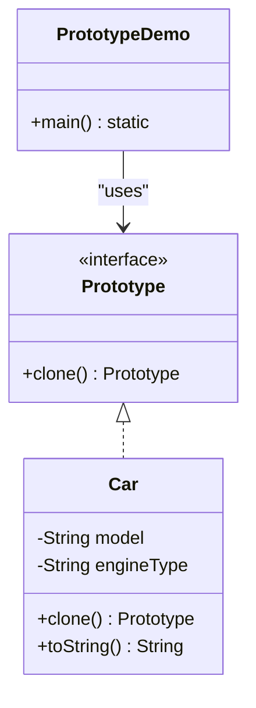

# 🧬 Prototype Pattern – Notion Style (viva-Ready)

The **Prototype Design Pattern** is a **Creational Design Pattern** that allows creating new objects by **cloning existing objects** instead of instantiating them through constructors.

👉 **Think**:
- **You**: Need 100 warriors in a game.
- **Problem**: Calling `new Warrior()` 100 times is slow and repeats the same setup.
- **Solution**: Create ONE "Master Warrior" (Prototype) and just **duplicate (clone)** it 99 times.
- **Key Insight**: Cloning is often faster than full initialization if the object setup is complex.

---

## 📊 UML Diagram (Visual Understanding)



---

## 🧩 Core Components

| Component | Role | Description |
| :--- | :--- | :--- |
| **Prototype Interface** | **Contract** | Defines the mandatory `clone()` method. |
| **Concrete Prototype** | **Self-Cloner** | Implements `clone()` by returning a copy of itself. |
| **Client** | **Requester** | Asks the prototype to clone itself to get a new object. |

---

## 💻 Complete Java Implementation (Car Cloning)

```java
// 1. Prototype Interface
interface Prototype {
    Prototype clone();
}

// 2. Concrete Prototype (Car)
class Car implements Prototype {
    private String model;
    private String engineType;

    public Car(String model, String engineType) {
        this.model = model;
        this.engineType = engineType;
        System.out.println("[DB CALL] Loading configuration for: " + model);
    }

    // Copy Constructor (Used for cloning)
    public Car(Car source) {
        this.model = source.model;
        this.engineType = source.engineType;
    }

    @Override
    public Prototype clone() {
        return new Car(this); // Cheap Operation
    }

    @Override
    public String toString() {
        return "Car { Model: " + model + ", Engine: " + engineType + " }";
    }
}

// 3. Main Class (Client)
public class Main {
    public static void main(String[] args) {
        // Expensive setup
        Car bmvPrototype = new Car("BMW M3", "Twin-Turbo I6");

        // Cheap cloning
        Car clone1 = (Car) bmvPrototype.clone();
        Car clone2 = (Car) bmvPrototype.clone();

        System.out.println("Clone 1: " + clone1);
        System.out.println("Clone 2: " + clone2);
    }
}
```

---

## ⚡ Shallow Copy vs Deep Copy (Viva Favorite!)

| Feature | Shallow Copy | Deep Copy |
| :--- | :--- | :--- |
| **Definition** | Copies field values (references point to same object). | Creates new instances for all internal objects. |
| **Complexity** | Simple and Fast. | Complex and Recurse. |
| **Safety** | Risky: Changing clone affects original (for non-primitives). | Safe: Clone is independent. |

> [!TIP]
> In interviews, if you mention Prototype, be ready to explain how you'd handle **Deep Copy** (e.g., manually copying every internal list/object).

---

## 🔥 Why use Prototype? (Interview Edge)

1. **Performance**: Avoids costly pre-computations or database calls attached to a constructor.
2. **Simplified Initialization**: If an object state is very complex to set up, cloning it is easier.
3. **Reduced Subclassing**: You don't need a factory for every type; you just need one prototype of each type.

---

## 🏗️ Real Interview Story (How to explain)
"I used the Prototype pattern in a reporting tool where generating a 'Base Template' took 5 seconds of DB queries. Instead of re-querying for every user report, I queried once, stored it as a **Prototype**, and simply **cloned** it for every user. This reduced the generation time from 5 seconds to milliseconds."

---
*Created for viva preparation using Scaler LLD session notes.*
