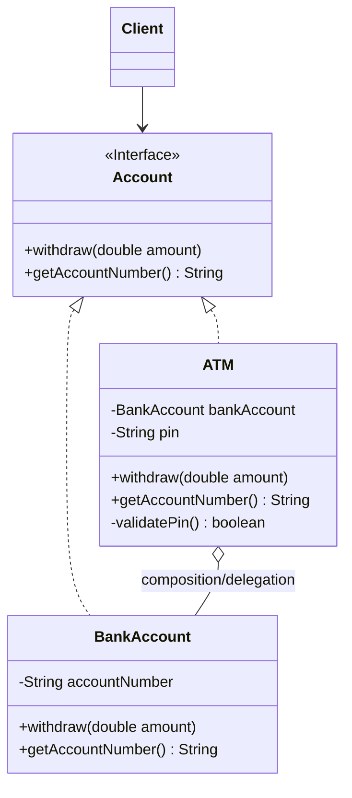

# Proxy Design Pattern - Complete Notes with Java Code

## 1. Overview
The **Proxy Design Pattern** is a **structural design pattern** that creates a **proxy object** (reference) to act as an intermediary for a real object. This allows you to:
- Control access to the real object
- Add extra functionality (validation, caching, logging)
- Delay creation of expensive objects until needed   

**Key Idea**: Use proxy instead of direct access to reduce load on the actual object.  

## 2. Real-World Examples

### Payment System
```
Cash (Real Object)
├── Credit Card (Proxy)
├── Debit Card (Proxy) 
├── UPI (Proxy)
└── Online Transaction (Proxy)
```
All payment methods are **proxies for cash** - you don't carry cash, shopkeeper doesn't handle cash. **Win-win situation**.   

### Bank Account & ATM
```
Bank Account (Real Object)
└── ATM (Proxy)
    ├── PIN Validation
    ├── Balance Check
    └── Withdraw Money
```
ATM provides **convenient access** to bank account without visiting the bank.   

## 3. Core Components
1. **Subject Interface** - Common interface for RealSubject and Proxy
2. **RealSubject** - Actual object with business logic
3. **Proxy** - Implements same interface, holds reference to RealSubject
4. **Client** - Uses Proxy instead of RealSubject   

## 4. Complete Java Implementation

### Step 1: Account Interface (Subject)
```java
public interface Account {
    void withdraw(double amount);
    String getAccountNumber();
}
```
**Purpose**: Forces both RealSubject and Proxy to implement same methods.  

### Step 3: ATM (Proxy)
```java
public class ATM implements Account {
    private BankAccount bankAccount;
    private String pin;
    
    public ATM(String accountNumber, String pin) {
        this.pin = pin;
        // Lazy initialization - create real object only when needed
        this.bankAccount = new BankAccount(accountNumber);
    }
    
    @Override
    public void withdraw(double amount) {
        // **Proxy adds extra functionality** before calling real object
        if (validatePin()) {
            System.out.println("PIN validated successfully");
            bankAccount.withdraw(amount);  // Delegate to real object
        } else {
            System.out.println("Invalid PIN! Transaction denied.");
        }
    }
    
    @Override
    public String getAccountNumber() {
        if (validatePin()) {
            return bankAccount.getAccountNumber();
        }
        return "Access denied - Invalid PIN";
    }
    
    private boolean validatePin() {
        // Simulate PIN validation
        return "1234".equals(pin);
    }
}
```
**Key Proxy Features**:
- **Validation** (PIN check)  
- **Access Control**
- **Lazy Loading** (bankAccount created only when needed)
- **Delegates** to real object after validation  

### Step 4: Client Code
```java
public class Client {
    public static void main(String[] args) {
        // Client uses PROXY, not real object directly
        Account atm = new ATM("1234567890", "1234");
        
        atm.withdraw(1000);     // PIN validated → Real withdrawal
        atm.withdraw(500);      // PIN validated → Real withdrawal
        
        System.out.println("Account: " + atm.getAccountNumber());
        
        // Wrong PIN
        Account wrongAtm = new ATM("1234567890", "9999");
        wrongAtm.withdraw(100); // Denied!
    }
}
```

**Output**:
```
PIN validated successfully
Withdrawing $1000.0 from account 1234567890
PIN validated successfully
Withdrawing $500.0 from account 1234567890
Account: 1234567890
Invalid PIN! Transaction denied.
```

## 5. Benefits of Proxy Pattern
| Benefit | Example |
|---------|---------|
| **Access Control** | PIN validation before withdrawal   |
| **Lazy Loading** | BankAccount created only when validated |
| **Remote Access** | ATM proxy for distant bank |
| **Caching** | Store frequently accessed data |
| **Logging** | Log all transactions |
| **Optimization** | Reduce load on real object   |

## 6. When to Use Proxy Pattern
✅ **Large/expensive objects** (database connections, network resources)  
✅ **Need access control** (authentication, authorization)  
✅ **Remote objects** (distributed systems)  
✅ **Want to add functionality** (logging, caching, validation)  

❌ **Simple objects** (no added value)  
❌ **Performance-critical** (extra layer adds overhead)

## 7. Class Diagram

