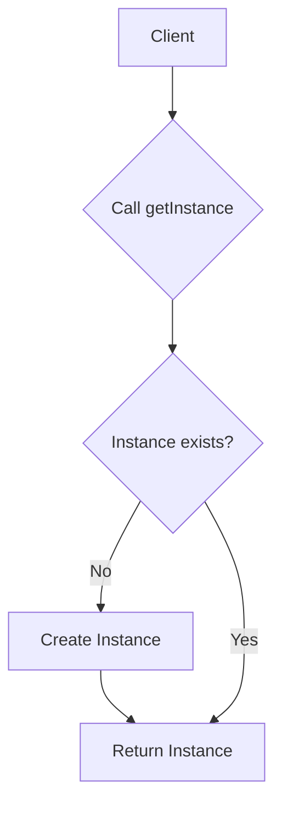

# 🛠️ Singleton Pattern – Notion Style (viva-Ready)

The **Singleton Pattern** ensures that a class has **only one instance** and provides a global point of access to it.

👉 **Think**:
- **Company Printer**: There are 50 employees, but only **ONE** printer. Everyone sends their "print jobs" to this one instance.
- **Database Connection**: You don't want to open 1000 connections to a database. You want one "Manager" that handles everything.

---

## 📊 Logic Flow (Visual Understanding)



---

## 🧩 Thread-Safety Comparison (Viva Hotseat! 🔥)

| Approach | Thread-Safe | Performance | Recommendation |
| :--- | :--- | :--- | :--- |
| **Lazy (Basic)** | ❌ No | Fast | Avoid in production. |
| **Synchronized Method** | ✅ Yes | **Slow** | Good for early learning. |
| **Double-Checked Locking** | ✅ Yes | **Fast** | Preferred by LLD experts. |
| **Bill Pugh (Static Inner)** | ✅ Yes | **Fastest** | **Industry Standard.** |

---

## 💻 Complete Java Implementation (Bill Pugh Singleton)

```java
public class DatabaseManager {
    private String connectionString;

    // 1. Private Constructor
    private DatabaseManager() {
        this.connectionString = "jdbc:mysql://localhost:3306/scaler_db";
        System.out.println("[INIT] Connecting to Database...");
    }

    // 2. Static Inner Class (Loaded only when needed)
    private static class SingletonHelper {
        private static final DatabaseManager INSTANCE = new DatabaseManager();
    }

    // 3. Global Access Point
    public static DatabaseManager getInstance() {
        return SingletonHelper.INSTANCE;
    }

    public void query(String sql) {
        System.out.println("Executing: " + sql + " on " + connectionString);
    }
}

// 4. Client Execution
public class Main {
    public static void main(String[] args) {
        DatabaseManager db1 = DatabaseManager.getInstance();
        DatabaseManager db2 = DatabaseManager.getInstance();

        db1.query("SELECT * FROM users");

        System.out.println("Are both instances same? " + (db1 == db2));
    }
}
```

---

## 🔥 Why volatile? (Interview Edge)
Without `volatile`, a thread might see a half-initialized object because the JVM or CPU might reorder instructions during the `new` operation. `volatile` prevents this reordering.

---

## 🎯 Viva Q&A
1. **How to break a Singleton?**
   - Using **Reflection** (can access private constructor), **Serialization**, or **Cloning**.
2. **How to fix Reflection break?**
   - Throw an exception from constructor if instance already exists.
3. **Difference between Eager vs Lazy?**
   - Eager: Created at class load time (wastes memory if not used).
   - Lazy: Created only when requested (saves memory).

---

## 🏗️ Real Interview Story (How to explain)
"In our microservice, we had a `CacheManager` that held a lot of metadata. Creating multiple instances would cause memory leaks and inconsistent data. I used the **Singleton pattern with Bill Pugh implementation** because it's thread-safe and doesn't have the overhead of `synchronized` every time we access it. This kept our metadata consistent across the entire application thread pool."

---
*Created for viva preparation using Scaler LLD session notes.*
