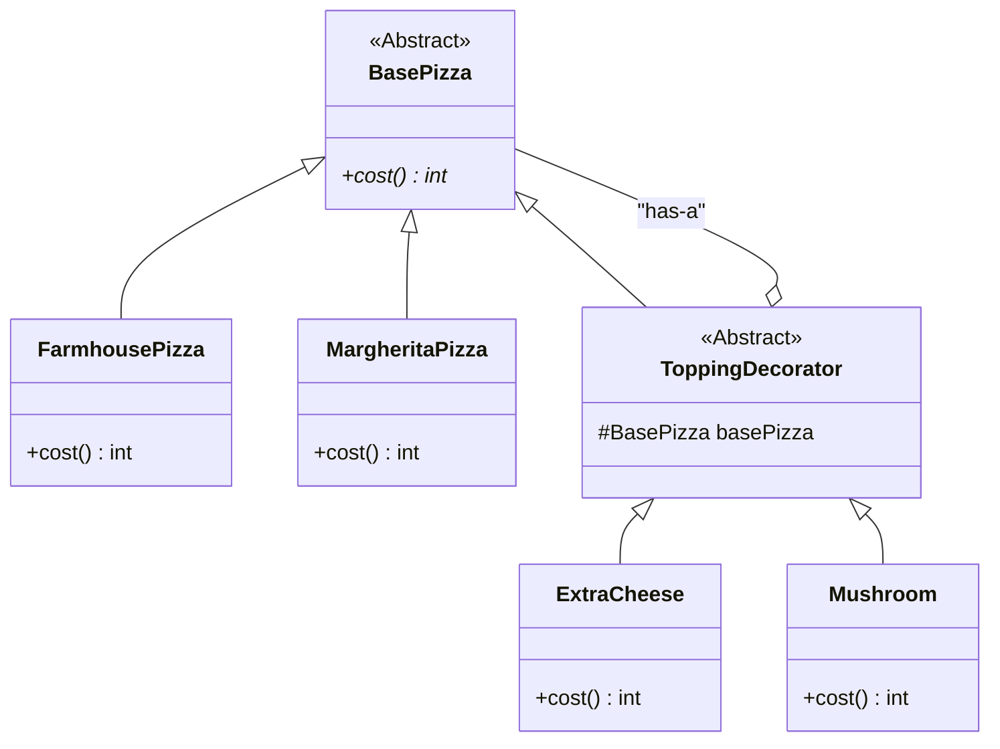
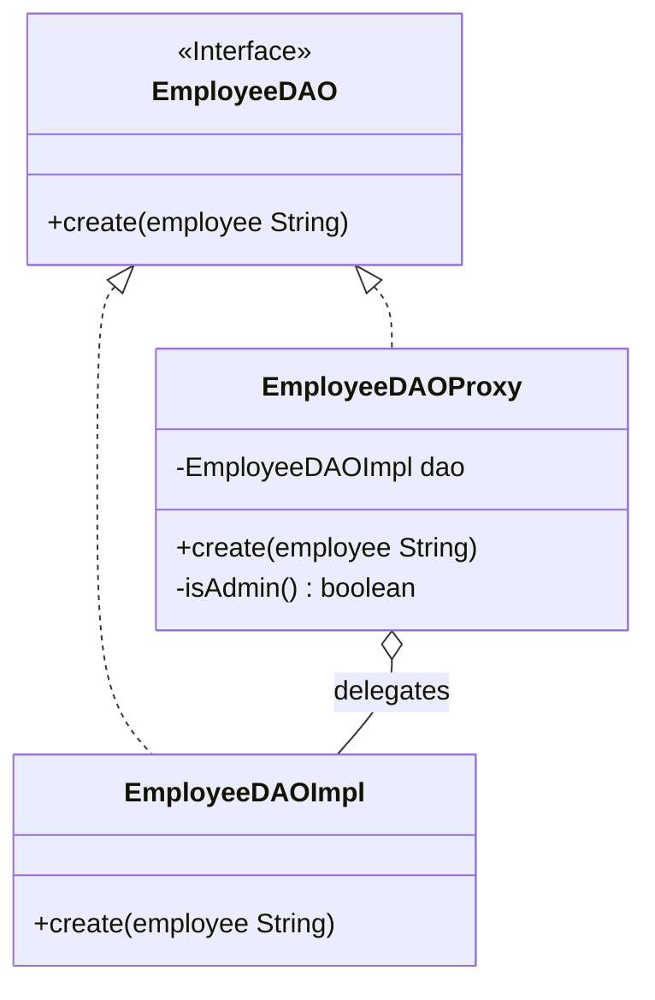
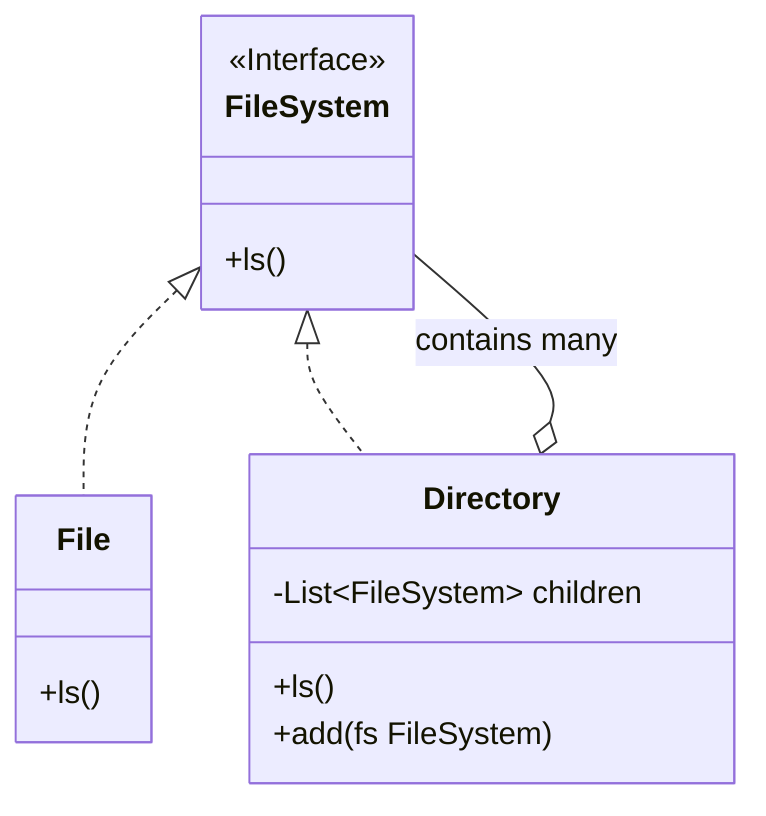
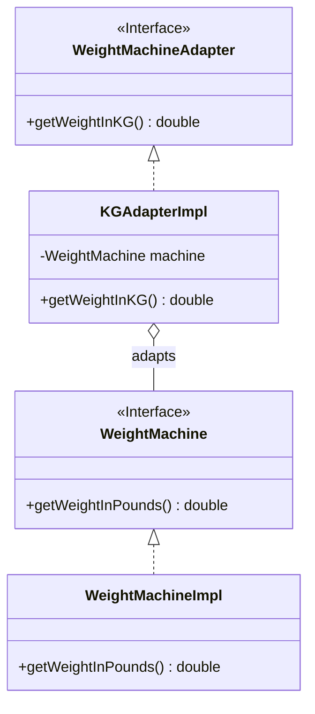
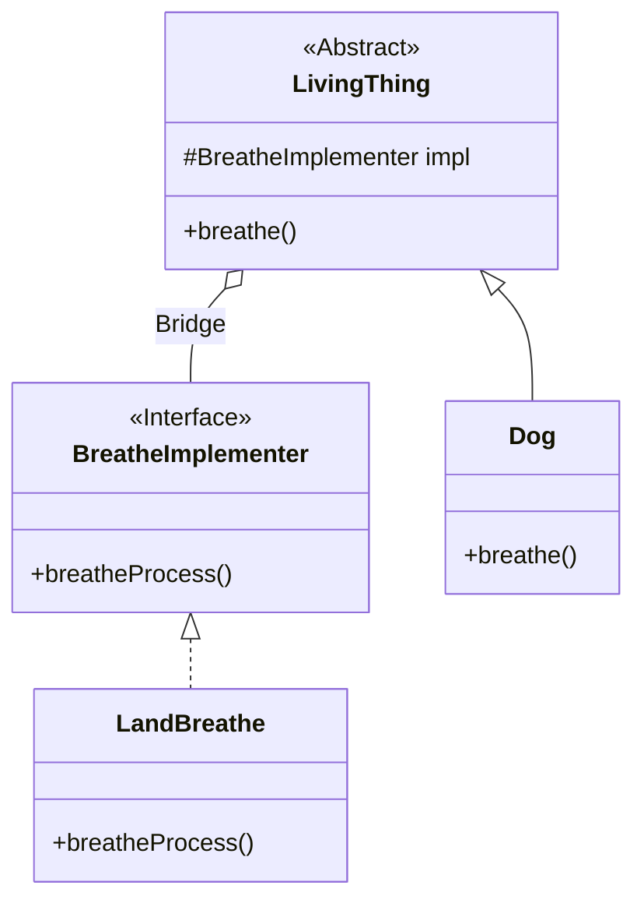
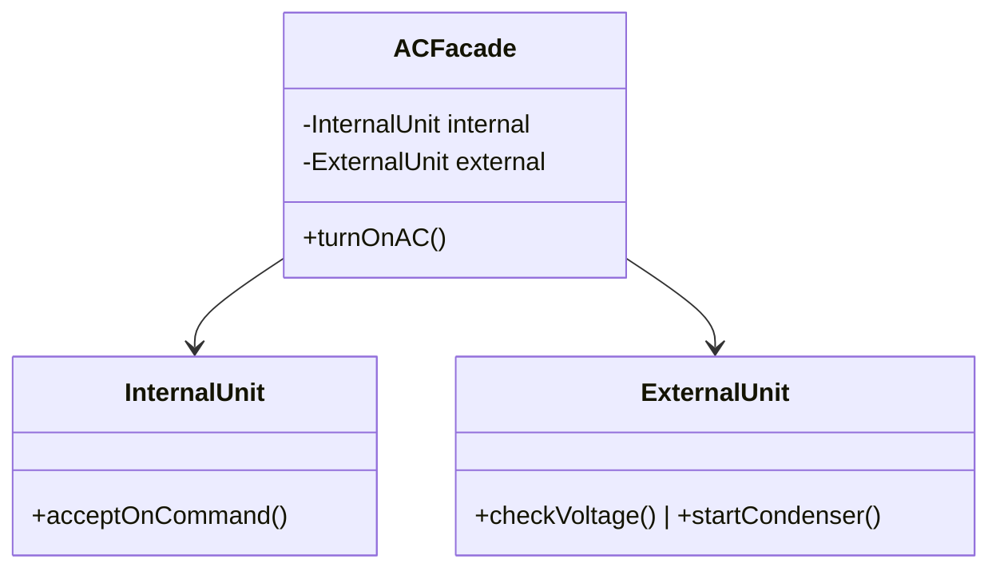
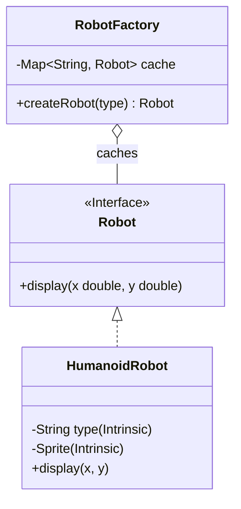

# 🏗️ Structural Design Patterns - Complete Guide

Structural design patterns explain how to assemble objects and classes into larger structures while keeping these structures flexible and efficient. They focus on how classes and objects are composed to form larger structures.

---

## 1. 🍕 Decorator Pattern
**Purpose**: Add functionality to existing objects **without changing their structure** (Runtime modification).

**Case Study**: Pizza Toppings
Avoid "Class Explosion" (e.g., creating `ThickCrustWithCheeseAndMushroomPizza`).

### 📊 UML Diagram


### 💻 Code Snippet
```java
abstract class BasePizza { public abstract int cost(); }

class MargheritaPizza extends BasePizza { public int cost() { return 100; } }

abstract class ToppingDecorator extends BasePizza {
    protected BasePizza basePizza;
    public ToppingDecorator(BasePizza pizza) { this.basePizza = pizza; }
}

class ExtraCheese extends ToppingDecorator {
    public ExtraCheese(BasePizza pizza) { super(pizza); }
    public int cost() { return basePizza.cost() + 10; }
}
```

---

## 2. 🛡️ Proxy Pattern
**Purpose**: Provide a placeholder for another object to control access (Validation, Logging, Lazy Init).

**Case Study**: Employee Access Control
Only Admins can perform `create` operations.

### 📊 UML Diagram


---

## 3. 🌳 Composite Pattern
**Purpose**: Treat individual objects and compositions of objects uniformly (Tree Structures).

**Case Study**: File System (Files and Directories).

### 📊 UML Diagram


---

## 4. 🔌 Adapter Pattern
**Purpose**: Allow objects with incompatible interfaces to collaborate.

**Case Study**: Weight Machine (Pounds to KG).

### 📊 UML Diagram


---

## 🌉 5. Bridge Pattern
**Purpose**: Decouple abstraction from its implementation so the two can vary independently.

**Case Study**: Living Things & Breathing Processes.

### 📊 UML Diagram


---

## 🚪 6. Facade Pattern
**Purpose**: Provide a simplified interface to a complex set of classes/subsystems.

**Case Study**: AC System (Internal + External Units).

### 📊 UML Diagram


---

## 🪶 7. Flyweight Pattern
**Purpose**: Support high numbers of fine-grained objects efficiently by sharing common data.

**Key Concepts**:
- **Intrinsic**: Shared state (e.g., Robot Type, Sprite).
- **Extrinsic**: Unique state passed in (e.g., Coordinates X, Y).

### 📊 UML Diagram


---

## 📈 Summary Table

| Pattern | Goal | Relationship |
| :--- | :--- | :--- |
| **Decorator** | Add features at runtime | **is-a + has-a** |
| **Proxy** | Control access | **is-a** |
| **Composite** | Tree structures | **has-a list** |
| **Adapter** | Interface matching | **has-a** |
| **Bridge** | Independence | **has-a implementation** |
| **Facade** | Simplicity | **has-a subsystem** |
| **Flyweight** | Memory efficiency | **Shared state** |
