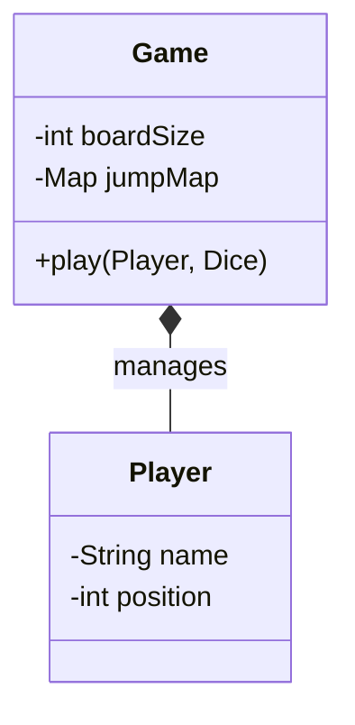
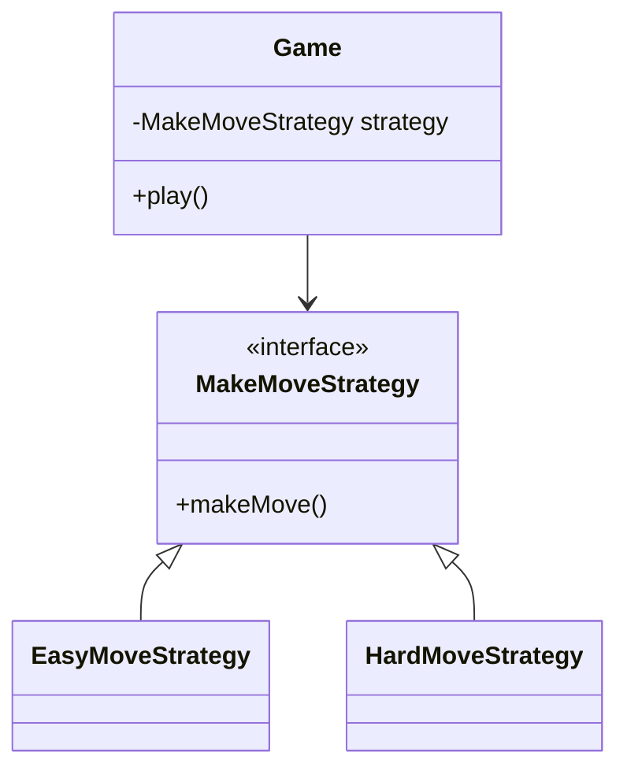
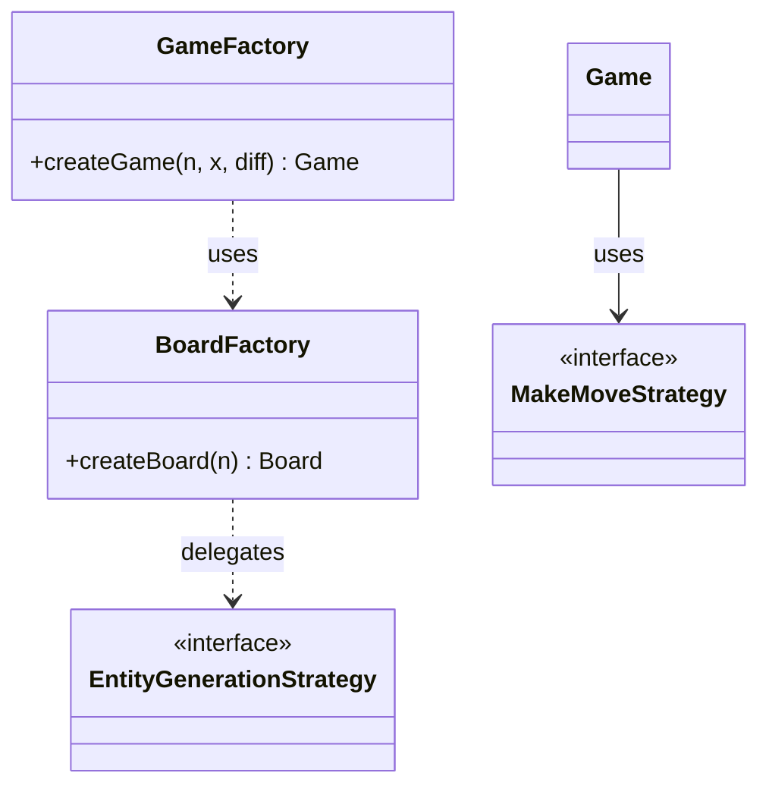
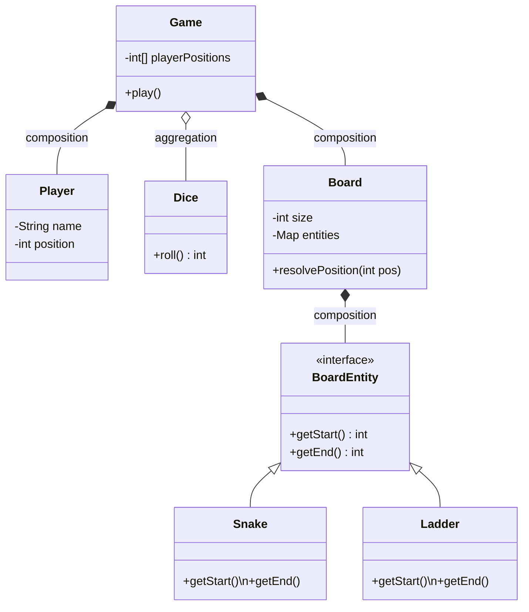
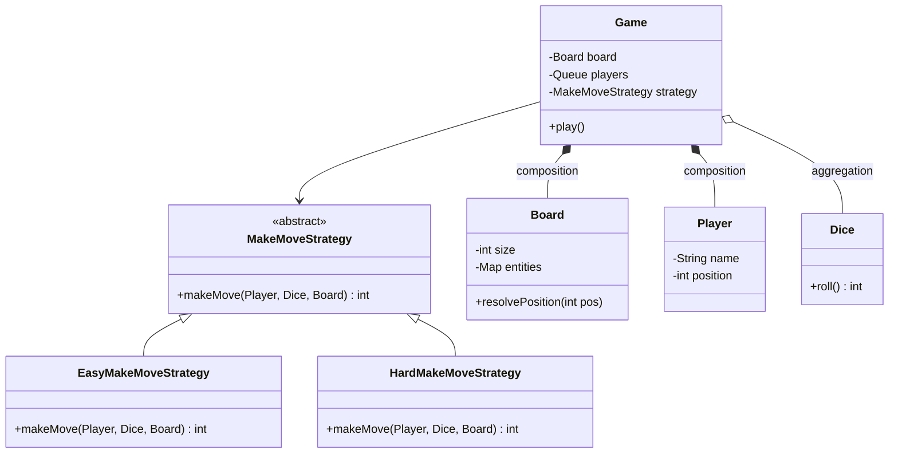
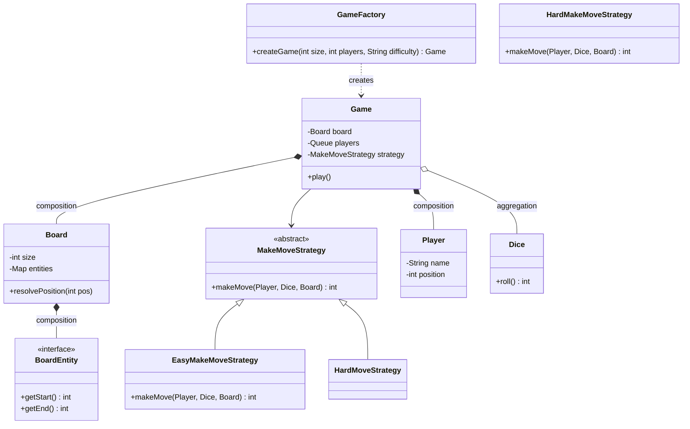
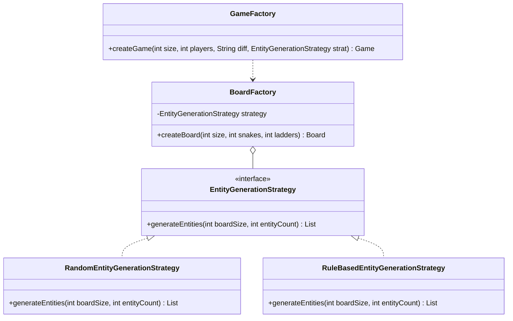
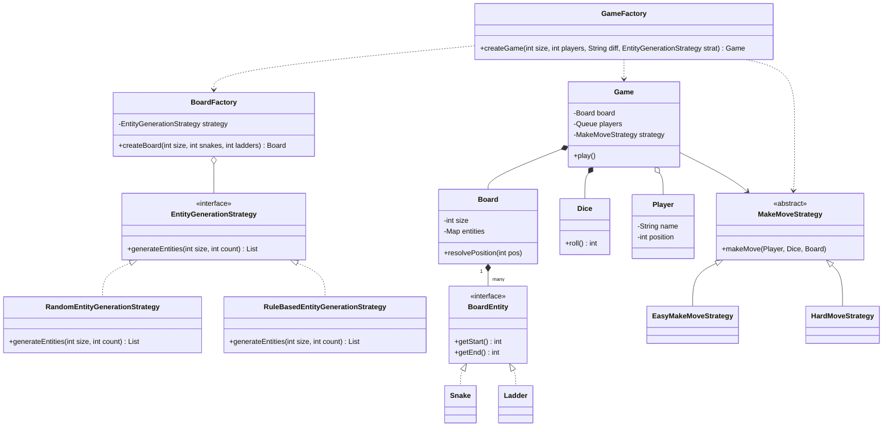

# 🐍 Snake & Ladder Design: SDE-1 / SDE-2 Interview Guide

This repository contains the complete evolution of the **Snake & Ladder** system, progressing from a simple monolithic class to a robust, highly extensible architecture using the **Strategy Pattern**, **Factory Pattern**, and **Delegation**.

---

## 🎤 Viva Presentation Guide: Step-by-Step Architecture Evolution

If asked to explain your design during a Viva or interview, follow this 3-Step narrative:

### Step 1: V0 - The Monolith Approach (Avoid This)
*   **The Design:** Put all logic (dice rolls, player movement, snake/ladder checks) inside one `Game` class or even `Main`.
*   **The Problem:** Violates **Single Responsibility Principle (SRP)**. If you want to change how a 6 roll behaves (e.g., extra turn vs. three 6s lose turn), you have to modify the core game loop. This violates **Open/Closed Principle (OCP)**.

### Step 2: V1 - Moving to Strategy Pattern
*   **The Fix:** Extract "Movement Logic" into a **Strategy Pattern**.
*   We create a `MakeMoveStrategy` interface. Now, the `Game` doesn't care if it's Easy Mode or Hard Mode; it just calls `strategy.makeMove()`.
*   This makes the game rules "pluggable."

### Step 3: V2 - Advanced Factories & Generation
*   **The Fix:** Decouple "Object Creation" and "Board Setup."
*   **BoardFactory + EntityGenerationStrategy:** Ensures that creating the board (placing snakes/ladders) is separate from game logic. We can use `RandomEntityGenerationStrategy` or a `FixedEntityStrategy` without touching the `Board` class.
*   **GameFactory:** Wires everything together (Board + Players + Strategies) into a single `Game` object.

---

## 🛠️ Step 1: V0 - The Basic Monolithic Class

### 💻 V0 Code (Simple & Rigid)
```java
public class Game {
    private int boardSize = 100;
    private Map<Integer, Integer> snakesAndLadders;

    public void play(Player player, Dice dice) {
        int roll = dice.roll();
        int nextPos = player.position + roll;
        
        // Rigid hardcoded logic inside the core loop
        if (snakesAndLadders.containsKey(nextPos)) {
            nextPos = snakesAndLadders.get(nextPos);
        }
        player.position = nextPos;
    }
}

public class Main {
    public static void main(String[] args) {
        Game game = new Game();
        Player p1 = new Player("Player 1");
        game.play(p1, new Dice());
    }
}
```

### 📊 V0 UML Diagram


---

## 🛠️ Step 2: V1 - The Strategy Pattern (Rules Decoupled)

### 💻 V1 Code (Move Strategy)
```java
// 1. The Strategy Interface
public abstract class MakeMoveStrategy {
    public abstract int makeMove(Player player, Dice dice, Board board);
}

// 🟢 EASY: Extra turn on rolling 6
class EasyMoveStrategy extends MakeMoveStrategy {
    public int makeMove(Player p, Dice d, Board b) {
        int roll = d.roll();
        if (p.position + roll <= b.getSize()) {
            p.position = b.resolvePosition(p.position + roll);
        }
        if (roll == 6) return makeMove(p, d, b); // Extra turn!
        return p.position;
    }
}

// 🔴 HARD: Three 6s in a row = Turn Forfeited
class HardMoveStrategy extends MakeMoveStrategy {
    public int makeMove(Player p, Dice d, Board b) {
        int sixes = 0, roll;
        do { roll = d.roll(); if (roll == 6) sixes++; } while (sixes < 3 && roll == 6);
        
        if (sixes == 3) return p.position; // Forfeit!
        
        int total = (sixes * 6) + roll;
        if (p.position + total <= b.getSize()) {
            p.position = b.resolvePosition(p.position + total);
        }
        return p.position;
    }
}

public class Main {
    public static void main(String[] args) {
        // Choice of strategy happens at startup!
        MakeMoveStrategy strategy = new HardMoveStrategy();
        Game game = new Game(new Board(100), players, strategy);
        game.play();
    }
}
```

### 📊 V1 UML Diagram


---

## 🛠️ Step 3: V2 - Full Architecture (Factories & Board Generation)

### 💻 V2 Code (Board Factory & Generation)
```java
// Logic for PLACING snakes/ladders is extracted
public interface EntityGenerationStrategy {
    List<BoardEntity> generateSnakes(int size, int count);
    List<BoardEntity> generateLadders(int size, int count, List<BoardEntity> existing);
}

public class BoardFactory {
    private EntityGenerationStrategy strategy;
    public Board createBoard(int n) {
        Board b = new Board(n);
        // Generates 5 snakes, then 5 ladders avoiding cycles
        List<BoardEntity> entities = strategy.generateSnakes(n*n, 5);
        entities.addAll(strategy.generateLadders(n*n, 5, entities));
        for(BoardEntity e : entities) b.addEntity(e);
        return b;
    }
}

// Final Game Assembly
public class GameFactory {
    public static Game createGame(int n, int x, String difficulty) {
        Board board = new BoardFactory(new RandomEntityGenerationStrategy()).createBoard(n);
        MakeMoveStrategy move = difficulty.equals("HARD") ? new HardMoveStrategy() : new EasyMoveStrategy();
        return new Game(board, players, move);
    }
}

public class Main {
    public static void main(String[] args) {
        // Simple, clean entry point
        Game game = GameFactory.createGame(10, 2, "HARD");
        game.play();
    }
}
```

### 📊 V2 UML Diagram


---

## 🎤 Final Viva Prep Cheat Sheet

1.  **"How do you handle turns?"** -> I use a **Queue<Player>**. Poll from front, play, then offer back to the end (unless they won).
2.  **"How do you prevent cycles?"** -> I ensure a cell cannot be both a `Start` and an `End` for any entity during generation.
3.  **"Why use a Strategy for move logic?"** -> To adhere to **OCP**. I can add "Super Hard" mode by creating one class without touching `Game` logic.
4.  **"What is the role of BoardFactory?"** -> To hide the complexity of board setup (cell mapping, snake/ladder placement) from the `Game` class.

---

## 🎲 Part 2: Comprehensive Notes on Object-Oriented Design (Snake & Ladder)

⸻

### 🎯 1. How to Approach LLD Problems (What Sir Emphasized First)

Before even writing code, focus on the thinking process. There are two ways to approach design:

🔹 **Top-Down Approach**: Start from high-level entities like `Game`, `Board`, `Player` and break them into smaller components.

🔹 **Bottom-Up Approach**: Start from small components like `Dice`, movement logic, position updates and combine them. The client contains the main game loop:

```java
// Client — Bottom-Up view of the game loop
Game game = GameFactory.createGame(100, 2, "EASY");

while (true) {                                          // game loop
    Player current = queue.poll();                      // pick current player
    int finalPos = strategy.makeMove(current, dice, board);  // roll + move
    board.resolveSnakeAndLadder(finalPos);              // apply snake/ladder
    if (current.position == board.getSize()) break;     // win condition
    queue.offer(current);                               // rotate turn
}
```

> [!NOTE]
> #### 🔑 Key Insight: The `while` loop is a **Delegator**, not a Doer
>
> The loop itself has **zero business logic**. Every line inside it is a delegation call:
>
> | Line | Delegates To | What it does |
> | :--- | :--- | :--- |
> | `queue.poll()` | `Queue<Player>` | Decides whose turn it is |
> | `strategy.makeMove(...)` | `MakeMoveStrategy` | Rolls dice + calculates new position |
> | `board.resolveSnakeAndLadder(...)` | `Board` | Applies snake/ladder effect |
> | `queue.offer(current)` | `Queue<Player>` | Rotates the turn to the next player |
>
> This is **Delegation over Implementation** — the `while` loop is just the conductor; the real work lives inside the collaborator objects.


> [!IMPORTANT]
> **Interview Insight**: In machine coding rounds (~2 hours), focus on scoping properly, avoiding over-engineering, and not adding unnecessary features like login systems or analytics. **"Do NOT build what is not asked."**


⸻

### 🧱 2. Identifying Core Entities and Relationships

#### Core Entities
- **Game**: The central controller.
- **Board**: Manages the grid and entities.
- **Player**: Represents participants.
- **Dice**: Handles randomization.
- **Snake / Ladder**: Board entities for position mapping.

#### Relationships
- **Composition**: `Game` contains `Board`, `Players`, and `Dice`. These objects exist only for a game instance and are tightly coupled with the `Game` lifecycle.

#### 🔄 Turn Handling (Queue Insight)
The best structure for managing turns is a **Queue<Player>**.
- **FIFO**: Natural turn order.
- **Easy Rotation**: Remove from front → play turn → add back to end.

⸻

### 🎲 3. Basic Class Design (V0 – Simple Version)

```java
class Player {
    String name;
    int position;

    public Player(String name) {
        this.name = name;
        this.position = 0;
    }
}

class Dice {
    private Random random = new Random();
    public int roll() { return random.nextInt(6) + 1; }
}

interface BoardEntity {
    int getStart();
    int getEnd();
}

class Snake implements BoardEntity {
    private int start, end;
    public Snake(int start, int end) { this.start = start; this.end = end; }
    public int getStart() { return start; }
    public int getEnd() { return end; }
}

class Ladder implements BoardEntity {
    private int start, end;
    public Ladder(int start, int end) { this.start = start; this.end = end; }
    public int getStart() { return start; }
    public int getEnd() { return end; }
}

class Board {
    private int size;
    private Map<Integer, BoardEntity> entities = new HashMap<>();

    public Board(int size) { this.size = size; }
    public void addEntity(BoardEntity entity) { entities.put(entity.getStart(), entity); }

    public int resolvePosition(int position) {
        if (entities.containsKey(position)) {
            return entities.get(position).getEnd();
        }
        return position;
    }
    public int getSize() { return size; }
}
```

#### 📊 V0 UML — Core Entities Only



⸻


### 🚀 4. Game Class and the Strategy Pattern

#### The Problem in V0
In a basic implementation, the `Game` class handles move logic, difficulty, and rule changes. This violates **Single Responsibility Principle (SRP)** and is not flexible.

#### Introducing Strategy Pattern
Move logic should be decoupled. This allow changing rules (Easy vs. Hard) without touching the `Game` class (**OCP**).

```java
abstract class MakeMoveStrategy {
    public abstract int makeMove(Player player, Dice dice, Board board);
}

class EasyMakeMoveStrategy extends MakeMoveStrategy {
    @Override
    public int makeMove(Player player, Dice dice, Board board) {
        int roll = dice.roll();
        int newPosition = player.position + roll;
        if (newPosition <= board.getSize()) {
            newPosition = board.resolvePosition(newPosition);
        }
        player.position = newPosition;
        // Extra turn if 6
        if (roll == 6) return makeMove(player, dice, board);
        return player.position;
    }
}

class HardMakeMoveStrategy extends MakeMoveStrategy {
    @Override
    public int makeMove(Player player, Dice dice, Board board) {
        int sixCount = 0;
        int roll;
        do {
            roll = dice.roll();
            if (roll == 6) sixCount++;
            else break;
        } while (sixCount < 3);

        if (sixCount == 3) return player.position; // Lose turn

        int newPosition = player.position + roll;
        if (newPosition <= board.getSize()) {
            newPosition = board.resolvePosition(newPosition);
        }
        player.position = newPosition;
        return newPosition;
    }
}
```

#### 📊 V1 UML — Strategy Pattern Introduced




#### Updated Game Class
```java
class Game {
    private Board board;
    private Queue<Player> players;
    private MakeMoveStrategy strategy;

    public Game(Board board, List<Player> players, MakeMoveStrategy strategy) {
        this.board = board;
        this.players = new LinkedList<>(players);
        this.strategy = strategy;
    }

    public void play() {
        while (true) {
            Player current = players.poll();
            strategy.makeMove(current, new Dice(), board);
            System.out.println(current.name + " at " + current.position);
            if (current.position == board.getSize()) {
                System.out.println(current.name + " wins!");
                break;
            }
            players.offer(current);
        }
    }
}
```

⸻

### 🏭 5. Factory Method (Game Creation)

```java
class GameFactory {
    public static Game createGame(int size, int playerCount, String difficulty) {
        Board board = new Board(size);
        List<Player> players = new ArrayList<>();
        for (int i = 1; i <= playerCount; i++) {
            players.add(new Player("P" + i));
        }

        MakeMoveStrategy strategy = difficulty.equalsIgnoreCase("EASY") 
            ? new EasyMakeMoveStrategy() 
            : new HardMakeMoveStrategy();

        return new Game(board, players, strategy);
    }
}
```

#### 📊 V2 UML — Factory Method + Full Architecture



⸻

### 🧩 6. Entity Generation Strategy & Board Factory

To segregate the logic of generating snakes and ladders from the board creation, we use the **Strategy Pattern**. This allows us to have different rules for placing entities (e.g., random placement vs. rule-based placement on alternate rows).

#### 🔹 Entity Generation Strategy Interface
```java
public interface EntityGenerationStrategy {
    List<BoardEntity> generateEntities(int boardSize, int entityCount);
}
```

#### 🔹 Concrete Strategies
```java
public class RandomEntityGenerationStrategy implements EntityGenerationStrategy {
    @Override
    public List<BoardEntity> generateEntities(int EntityGenerationStrategy entityCount) {
        // Implement random generation logic ensuring valid placements
        return new ArrayList<>();
    }
}

public class RuleBasedEntityGenerationStrategy implements EntityGenerationStrategy {
    @Override
    public List<BoardEntity> generateEntities(int boardSize, int entityCount) {
        // Implement rule-based logic (e.g., place entities on every alternate row)
        return new ArrayList<>();
    }
}
```

#### 🔹 Board Factory
The `BoardFactory` utilizes this strategy to create the board:
```java
public class BoardFactory {
    private EntityGenerationStrategy strategy;

    public BoardFactory(EntityGenerationStrategy strategy) {
        this.strategy = strategy;
    }

    public Board createBoard(int size, int snakeCount, int ladderCount) {
        List<BoardEntity> snakes = strategy.generateEntities(size, snakeCount);
        List<BoardEntity> ladders = strategy.generateEntities(size, ladderCount);
        
        Board board = new Board(size);
        for (BoardEntity snake : snakes) board.addEntity(snake);
        for (BoardEntity ladder : ladders) board.addEntity(ladder);
        
        return board;
    }
}
```

#### 🔹 Updated Game Factory
The `GameFactory` now delegates board creation to `BoardFactory`:
```java
public class GameFactory {
    public static Game createGame(int boardSize, int playerCount, String difficulty, EntityGenerationStrategy strategy) {
        BoardFactory boardFactory = new BoardFactory(strategy);
        Board board = boardFactory.createBoard(boardSize, 5, 5); // Example counts
        
        List<Player> players = new ArrayList<>();
        for (int i = 1; i <= playerCount; i++) {
            players.add(new Player("P" + i));
        }

        MakeMoveStrategy moveStrategy = difficulty.equalsIgnoreCase("EASY") 
            ? new EasyMakeMoveStrategy() 
            : new HardMoveStrategy();

        return new Game(board, players, moveStrategy);
    }
}
```

#### 📊 V3 UML — Board & Entity Generation



⸻

### 🔥 Final Interview Takeaways
- 🚀 **Extensibility**: Easily add AI players, new board rules, new difficulty modes, or **new board generation strategies**.

⸻

### 📋 UML-like Class Structure (Snake & Ladder)

| Class / Interface | Role | Key Responsibility | Relationships |
| :--- | :--- | :--- | :--- |
| `Game` | Controller | Manages game lifecycle and turns | Composed of `Board`, `Players`, `MakeMoveStrategy` |
| `Board` | Manager | Manages grid size and board entities | Contains map of `BoardEntity` |
| `Player` | Entity | Represents a player on the board | Has a `position` |
| `Dice` | Utility | Provides random move values | Used by `MakeMoveStrategy` |
| `BoardEntity` | Interface | Logic for Snakes and Ladders | `getStart()`, `getEnd()` |
| `MakeMoveStrategy` | Strategy | Decouples movement rules | Operates on `Player`, `Dice`, `Board` |
| `EntityGenerationStrategy` | Strategy | Decouples entity placement logic | Used by `BoardFactory` |
| `BoardFactory` | Factory | Creates `Board` with specific entities | Uses `EntityGenerationStrategy` |
| `GameFactory` | Factory | Creates game instances by difficulty | Uses `BoardFactory`, Orchestrates object wiring |

### 📊 Visual UML Diagram (Snake & Ladder)


